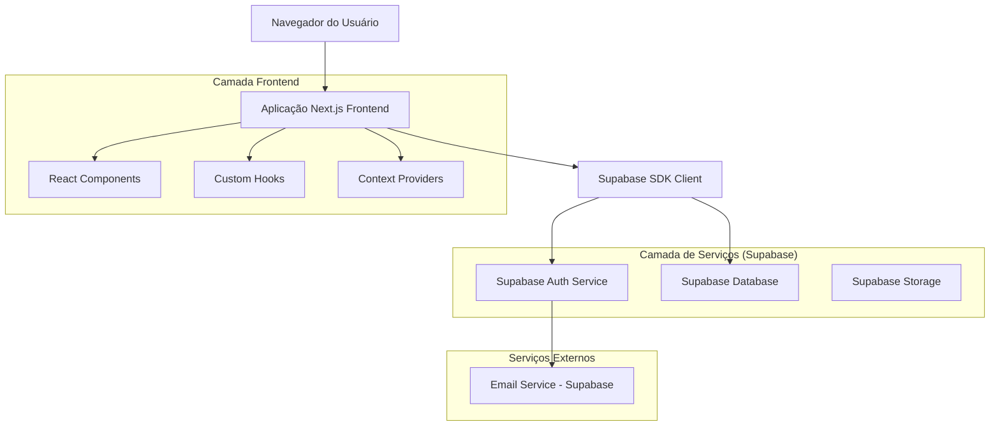
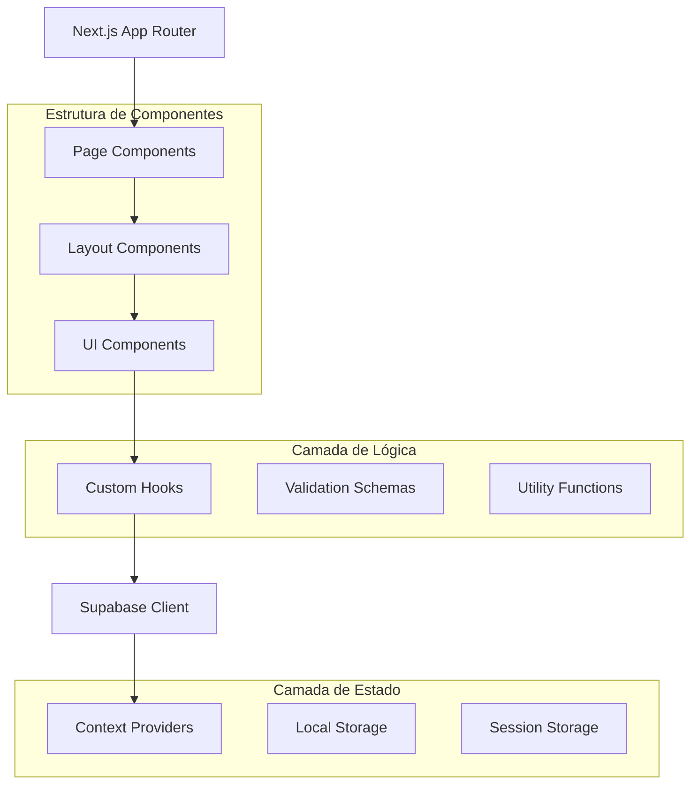
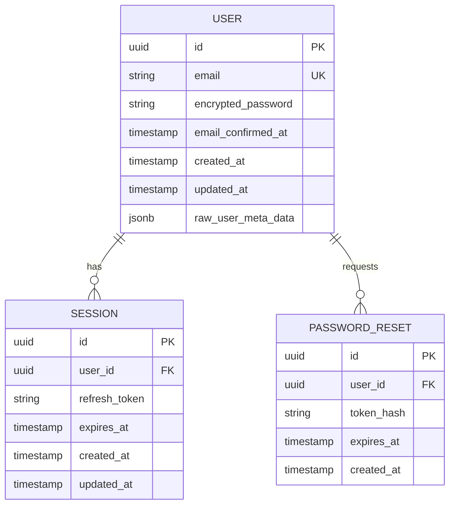

# Documento de Arquitetura Técnica - Sistema de Indicadores Bombeiro MedMais

## 1. Design da Arquitetura



## 2. Descrição das Tecnologias

**Stack Principal:**

* Frontend: Next.js\@14 + React\@18 + TypeScript\@5

* Estilização: Tailwind CSS\@3 + Headless UI

* Autenticação: Supabase Auth

* Banco de Dados: Supabase (PostgreSQL)

* Validação: React Hook Form + Zod

* Ícones: Lucide React

## 3. Definições de Rotas

| Rota                   | Propósito                                                   |
| ---------------------- | ----------------------------------------------------------- |
| /                      | Página inicial - redireciona para /login se não autenticado |
| /login                 | Página de login principal com formulário de autenticação    |
| /forgot-password       | Página de recuperação de senha                              |
| /reset-password        | Página para definir nova senha (via link do email)          |
| /dashboard             | Dashboard principal personalizado por perfil do usuário     |
| /dashboard/gestor      | Dashboard específico para Gestor POP                        |
| /dashboard/gerente     | Dashboard específico para Gerente de Seção                  |
| /dashboard/ba-ce       | Dashboard específico para BA-CE                             |
| /indicadores           | Módulo de listagem e visualização de indicadores            |
| /indicadores/preencher | Formulário de preenchimento de indicadores (BA-CE)          |
| /indicadores/\[id]     | Detalhes e histórico de um indicador específico             |
| /secoes                | Módulo de gerenciamento de seções/bases                     |
| /secoes/\[id]          | Detalhes de uma seção específica                            |
| /relatorios            | Módulo de relatórios e dashboards analíticos                |
| /configuracoes         | Configurações do usuário e sistema                          |
| /auth/callback         | Callback do Supabase para processar autenticação            |

## 4. Definições de API

### 4.1 APIs Principais

**Autenticação de usuário**

```
POST /auth/v1/token (Supabase)
```

Requisição:

| Nome do Parâmetro | Tipo   | Obrigatório | Descrição        |
| ----------------- | ------ | ----------- | ---------------- |
| email             | string | true        | Email do usuário |
| password          | string | true        | Senha do usuário |

Resposta:

| Nome do Parâmetro | Tipo   | Descrição                    |
| ----------------- | ------ | ---------------------------- |
| access\_token     | string | Token JWT para autenticação  |
| refresh\_token    | string | Token para renovação         |
| user              | object | Dados do usuário autenticado |

Exemplo:

```json
{
  "email": "usuario@exemplo.com",
  "password": "senhaSegura123"
}
```

**Recuperação de senha**

```
POST /auth/v1/recover (Supabase)
```

Requisição:

| Nome do Parâmetro | Tipo   | Obrigatório | Descrição              |
| ----------------- | ------ | ----------- | ---------------------- |
| email             | string | true        | Email para recuperação |

Resposta:

| Nome do Parâmetro | Tipo   | Descrição                     |
| ----------------- | ------ | ----------------------------- |
| message           | string | Confirmação do envio do email |

### 4.2 Hooks Customizados

**useAuth Hook**

```typescript
interface AuthState {
  user: User | null;
  loading: boolean;
  signIn: (email: string, password: string, remember?: boolean) => Promise<void>;
  signOut: () => Promise<void>;
  resetPassword: (email: string) => Promise<void>;
}
```

**useLocalStorage Hook**

```typescript
interface LocalStorageHook<T> {
  value: T;
  setValue: (value: T) => void;
  removeValue: () => void;
}
```

## 5. Arquitetura do Servidor



## 6. Modelo de Dados

### 6.1 Definição do Modelo de Dados



### 6.2 Linguagem de Definição de Dados

**Sistema de Usuários e Perfis**

```sql
-- Tabela de perfis de usuário estendida
CREATE TABLE public.profiles (
    id UUID REFERENCES auth.users(id) PRIMARY KEY,
    email VARCHAR(255) NOT NULL,
    full_name VARCHAR(255) NOT NULL,
    user_role VARCHAR(20) NOT NULL CHECK (user_role IN ('gestor_pop', 'gerente_secao', 'ba_ce')),
    secao_id UUID REFERENCES public.secoes(id),
    avatar_url TEXT,
    remember_me BOOLEAN DEFAULT false,
    last_login TIMESTAMP WITH TIME ZONE,
    is_active BOOLEAN DEFAULT true,
    created_at TIMESTAMP WITH TIME ZONE DEFAULT NOW(),
    updated_at TIMESTAMP WITH TIME ZONE DEFAULT NOW()
);

-- Tabela de Seções/Bases
CREATE TABLE public.secoes (
    id UUID PRIMARY KEY DEFAULT gen_random_uuid(),
    nome VARCHAR(255) NOT NULL,
    codigo VARCHAR(50) UNIQUE NOT NULL,
    localizacao VARCHAR(255),
    gerente_id UUID REFERENCES public.profiles(id),
    descricao TEXT,
    is_active BOOLEAN DEFAULT true,
    created_at TIMESTAMP WITH TIME ZONE DEFAULT NOW(),
    updated_at TIMESTAMP WITH TIME ZONE DEFAULT NOW()
);

-- Tabela de Indicadores
CREATE TABLE public.indicadores (
    id UUID PRIMARY KEY DEFAULT gen_random_uuid(),
    nome VARCHAR(255) NOT NULL,
    descricao TEXT,
    tipo_dado VARCHAR(50) NOT NULL CHECK (tipo_dado IN ('numero', 'texto', 'data', 'boolean', 'decimal')),
    unidade_medida VARCHAR(50),
    periodicidade VARCHAR(20) CHECK (periodicidade IN ('diario', 'semanal', 'mensal', 'trimestral')),
    is_obrigatorio BOOLEAN DEFAULT false,
    is_active BOOLEAN DEFAULT true,
    created_by UUID REFERENCES public.profiles(id),
    created_at TIMESTAMP WITH TIME ZONE DEFAULT NOW(),
    updated_at TIMESTAMP WITH TIME ZONE DEFAULT NOW()
);

-- Tabela de Preenchimentos de Indicadores
CREATE TABLE public.preenchimentos (
    id UUID PRIMARY KEY DEFAULT gen_random_uuid(),
    indicador_id UUID REFERENCES public.indicadores(id) NOT NULL,
    secao_id UUID REFERENCES public.secoes(id) NOT NULL,
    preenchido_por UUID REFERENCES public.profiles(id) NOT NULL,
    valor_texto TEXT,
    valor_numerico DECIMAL,
    valor_data DATE,
    valor_boolean BOOLEAN,
    periodo_referencia DATE NOT NULL,
    status VARCHAR(20) DEFAULT 'pendente' CHECK (status IN ('pendente', 'aprovado', 'rejeitado')),
    aprovado_por UUID REFERENCES public.profiles(id),
    aprovado_em TIMESTAMP WITH TIME ZONE,
    observacoes TEXT,
    created_at TIMESTAMP WITH TIME ZONE DEFAULT NOW(),
    updated_at TIMESTAMP WITH TIME ZONE DEFAULT NOW()
);

-- Índices para performance
CREATE INDEX idx_profiles_user_role ON public.profiles(user_role);
CREATE INDEX idx_profiles_secao_id ON public.profiles(secao_id);
CREATE INDEX idx_secoes_codigo ON public.secoes(codigo);
CREATE INDEX idx_indicadores_tipo_dado ON public.indicadores(tipo_dado);
CREATE INDEX idx_preenchimentos_indicador_secao ON public.preenchimentos(indicador_id, secao_id);
CREATE INDEX idx_preenchimentos_periodo ON public.preenchimentos(periodo_referencia DESC);
CREATE INDEX idx_preenchimentos_status ON public.preenchimentos(status);

-- RLS (Row Level Security) para segurança
ALTER TABLE public.profiles ENABLE ROW LEVEL SECURITY;
ALTER TABLE public.secoes ENABLE ROW LEVEL SECURITY;
ALTER TABLE public.indicadores ENABLE ROW LEVEL SECURITY;
ALTER TABLE public.preenchimentos ENABLE ROW LEVEL SECURITY;

-- Políticas de segurança para Profiles
CREATE POLICY "Usuários podem ver seu próprio perfil" 
ON public.profiles FOR SELECT 
USING (auth.uid() = id);

CREATE POLICY "Gestores POP podem ver todos os perfis" 
ON public.profiles FOR SELECT 
USING (
    EXISTS (
        SELECT 1 FROM public.profiles p 
        WHERE p.id = auth.uid() AND p.user_role = 'gestor_pop'
    )
);

-- Políticas de segurança para Seções
CREATE POLICY "Gestores POP podem ver todas as seções" 
ON public.secoes FOR SELECT 
USING (
    EXISTS (
        SELECT 1 FROM public.profiles p 
        WHERE p.id = auth.uid() AND p.user_role = 'gestor_pop'
    )
);

CREATE POLICY "Gerentes podem ver apenas sua seção" 
ON public.secoes FOR SELECT 
USING (
    EXISTS (
        SELECT 1 FROM public.profiles p 
        WHERE p.id = auth.uid() 
        AND (p.user_role = 'gerente_secao' AND p.secao_id = id)
    )
);

-- Políticas de segurança para Preenchimentos
CREATE POLICY "BA-CE podem inserir preenchimentos da sua seção" 
ON public.preenchimentos FOR INSERT 
WITH CHECK (
    EXISTS (
        SELECT 1 FROM public.profiles p 
        WHERE p.id = auth.uid() 
        AND p.user_role = 'ba_ce' 
        AND p.secao_id = secao_id
    )
);

CREATE POLICY "Usuários podem ver preenchimentos baseado no perfil" 
ON public.preenchimentos FOR SELECT 
USING (
    EXISTS (
        SELECT 1 FROM public.profiles p 
        WHERE p.id = auth.uid() 
        AND (
            p.user_role = 'gestor_pop' OR
            (p.user_role IN ('gerente_secao', 'ba_ce') AND p.secao_id = secao_id)
        )
    )
);

-- Triggers para atualizar updated_at
CREATE OR REPLACE FUNCTION update_updated_at_column()
RETURNS TRIGGER AS $$
BEGIN
    NEW.updated_at = NOW();
    RETURN NEW;
END;
$$ language 'plpgsql';

CREATE TRIGGER update_profiles_updated_at 
    BEFORE UPDATE ON public.profiles 
    FOR EACH ROW 
    EXECUTE FUNCTION update_updated_at_column();

CREATE TRIGGER update_secoes_updated_at 
    BEFORE UPDATE ON public.secoes 
    FOR EACH ROW 
    EXECUTE FUNCTION update_updated_at_column();

CREATE TRIGGER update_indicadores_updated_at 
    BEFORE UPDATE ON public.indicadores 
    FOR EACH ROW 
    EXECUTE FUNCTION update_updated_at_column();

CREATE TRIGGER update_preenchimentos_updated_at 
    BEFORE UPDATE ON public.preenchimentos 
    FOR EACH ROW 
    EXECUTE FUNCTION update_updated_at_column();

-- Função para criar perfil automaticamente após registro
CREATE OR REPLACE FUNCTION public.handle_new_user()
RETURNS TRIGGER AS $$
BEGIN
    INSERT INTO public.profiles (id, email, full_name, user_role)
    VALUES (
        NEW.id, 
        NEW.email, 
        COALESCE(NEW.raw_user_meta_data->>'full_name', 'Usuário'),
        COALESCE(NEW.raw_user_meta_data->>'user_role', 'ba_ce')
    );
    RETURN NEW;
END;
$$ LANGUAGE plpgsql SECURITY DEFINER;

-- Trigger para executar a função após inserção de novo usuário
CREATE TRIGGER on_auth_user_created
    AFTER INSERT ON auth.users
    FOR EACH ROW EXECUTE FUNCTION public.handle_new_user();

-- Dados iniciais para teste
INSERT INTO public.secoes (id, nome, codigo, localizacao) VALUES
    ('550e8400-e29b-41d4-a716-446655440001', 'Seção Aeroporto Santos Dumont', 'SBRJ', 'Rio de Janeiro - RJ'),
    ('550e8400-e29b-41d4-a716-446655440002', 'Seção Aeroporto Congonhas', 'SBSP', 'São Paulo - SP'),
    ('550e8400-e29b-41d4-a716-446655440003', 'Seção Aeroporto Brasília', 'SBBR', 'Brasília - DF');

-- Usuários de teste (serão criados via Supabase Auth)
-- gestor@medmais.com - Gestor POP
-- gerente.sbrj@medmais.com - Gerente Seção SBRJ  
-- bace.sbrj@medmais.com - BA-CE Seção SBRJ

-- Permissões para roles
GRANT SELECT ON public.profiles TO anon;
GRANT ALL PRIVILEGES ON public.profiles TO authenticated;
GRANT SELECT ON public.secoes TO anon;
GRANT ALL PRIVILEGES ON public.secoes TO authenticated;
GRANT SELECT ON public.indicadores TO anon;
GRANT ALL PRIVILEGES ON public.indicadores TO authenticated;
GRANT ALL PRIVILEGES ON public.preenchimentos TO authenticated;
```

