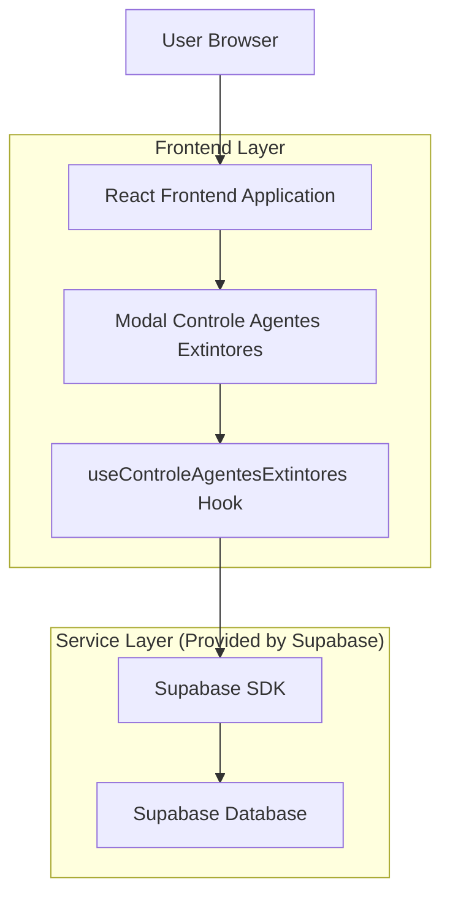
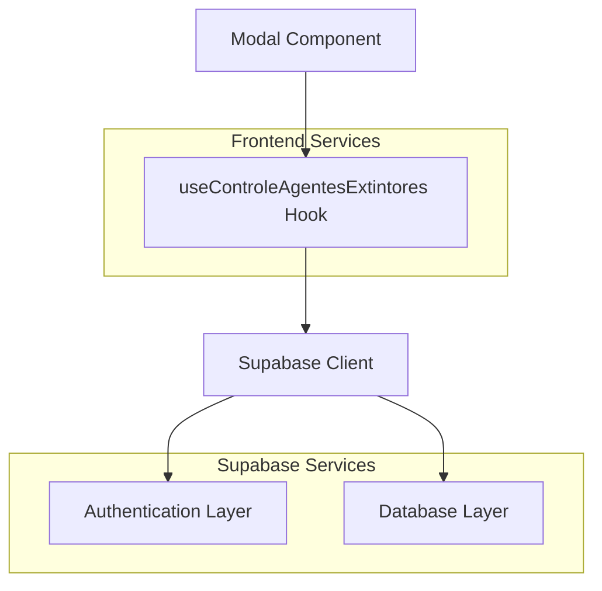
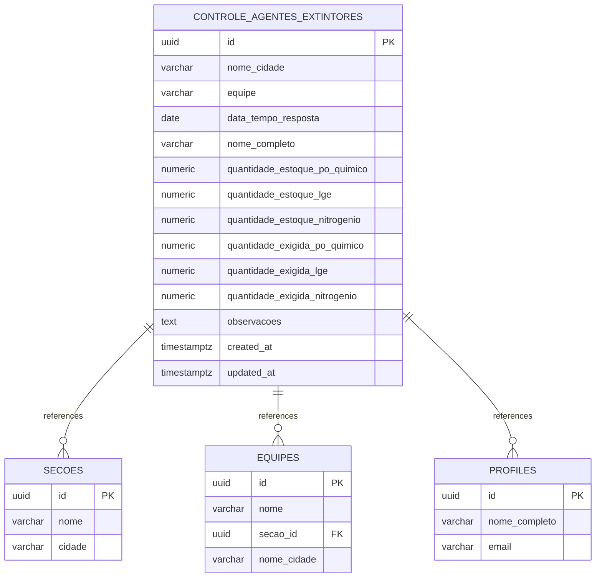

# Arquitetura Técnica - Modal Controle de Agentes Extintores

## 1. Architecture design



## 2. Technology Description

- Frontend: React@18 + TypeScript + Tailwind CSS@3 + Vite
- Backend: Supabase (PostgreSQL + Auth + Real-time)
- Icons: Lucide React
- Notifications: Sonner (toast)

## 3. Route definitions

| Route | Purpose |
|-------|---------|
| /indicadores | Página principal onde o modal é acionado pelo botão "Preencher" |

## 4. API definitions

### 4.1 Core API

**Supabase Integration - Tabela controle_agentes_extintores**

```typescript
interface ControleAgentesExtintoresData {
  id?: string
  nome_cidade: string
  equipe: string
  data_tempo_resposta: string // formato DATE
  nome_completo: string
  quantidade_estoque_po_quimico: number
  quantidade_estoque_lge: number
  quantidade_estoque_nitrogenio: number
  quantidade_exigida_po_quimico: number
  quantidade_exigida_lge: number
  quantidade_exigida_nitrogenio: number
  observacoes: string
  created_at?: string
  updated_at?: string
}
```

**Hook useControleAgentesExtintores**

```typescript
interface UseControleAgentesExtintores {
  // Estados
  secoes: Secao[]
  equipes: Equipe[]
  loading: boolean
  saving: boolean
  
  // Funções
  fetchEquipesPorSecao: (secaoId: string) => Promise<void>
  salvarControleAgentesExtintores: (data: ControleAgentesExtintoresData) => Promise<boolean>
  validarFormulario: (data: Partial<ControleAgentesExtintoresData>) => ValidationErrors
}
```

**Validação de Dados**

```typescript
interface ValidationErrors {
  [key: string]: string
}

// Regras de validação:
// - nome_cidade: obrigatório
// - equipe: obrigatório  
// - data_tempo_resposta: obrigatório, não pode ser futura
// - quantidade_estoque_po_quimico: obrigatório, número >= 0
// - quantidade_estoque_lge: obrigatório, número >= 0
// - quantidade_estoque_nitrogenio: obrigatório, número >= 0
// - quantidade_exigida_po_quimico: obrigatório, número >= 0
// - quantidade_exigida_lge: obrigatório, número >= 0
// - quantidade_exigida_nitrogenio: obrigatório, número >= 0
```

## 5. Server architecture diagram



## 6. Data model

### 6.1 Data model definition



### 6.2 Data Definition Language

**Tabela controle_agentes_extintores**

```sql
-- Criar tabela controle_agentes_extintores
CREATE TABLE IF NOT EXISTS controle_agentes_extintores (
    id UUID PRIMARY KEY DEFAULT gen_random_uuid(),
    nome_cidade VARCHAR(255) NOT NULL,
    equipe VARCHAR(255) NOT NULL,
    data_tempo_resposta DATE NOT NULL,
    nome_completo VARCHAR(255) NOT NULL,
    quantidade_estoque_po_quimico NUMERIC(10,2) NOT NULL CHECK (quantidade_estoque_po_quimico >= 0),
    quantidade_estoque_lge NUMERIC(10,2) NOT NULL CHECK (quantidade_estoque_lge >= 0),
    quantidade_estoque_nitrogenio INTEGER NOT NULL CHECK (quantidade_estoque_nitrogenio >= 0),
    quantidade_exigida_po_quimico NUMERIC(10,2) NOT NULL CHECK (quantidade_exigida_po_quimico >= 0),
    quantidade_exigida_lge NUMERIC(10,2) NOT NULL CHECK (quantidade_exigida_lge >= 0),
    quantidade_exigida_nitrogenio INTEGER NOT NULL CHECK (quantidade_exigida_nitrogenio >= 0),
    observacoes TEXT,
    created_at TIMESTAMP WITH TIME ZONE DEFAULT NOW(),
    updated_at TIMESTAMP WITH TIME ZONE DEFAULT NOW()
);

-- Comentários nas colunas
COMMENT ON TABLE controle_agentes_extintores IS 'Registro de controle de agentes extintores por equipe';
COMMENT ON COLUMN controle_agentes_extintores.nome_cidade IS 'Nome da cidade/base onde foi realizado o controle';
COMMENT ON COLUMN controle_agentes_extintores.equipe IS 'Nome da equipe responsável pelo controle';
COMMENT ON COLUMN controle_agentes_extintores.data_tempo_resposta IS 'Data do controle dos agentes extintores';
COMMENT ON COLUMN controle_agentes_extintores.nome_completo IS 'Nome completo do usuário que registrou o controle';
COMMENT ON COLUMN controle_agentes_extintores.quantidade_estoque_po_quimico IS 'Quantidade atual em estoque de pó químico (Kg)';
COMMENT ON COLUMN controle_agentes_extintores.quantidade_estoque_lge IS 'Quantidade atual em estoque de LGE (Lts)';
COMMENT ON COLUMN controle_agentes_extintores.quantidade_estoque_nitrogenio IS 'Quantidade atual em estoque de nitrogênio (unidades)';
COMMENT ON COLUMN controle_agentes_extintores.quantidade_exigida_po_quimico IS 'Quantidade exigida de pó químico (Kg)';
COMMENT ON COLUMN controle_agentes_extintores.quantidade_exigida_lge IS 'Quantidade exigida de LGE (Lts)';
COMMENT ON COLUMN controle_agentes_extintores.quantidade_exigida_nitrogenio IS 'Quantidade exigida de nitrogênio (unidades)';

-- Criar índices para performance
CREATE INDEX idx_controle_agentes_extintores_nome_cidade ON controle_agentes_extintores(nome_cidade);
CREATE INDEX idx_controle_agentes_extintores_data ON controle_agentes_extintores(data_tempo_resposta DESC);
CREATE INDEX idx_controle_agentes_extintores_equipe ON controle_agentes_extintores(equipe);

-- Trigger para atualizar updated_at
CREATE OR REPLACE FUNCTION update_controle_agentes_extintores_updated_at()
RETURNS TRIGGER AS $$
BEGIN
    NEW.updated_at = NOW();
    RETURN NEW;
END;
$$ language 'plpgsql';

CREATE TRIGGER trigger_update_controle_agentes_extintores_updated_at
    BEFORE UPDATE ON controle_agentes_extintores
    FOR EACH ROW
    EXECUTE FUNCTION update_controle_agentes_extintores_updated_at();

-- Políticas RLS (Row Level Security)
ALTER TABLE controle_agentes_extintores ENABLE ROW LEVEL SECURITY;

-- Política para usuários autenticados poderem inserir
CREATE POLICY "Usuários autenticados podem inserir controle de agentes extintores"
    ON controle_agentes_extintores FOR INSERT
    TO authenticated
    WITH CHECK (true);

-- Política para usuários autenticados poderem visualizar
CREATE POLICY "Usuários autenticados podem visualizar controle de agentes extintores"
    ON controle_agentes_extintores FOR SELECT
    TO authenticated
    USING (true);

-- Política para usuários autenticados poderem atualizar
CREATE POLICY "Usuários autenticados podem atualizar controle de agentes extintores"
    ON controle_agentes_extintores FOR UPDATE
    TO authenticated
    USING (true)
    WITH CHECK (true);

-- Conceder permissões básicas
GRANT SELECT ON controle_agentes_extintores TO anon;
GRANT ALL PRIVILEGES ON controle_agentes_extintores TO authenticated;
```