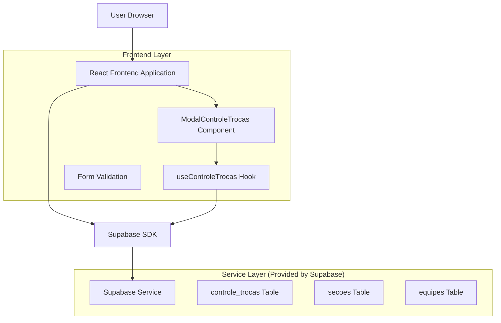
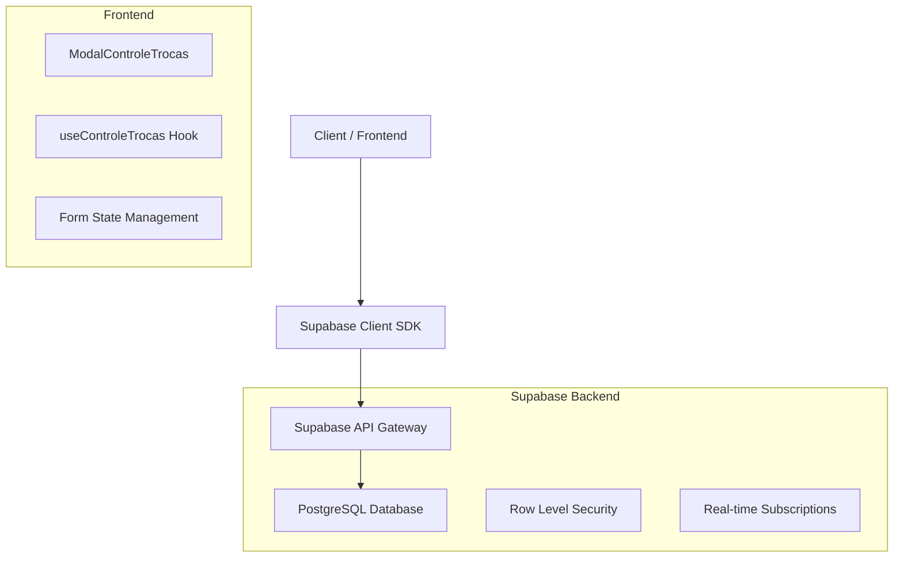
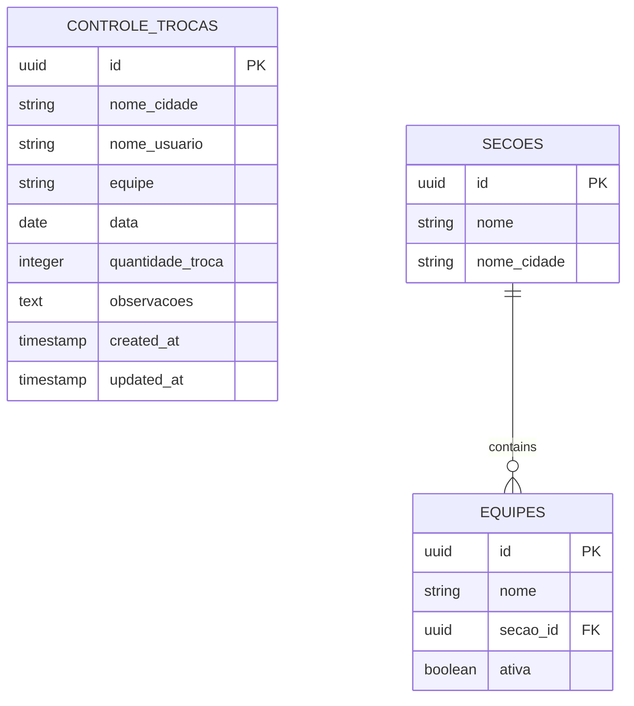

# Arquitetura Técnica - Modal Controle de Trocas

## 1. Architecture design



## 2. Technology Description
- Frontend: React@18 + tailwindcss@3 + vite
- Backend: Supabase
- Database: Supabase (PostgreSQL)
- Form Handling: React hooks + custom validation
- UI Components: Lucide React icons + custom styled components

## 3. Route definitions
| Route | Purpose |
|-------|---------|
| /indicadores/preencher | Página principal onde o modal é acionado através do card "Controle de Trocas" |

## 4. API definitions
### 4.1 Core API

**Buscar seções/bases disponíveis**
```
GET /rest/v1/secoes
```
Response:
| Param Name | Param Type | Description |
|------------|------------|-------------|
| id | string | ID único da seção |
| nome | string | Nome da seção/base |
| nome_cidade | string | Nome da cidade da base |

**Buscar equipes por seção**
```
GET /rest/v1/equipes?secao_id=eq.{secao_id}&ativa=eq.true
```
Response:
| Param Name | Param Type | Description |
|------------|------------|-------------|
| id | string | ID único da equipe |
| nome | string | Nome da equipe |
| secao_id | string | ID da seção à qual pertence |

**Salvar dados de controle de trocas**
```
POST /rest/v1/controle_trocas
```
Request:
| Param Name | Param Type | isRequired | Description |
|------------|------------|------------|-------------|
| nome_cidade | string | true | Nome da cidade conforme base selecionada |
| nome_usuario | string | true | Nome do usuário logado |
| equipe | string | true | Nome da equipe selecionada |
| data | string | true | Data no formato YYYY-MM-DD |
| quantidade_troca | number | true | Quantidade numérica de trocas |
| observacoes | string | false | Observações opcionais |

## 5. Server architecture diagram


## 6. Data model

### 6.1 Data model definition


### 6.2 Data Definition Language

**Tabela controle_trocas**
```sql
-- Criar tabela controle_trocas
CREATE TABLE IF NOT EXISTS controle_trocas (
    id UUID PRIMARY KEY DEFAULT gen_random_uuid(),
    nome_cidade VARCHAR(100) NOT NULL,
    nome_usuario VARCHAR(100) NOT NULL,
    equipe VARCHAR(100) NOT NULL,
    data DATE NOT NULL,
    quantidade_troca INTEGER NOT NULL CHECK (quantidade_troca >= 0),
    observacoes TEXT,
    created_at TIMESTAMP WITH TIME ZONE DEFAULT NOW(),
    updated_at TIMESTAMP WITH TIME ZONE DEFAULT NOW()
);

-- Criar índices para otimização
CREATE INDEX idx_controle_trocas_data ON controle_trocas(data DESC);
CREATE INDEX idx_controle_trocas_equipe ON controle_trocas(equipe);
CREATE INDEX idx_controle_trocas_nome_cidade ON controle_trocas(nome_cidade);

-- Comentários das colunas
COMMENT ON COLUMN controle_trocas.nome_cidade IS 'Nome da cidade/base onde foi realizado o controle';
COMMENT ON COLUMN controle_trocas.nome_usuario IS 'Nome do usuário que registrou o controle';
COMMENT ON COLUMN controle_trocas.equipe IS 'Nome da equipe responsável pelas trocas';
COMMENT ON COLUMN controle_trocas.data IS 'Data de referência do controle de trocas';
COMMENT ON COLUMN controle_trocas.quantidade_troca IS 'Quantidade mensal de trocas realizadas pela equipe';
COMMENT ON COLUMN controle_trocas.observacoes IS 'Observações adicionais sobre o controle de trocas';

-- Habilitar RLS (Row Level Security)
ALTER TABLE controle_trocas ENABLE ROW LEVEL SECURITY;

-- Política de acesso para usuários autenticados
CREATE POLICY "Usuários autenticados podem inserir controle_trocas" ON controle_trocas
    FOR INSERT TO authenticated
    WITH CHECK (true);

CREATE POLICY "Usuários autenticados podem visualizar controle_trocas" ON controle_trocas
    FOR SELECT TO authenticated
    USING (true);

-- Trigger para atualizar updated_at
CREATE OR REPLACE FUNCTION update_updated_at_column()
RETURNS TRIGGER AS $$
BEGIN
    NEW.updated_at = NOW();
    RETURN NEW;
END;
$$ language 'plpgsql';

CREATE TRIGGER update_controle_trocas_updated_at
    BEFORE UPDATE ON controle_trocas
    FOR EACH ROW
    EXECUTE FUNCTION update_updated_at_column();

-- Comentário da tabela
COMMENT ON TABLE controle_trocas IS 'Registro de controle de trocas mensais por equipe';
```