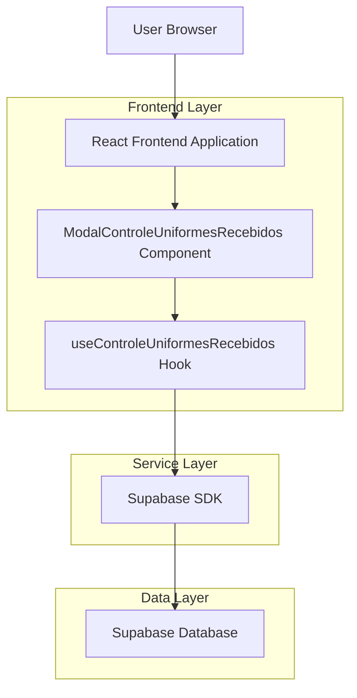
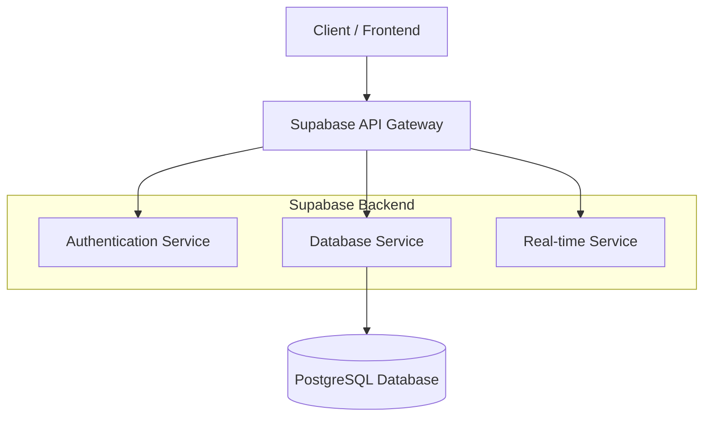
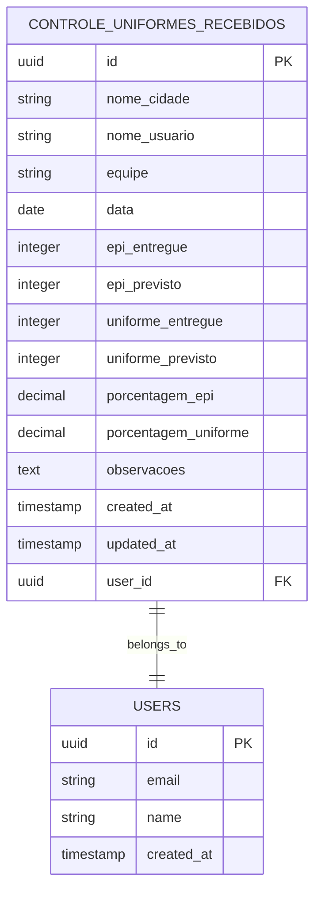

# Arquitetura Técnica - Modal Controle de Uniformes Recebidos

## 1. Architecture design



## 2. Technology Description

- Frontend: React@18 + TypeScript + TailwindCSS@3 + Vite
- Backend: Supabase (PostgreSQL + Auth + Real-time)
- UI Components: Lucide React (ícones), React Hook Form (formulários)
- Validação: Zod + React Hook Form resolver

## 3. Route definitions

| Route | Purpose |
|-------|---------|
| /dashboard | Dashboard principal com card "Controle de Uniformes Recebidos" |
| Modal Component | Componente modal renderizado sobre o dashboard (não é rota) |

## 4. API definitions

### 4.1 Core API

**Buscar registros de uniformes**
```
GET /rest/v1/controle_uniformes_recebidos
```

Request Headers:
| Header Name | Header Type | isRequired | Description |
|-------------|-------------|------------|-------------|
| Authorization | Bearer token | true | Token JWT do usuário autenticado |
| apikey | string | true | Chave pública do Supabase |

Response:
| Param Name | Param Type | Description |
|------------|------------|-------------|
| data | array | Lista de registros de controle de uniformes |
| error | object | Objeto de erro se houver falha |

**Criar novo registro de uniforme**
```
POST /rest/v1/controle_uniformes_recebidos
```

Request:
| Param Name | Param Type | isRequired | Description |
|------------|------------|------------|-------------|
| nome_cidade | string | true | Nome da cidade/base selecionada |
| nome_usuario | string | true | Nome do usuário logado (preenchido automaticamente) |
| equipe | string | true | Nome da equipe selecionada |
| data | date | true | Data do registro no formato YYYY-MM-DD |
| epi_entregue | integer | true | Quantidade de EPIs entregues |
| epi_previsto | integer | true | Quantidade de EPIs previstos |
| uniforme_entregue | integer | true | Quantidade de uniformes entregues |
| uniforme_previsto | integer | true | Quantidade de uniformes previstos |
| porcentagem_epi | decimal | true | Porcentagem de EPIs entregues (calculada automaticamente) |
| porcentagem_uniforme | decimal | true | Porcentagem de uniformes entregues (calculada automaticamente) |
| observacoes | text | false | Observações adicionais |

Response:
| Param Name | Param Type | Description |
|------------|------------|-------------|
| data | object | Registro criado com ID gerado |
| error | object | Objeto de erro se houver falha |

Example Request:
```json
{
  "nome_cidade": "Brasília",
  "nome_usuario": "João Silva",
  "equipe": "Equipe Alpha",
  "data": "2025-01-25",
  "epi_entregue": 45,
  "epi_previsto": 50,
  "uniforme_entregue": 38,
  "uniforme_previsto": 40,
  "porcentagem_epi": 90.0,
  "porcentagem_uniforme": 95.0,
  "observacoes": "Entrega realizada conforme cronograma"
}
```

## 5. Server architecture diagram



## 6. Data model

### 6.1 Data model definition



### 6.2 Data Definition Language

**Tabela controle_uniformes_recebidos**
```sql
-- Criar tabela controle_uniformes_recebidos
CREATE TABLE IF NOT EXISTS controle_uniformes_recebidos (
    id UUID PRIMARY KEY DEFAULT gen_random_uuid(),
    nome_cidade VARCHAR(100) NOT NULL,
    nome_usuario VARCHAR(100) NOT NULL,
    equipe VARCHAR(50) NOT NULL,
    data DATE NOT NULL,
    epi_entregue INTEGER NOT NULL CHECK (epi_entregue >= 0),
    epi_previsto INTEGER NOT NULL CHECK (epi_previsto > 0),
    uniforme_entregue INTEGER NOT NULL CHECK (uniforme_entregue >= 0),
    uniforme_previsto INTEGER NOT NULL CHECK (uniforme_previsto > 0),
    porcentagem_epi DECIMAL(5,2) NOT NULL CHECK (porcentagem_epi >= 0 AND porcentagem_epi <= 100),
    porcentagem_uniforme DECIMAL(5,2) NOT NULL CHECK (porcentagem_uniforme >= 0 AND porcentagem_uniforme <= 100),
    observacoes TEXT,
    user_id UUID REFERENCES auth.users(id) ON DELETE CASCADE,
    created_at TIMESTAMP WITH TIME ZONE DEFAULT NOW(),
    updated_at TIMESTAMP WITH TIME ZONE DEFAULT NOW()
);

-- Criar índices para performance
CREATE INDEX idx_controle_uniformes_user_id ON controle_uniformes_recebidos(user_id);
CREATE INDEX idx_controle_uniformes_data ON controle_uniformes_recebidos(data DESC);
CREATE INDEX idx_controle_uniformes_equipe ON controle_uniformes_recebidos(equipe);
CREATE INDEX idx_controle_uniformes_cidade ON controle_uniformes_recebidos(nome_cidade);

-- Constraint para validar que entregues não excedam previstos
ALTER TABLE controle_uniformes_recebidos 
ADD CONSTRAINT check_epi_entregue_valido 
CHECK (epi_entregue <= epi_previsto);

ALTER TABLE controle_uniformes_recebidos 
ADD CONSTRAINT check_uniforme_entregue_valido 
CHECK (uniforme_entregue <= uniforme_previsto);

-- Trigger para atualizar updated_at automaticamente
CREATE OR REPLACE FUNCTION update_updated_at_column()
RETURNS TRIGGER AS $$
BEGIN
    NEW.updated_at = NOW();
    RETURN NEW;
END;
$$ language 'plpgsql';

CREATE TRIGGER update_controle_uniformes_updated_at 
    BEFORE UPDATE ON controle_uniformes_recebidos 
    FOR EACH ROW EXECUTE FUNCTION update_updated_at_column();

-- Políticas RLS (Row Level Security)
ALTER TABLE controle_uniformes_recebidos ENABLE ROW LEVEL SECURITY;

-- Política para usuários autenticados poderem ver seus próprios registros
CREATE POLICY "Users can view own controle_uniformes records" ON controle_uniformes_recebidos
    FOR SELECT USING (auth.uid() = user_id);

-- Política para usuários autenticados poderem inserir registros
CREATE POLICY "Users can insert own controle_uniformes records" ON controle_uniformes_recebidos
    FOR INSERT WITH CHECK (auth.uid() = user_id);

-- Política para usuários autenticados poderem atualizar seus próprios registros
CREATE POLICY "Users can update own controle_uniformes records" ON controle_uniformes_recebidos
    FOR UPDATE USING (auth.uid() = user_id);

-- Política para usuários autenticados poderem deletar seus próprios registros
CREATE POLICY "Users can delete own controle_uniformes records" ON controle_uniformes_recebidos
    FOR DELETE USING (auth.uid() = user_id);

-- Grants para roles do Supabase
GRANT SELECT ON controle_uniformes_recebidos TO anon;
GRANT ALL PRIVILEGES ON controle_uniformes_recebidos TO authenticated;

-- Dados iniciais para teste (opcional)
INSERT INTO controle_uniformes_recebidos (
    nome_cidade, nome_usuario, equipe, data, 
    epi_entregue, epi_previsto, uniforme_entregue, uniforme_previsto,
    porcentagem_epi, porcentagem_uniforme, observacoes, user_id
) VALUES 
('Brasília', 'Admin User', 'Equipe Alpha', '2025-01-25', 
 45, 50, 38, 40, 90.0, 95.0, 'Registro de exemplo', 
 (SELECT id FROM auth.users LIMIT 1))
ON CONFLICT DO NOTHING;
```