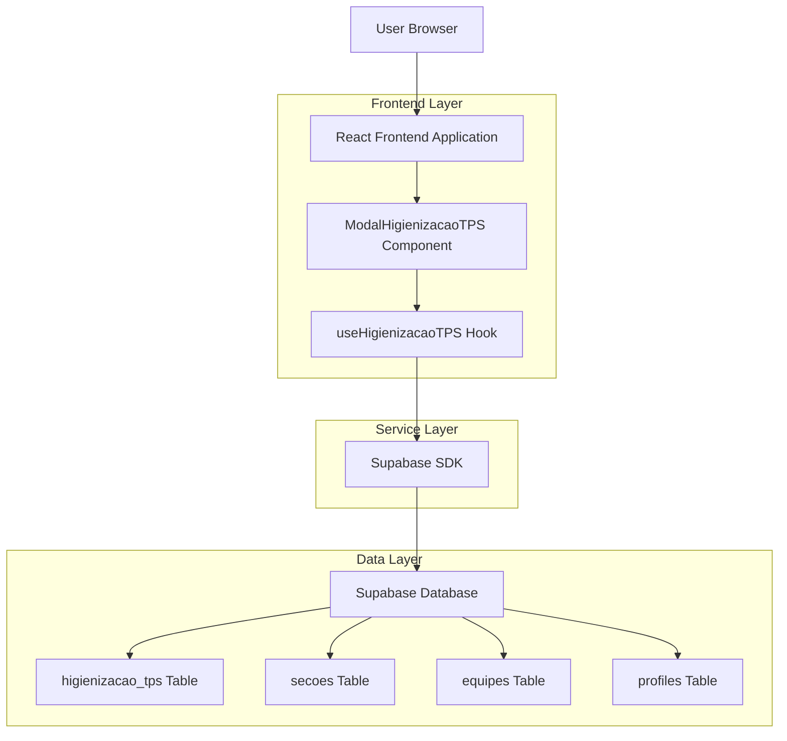
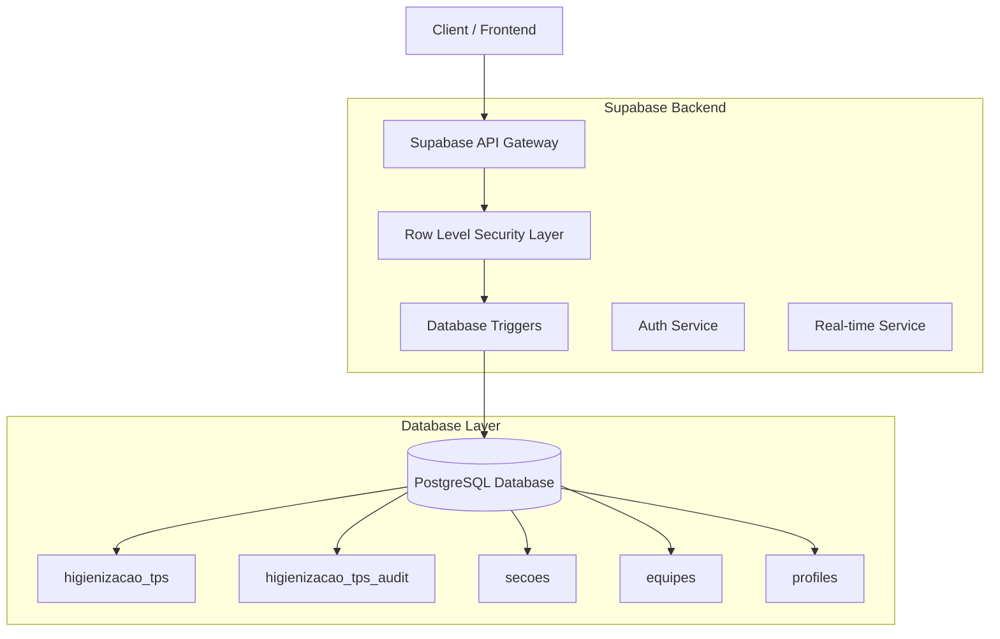
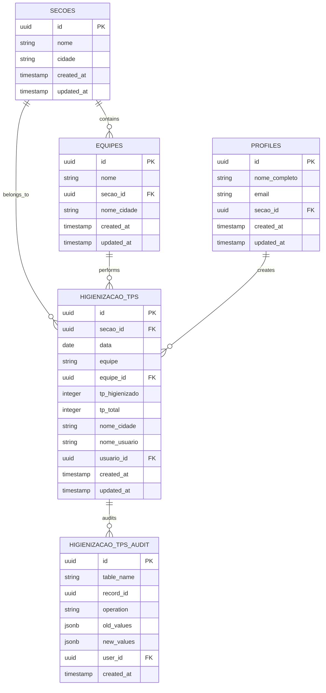

# Arquitetura Técnica - Modal de Higienização de TPS

## 1. Architecture design



## 2. Technology Description

- Frontend: React@18 + TypeScript + TailwindCSS@3 + Vite
- Backend: Supabase (PostgreSQL + Auth + RLS)
- UI Components: Lucide React (ícones)
- State Management: React Hooks (useState, useEffect, useCallback)
- Validation: Custom validation functions
- Notifications: React Hot Toast

## 3. Route definitions

| Route | Purpose |
|-------|---------|
| /dashboard | Dashboard principal com cards de indicadores, incluindo "Higienização de TPS" |
| /dashboard (modal) | Modal de registro de higienização sobreposto ao dashboard |

## 4. API definitions

### 4.1 Core API

**Buscar seções disponíveis**
```
GET /rest/v1/secoes
```

Response:
| Param Name | Param Type | Description |
|------------|------------|-------------|
| id | UUID | ID único da seção |
| nome | string | Nome da seção/base |
| cidade | string | Cidade da seção |

**Buscar equipes por seção**
```
GET /rest/v1/equipes?secao_id=eq.{secao_id}
```

Response:
| Param Name | Param Type | Description |
|------------|------------|-------------|
| id | UUID | ID único da equipe |
| nome | string | Nome da equipe |
| secao_id | UUID | ID da seção à qual pertence |

**Salvar registro de higienização**
```
POST /rest/v1/higienizacao_tps
```

Request:
| Param Name | Param Type | isRequired | Description |
|------------|------------|------------|-------------|
| secao_id | UUID | true | ID da seção/base selecionada |
| data | date | true | Data da higienização |
| equipe | string | true | Nome da equipe |
| equipe_id | UUID | true | ID da equipe |
| tp_higienizado | integer | true | Quantidade de TPs higienizados |
| tp_total | integer | true | Quantidade total de TPs |
| usuario_id | UUID | true | ID do usuário logado |

Response:
| Param Name | Param Type | Description |
|------------|------------|-------------|
| success | boolean | Status da operação |
| data | object | Dados do registro criado |

Example:
```json
{
  "secao_id": "123e4567-e89b-12d3-a456-426614174000",
  "data": "2025-01-28",
  "equipe": "Alfa",
  "equipe_id": "456e7890-e89b-12d3-a456-426614174001",
  "tp_higienizado": 25,
  "tp_total": 30,
  "usuario_id": "789e0123-e89b-12d3-a456-426614174002"
}
```

## 5. Server architecture diagram



## 6. Data model

### 6.1 Data model definition



### 6.2 Data Definition Language

**Tabela higienizacao_tps**
```sql
-- Criar tabela higienizacao_tps
CREATE TABLE higienizacao_tps (
    id UUID PRIMARY KEY DEFAULT gen_random_uuid(),
    secao_id UUID REFERENCES secoes(id) ON DELETE CASCADE,
    data DATE NOT NULL,
    equipe VARCHAR(100) NOT NULL,
    equipe_id UUID REFERENCES equipes(id) ON DELETE CASCADE,
    tp_higienizado INTEGER NOT NULL CHECK (tp_higienizado >= 0),
    tp_total INTEGER NOT NULL CHECK (tp_total > 0),
    nome_cidade VARCHAR(100) NOT NULL,
    nome_usuario VARCHAR(100) NOT NULL,
    usuario_id UUID REFERENCES auth.users(id) ON DELETE CASCADE,
    created_at TIMESTAMP WITH TIME ZONE DEFAULT NOW(),
    updated_at TIMESTAMP WITH TIME ZONE DEFAULT NOW(),
    
    -- Constraints de consistência
    CONSTRAINT check_tp_higienizacao_consistency CHECK (
        tp_higienizado <= tp_total
    ),
    
    -- Constraint de unicidade (evitar duplicatas)
    UNIQUE(secao_id, data, equipe_id)
);

-- Índices para performance
CREATE INDEX idx_higienizacao_tps_secao_id ON higienizacao_tps(secao_id);
CREATE INDEX idx_higienizacao_tps_data ON higienizacao_tps(data DESC);
CREATE INDEX idx_higienizacao_tps_equipe_id ON higienizacao_tps(equipe_id);
CREATE INDEX idx_higienizacao_tps_usuario_id ON higienizacao_tps(usuario_id);
CREATE INDEX idx_higienizacao_tps_created_at ON higienizacao_tps(created_at DESC);

-- Trigger para atualizar updated_at
CREATE OR REPLACE FUNCTION update_higienizacao_tps_updated_at()
RETURNS TRIGGER AS $$
BEGIN
    NEW.updated_at = NOW();
    RETURN NEW;
END;
$$ LANGUAGE plpgsql;

CREATE TRIGGER trigger_update_higienizacao_tps_updated_at
    BEFORE UPDATE ON higienizacao_tps
    FOR EACH ROW
    EXECUTE FUNCTION update_higienizacao_tps_updated_at();

-- Função para preencher automaticamente nome_cidade e nome_usuario
CREATE OR REPLACE FUNCTION fill_higienizacao_tps_auto_fields()
RETURNS TRIGGER AS $$
BEGIN
    -- Preencher nome_cidade baseado na seção selecionada
    SELECT cidade INTO NEW.nome_cidade
    FROM secoes
    WHERE id = NEW.secao_id;
    
    -- Preencher nome_usuario baseado no usuário autenticado
    SELECT nome_completo INTO NEW.nome_usuario
    FROM profiles
    WHERE id = NEW.usuario_id;
    
    RETURN NEW;
END;
$$ LANGUAGE plpgsql SECURITY DEFINER;

CREATE TRIGGER trigger_fill_higienizacao_tps_auto_fields
    BEFORE INSERT ON higienizacao_tps
    FOR EACH ROW
    EXECUTE FUNCTION fill_higienizacao_tps_auto_fields();

-- Habilitar Row Level Security
ALTER TABLE higienizacao_tps ENABLE ROW LEVEL SECURITY;

-- Política RLS: Usuários podem ver apenas registros de suas seções
CREATE POLICY "Users can view higienizacao_tps from their sections" ON higienizacao_tps
    FOR SELECT USING (
        secao_id IN (
            SELECT p.secao_id 
            FROM profiles p 
            WHERE p.id = auth.uid()
        )
    );

-- Política RLS: Usuários podem inserir registros apenas em suas seções
CREATE POLICY "Users can insert higienizacao_tps in their sections" ON higienizacao_tps
    FOR INSERT WITH CHECK (
        secao_id IN (
            SELECT p.secao_id 
            FROM profiles p 
            WHERE p.id = auth.uid()
        ) AND usuario_id = auth.uid()
    );

-- Política RLS: Usuários podem atualizar apenas seus próprios registros
CREATE POLICY "Users can update their own higienizacao_tps" ON higienizacao_tps
    FOR UPDATE USING (
        usuario_id = auth.uid() AND
        secao_id IN (
            SELECT p.secao_id 
            FROM profiles p 
            WHERE p.id = auth.uid()
        )
    );

-- Grants de permissão
GRANT SELECT, INSERT, UPDATE ON higienizacao_tps TO authenticated;

-- Tabela de auditoria
CREATE TABLE higienizacao_tps_audit (
    id UUID PRIMARY KEY DEFAULT gen_random_uuid(),
    table_name VARCHAR(50) NOT NULL,
    record_id UUID NOT NULL,
    operation VARCHAR(10) NOT NULL,
    old_values JSONB,
    new_values JSONB,
    user_id UUID REFERENCES auth.users(id),
    created_at TIMESTAMP WITH TIME ZONE DEFAULT NOW()
);

-- Função de auditoria
CREATE OR REPLACE FUNCTION audit_higienizacao_tps()
RETURNS TRIGGER AS $$
BEGIN
    INSERT INTO higienizacao_tps_audit (
        table_name,
        record_id,
        operation,
        old_values,
        new_values,
        user_id
    ) VALUES (
        TG_TABLE_NAME,
        COALESCE(NEW.id, OLD.id),
        TG_OP,
        CASE WHEN TG_OP = 'DELETE' THEN row_to_json(OLD) ELSE NULL END,
        CASE WHEN TG_OP IN ('INSERT', 'UPDATE') THEN row_to_json(NEW) ELSE NULL END,
        auth.uid()
    );
    
    RETURN COALESCE(NEW, OLD);
END;
$$ LANGUAGE plpgsql SECURITY DEFINER;

-- Trigger de auditoria
CREATE TRIGGER trigger_audit_higienizacao_tps
    AFTER INSERT OR UPDATE OR DELETE ON higienizacao_tps
    FOR EACH ROW
    EXECUTE FUNCTION audit_higienizacao_tps();

-- RLS para auditoria
ALTER TABLE higienizacao_tps_audit ENABLE ROW LEVEL SECURITY;

CREATE POLICY "Users can view their own audit logs" ON higienizacao_tps_audit
    FOR SELECT USING (user_id = auth.uid());

GRANT SELECT ON higienizacao_tps_audit TO authenticated;
```