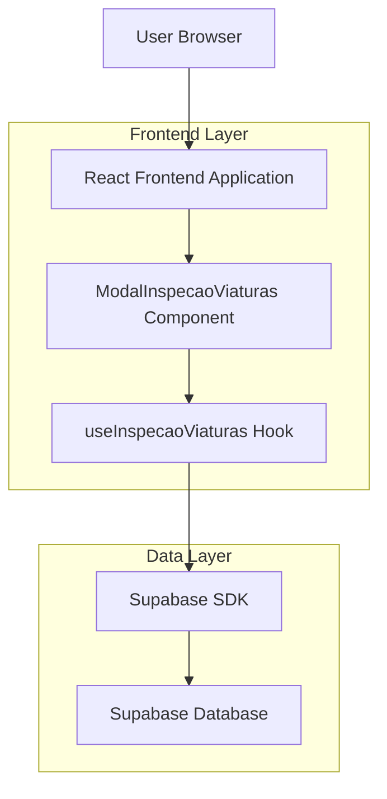
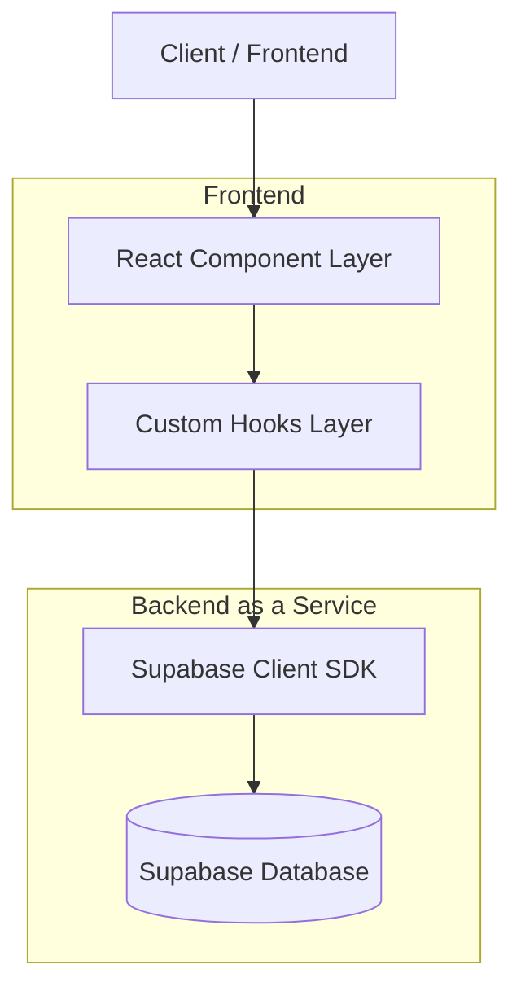
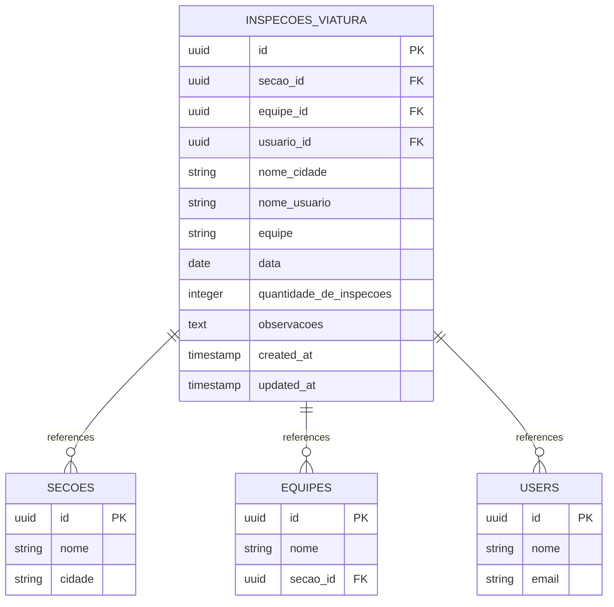

# Arquitetura Técnica - Modal Inspeção de Viaturas

## 1. Architecture design



## 2. Technology Description
- Frontend: React@18 + TypeScript + tailwindcss@3 + vite
- Backend: Supabase (PostgreSQL + Auth + Real-time)
- State Management: React Hooks (useState, useEffect)
- Form Validation: Custom validation with TypeScript
- UI Components: Lucide React icons, custom styled components

## 3. Route definitions
| Route | Purpose |
|-------|---------|
| /indicadores/preencher | Página principal onde o modal será integrado via card "Inspeção de Viaturas" |

## 4. API definitions
### 4.1 Core API

**Supabase Table Operations**

Buscar bases disponíveis
```typescript
// Via hook useInspecaoViaturas
const { bases } = useInspecaoViaturas();
```

Buscar equipes por base
```typescript
// Via hook useInspecaoViaturas
const { equipes } = useInspecaoViaturas(baseId);
```

Salvar dados de inspeção
```typescript
// Via hook useInspecaoViaturas
const { salvarInspecaoViaturas } = useInspecaoViaturas();

interface InspecaoViaturasData {
  nome_cidade: string;
  nome_usuario: string;
  equipe: string;
  data: string; // YYYY-MM-DD format
  quantidade_de_inspecoes: number;
  observacoes?: string;
}
```

### 4.2 TypeScript Interfaces

```typescript
interface InspecaoViaturasFormData {
  base_id: string;
  data: string;
  equipe_id: string;
  quantidade_de_inspecoes: number;
  observacoes: string;
}

interface Base {
  id: string;
  nome: string;
  cidade: string;
}

interface Equipe {
  id: string;
  nome: string;
  secao_id: string;
}

interface InspecaoViaturasResponse {
  success: boolean;
  message: string;
  data?: any;
}
```

## 5. Server architecture diagram


## 6. Data model

### 6.1 Data model definition


### 6.2 Data Definition Language

**Tabela inspecoes_viatura**
```sql
-- Criar tabela inspecoes_viatura
CREATE TABLE IF NOT EXISTS inspecoes_viatura (
    id UUID PRIMARY KEY DEFAULT gen_random_uuid(),
    secao_id UUID REFERENCES secoes(id),
    equipe_id UUID REFERENCES equipes(id),
    usuario_id UUID REFERENCES auth.users(id),
    nome_cidade VARCHAR(255) NOT NULL,
    nome_usuario VARCHAR(255) NOT NULL,
    equipe VARCHAR(255) NOT NULL,
    data DATE NOT NULL,
    quantidade_de_inspecoes INTEGER NOT NULL CHECK (quantidade_de_inspecoes >= 0),
    observacoes TEXT,
    created_at TIMESTAMP WITH TIME ZONE DEFAULT NOW(),
    updated_at TIMESTAMP WITH TIME ZONE DEFAULT NOW()
);

-- Criar índices para performance
CREATE INDEX idx_inspecoes_viatura_secao_id ON inspecoes_viatura(secao_id);
CREATE INDEX idx_inspecoes_viatura_equipe_id ON inspecoes_viatura(equipe_id);
CREATE INDEX idx_inspecoes_viatura_usuario_id ON inspecoes_viatura(usuario_id);
CREATE INDEX idx_inspecoes_viatura_data ON inspecoes_viatura(data DESC);

-- Habilitar RLS (Row Level Security)
ALTER TABLE inspecoes_viatura ENABLE ROW LEVEL SECURITY;

-- Políticas RLS para usuários autenticados
CREATE POLICY "Usuários autenticados podem inserir inspeções de viaturas" ON inspecoes_viatura
    FOR INSERT TO authenticated
    WITH CHECK (true);

CREATE POLICY "Usuários autenticados podem visualizar inspeções de viaturas" ON inspecoes_viatura
    FOR SELECT TO authenticated
    USING (true);

CREATE POLICY "Usuários autenticados podem atualizar inspeções de viaturas" ON inspecoes_viatura
    FOR UPDATE TO authenticated
    USING (true)
    WITH CHECK (true);

CREATE POLICY "Usuários autenticados podem deletar inspeções de viaturas" ON inspecoes_viatura
    FOR DELETE TO authenticated
    USING (true);

-- Trigger para atualizar updated_at automaticamente
CREATE OR REPLACE FUNCTION update_updated_at_column()
RETURNS TRIGGER AS $$
BEGIN
    NEW.updated_at = NOW();
    RETURN NEW;
END;
$$ language 'plpgsql';

CREATE TRIGGER update_inspecoes_viatura_updated_at
    BEFORE UPDATE ON inspecoes_viatura
    FOR EACH ROW
    EXECUTE FUNCTION update_updated_at_column();
```

**Dados iniciais (se necessário)**
```sql
-- Não há dados iniciais específicos para esta tabela
-- Os dados serão inseridos via formulário do modal
```