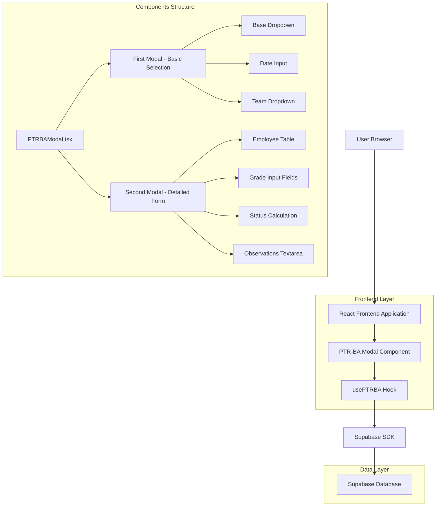
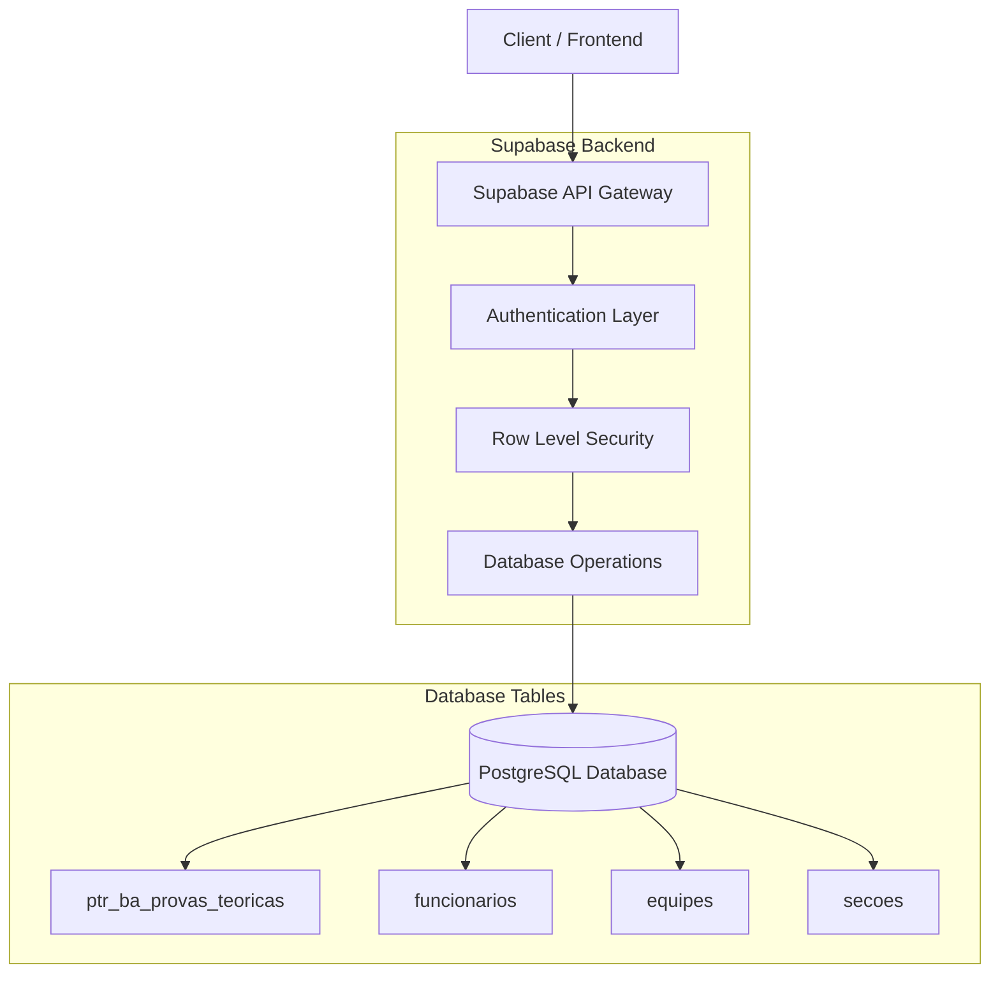
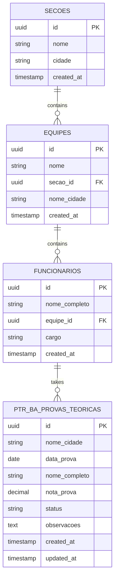

# Arquitetura Técnica - Modal PTR-BA (Prova Teórica)

## 1. Architecture design



## 2. Technology Description
- Frontend: React@18 + TypeScript + tailwindcss@3 + vite
- Backend: Supabase (PostgreSQL + Auth + Real-time)
- Icons: Lucide React
- Notifications: Sonner (toast)
- State Management: React Hooks (useState, useEffect)

## 3. Route definitions
O modal PTR-BA não possui rotas próprias, sendo acionado através do dashboard principal:

| Route | Purpose |
|-------|---------|
| /dashboard | Dashboard principal onde o card PTR-BA está localizado |
| /indicadores/preencher | Página de preenchimento de indicadores (contexto do modal) |

## 4. API definitions

### 4.1 Core API

**Buscar Seções/Bases**
```
GET /rest/v1/secoes
```

Response:
| Param Name| Param Type  | Description |
|-----------|-------------|-------------|
| id        | string      | ID único da seção |
| nome      | string      | Nome da seção/base |
| cidade    | string      | Nome da cidade |

**Buscar Equipes por Seção**
```
GET /rest/v1/equipes?secao_id=eq.{secao_id}
```

Response:
| Param Name| Param Type  | Description |
|-----------|-------------|-------------|
| id        | string      | ID único da equipe |
| nome      | string      | Nome da equipe |
| secao_id  | string      | ID da seção pai |
| nome_cidade | string    | Nome da cidade |

**Buscar Funcionários por Equipe**
```
GET /rest/v1/funcionarios?equipe_id=eq.{equipe_id}
```

Response:
| Param Name| Param Type  | Description |
|-----------|-------------|-------------|
| id        | string      | ID único do funcionário |
| nome_completo | string  | Nome completo do funcionário |
| equipe_id | string      | ID da equipe |

**Salvar Prova Teórica**
```
POST /rest/v1/ptr_ba_provas_teoricas
```

Request:
| Param Name| Param Type  | isRequired  | Description |
|-----------|-------------|-------------|-------------|
| nome_cidade | string    | true        | Nome da cidade da base |
| data_prova | date       | true        | Data da prova realizada |
| nome_completo | string  | true        | Nome completo do funcionário |
| nota_prova | decimal    | true        | Nota da prova (0.0-10.0) |
| status    | string      | true        | Status: "Aprovado" ou "Reprovado" |
| observacoes | text      | false       | Observações sobre a prova |

Example:
```json
{
  "nome_cidade": "Belo Horizonte",
  "data_prova": "2025-01-25",
  "nome_completo": "João Silva Santos",
  "nota_prova": 8.5,
  "status": "Aprovado",
  "observacoes": ""
}
```

## 5. Server architecture diagram



## 6. Data model

### 6.1 Data model definition



### 6.2 Data Definition Language

**Tabela PTR-BA Provas Teóricas**
```sql
-- Criar tabela para provas teóricas PTR-BA
CREATE TABLE ptr_ba_provas_teoricas (
    id UUID PRIMARY KEY DEFAULT gen_random_uuid(),
    nome_cidade VARCHAR(100) NOT NULL,
    data_prova DATE NOT NULL,
    nome_completo VARCHAR(255) NOT NULL,
    nota_prova DECIMAL(3,1) NOT NULL CHECK (nota_prova >= 0.0 AND nota_prova <= 10.0),
    status VARCHAR(20) NOT NULL CHECK (status IN ('Aprovado', 'Reprovado')),
    observacoes TEXT,
    created_at TIMESTAMP WITH TIME ZONE DEFAULT NOW(),
    updated_at TIMESTAMP WITH TIME ZONE DEFAULT NOW()
);

-- Criar índices para performance
CREATE INDEX idx_ptr_ba_provas_nome_cidade ON ptr_ba_provas_teoricas(nome_cidade);
CREATE INDEX idx_ptr_ba_provas_data_prova ON ptr_ba_provas_teoricas(data_prova DESC);
CREATE INDEX idx_ptr_ba_provas_status ON ptr_ba_provas_teoricas(status);
CREATE INDEX idx_ptr_ba_provas_created_at ON ptr_ba_provas_teoricas(created_at DESC);

-- Trigger para atualizar updated_at
CREATE OR REPLACE FUNCTION update_updated_at_column()
RETURNS TRIGGER AS $$
BEGIN
    NEW.updated_at = NOW();
    RETURN NEW;
END;
$$ language 'plpgsql';

CREATE TRIGGER update_ptr_ba_provas_teoricas_updated_at 
    BEFORE UPDATE ON ptr_ba_provas_teoricas 
    FOR EACH ROW EXECUTE FUNCTION update_updated_at_column();

-- Políticas RLS (Row Level Security)
ALTER TABLE ptr_ba_provas_teoricas ENABLE ROW LEVEL SECURITY;

-- Permitir leitura para usuários autenticados
CREATE POLICY "allow_read_ptr_ba_provas" ON ptr_ba_provas_teoricas
    FOR SELECT USING (auth.role() = 'authenticated');

-- Permitir inserção para usuários autenticados
CREATE POLICY "allow_insert_ptr_ba_provas" ON ptr_ba_provas_teoricas
    FOR INSERT WITH CHECK (auth.role() = 'authenticated');

-- Permitir atualização para usuários autenticados
CREATE POLICY "allow_update_ptr_ba_provas" ON ptr_ba_provas_teoricas
    FOR UPDATE USING (auth.role() = 'authenticated');

-- Dados iniciais de exemplo
INSERT INTO ptr_ba_provas_teoricas (nome_cidade, data_prova, nome_completo, nota_prova, status, observacoes)
VALUES 
    ('Belo Horizonte', '2025-01-20', 'João Silva Santos', 8.5, 'Aprovado', ''),
    ('Belo Horizonte', '2025-01-20', 'Maria Oliveira Costa', 7.2, 'Reprovado', ''),
    ('Confins', '2025-01-18', 'Pedro Almeida Lima', 9.0, 'Aprovado', ''),
    ('Confins', '2025-01-18', 'Ana Carolina Souza', 6.8, 'Reprovado', 'Necessita reforço em regulamentação'),
    ('Goiânia', '2025-01-15', 'Carlos Eduardo Ferreira', 0.0, 'Reprovado', 'Férias - não realizou a prova');
```