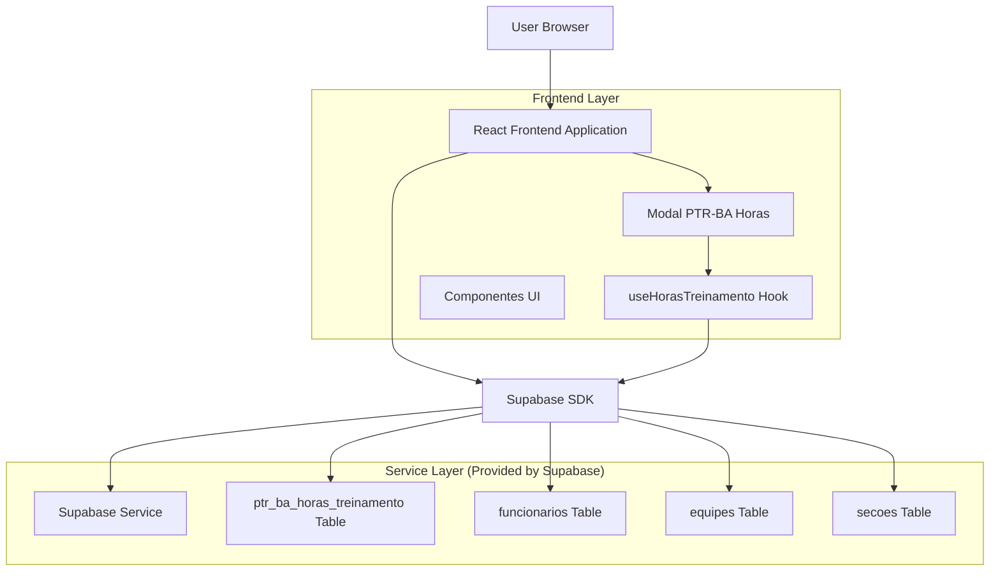
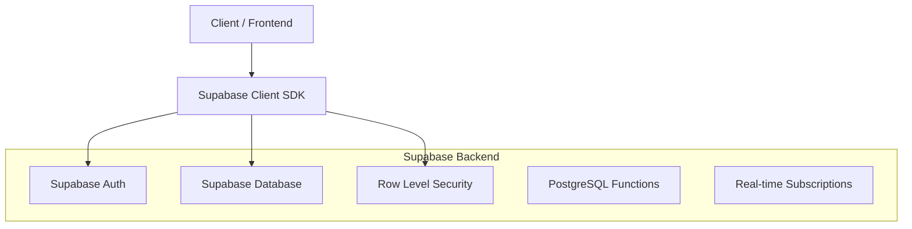
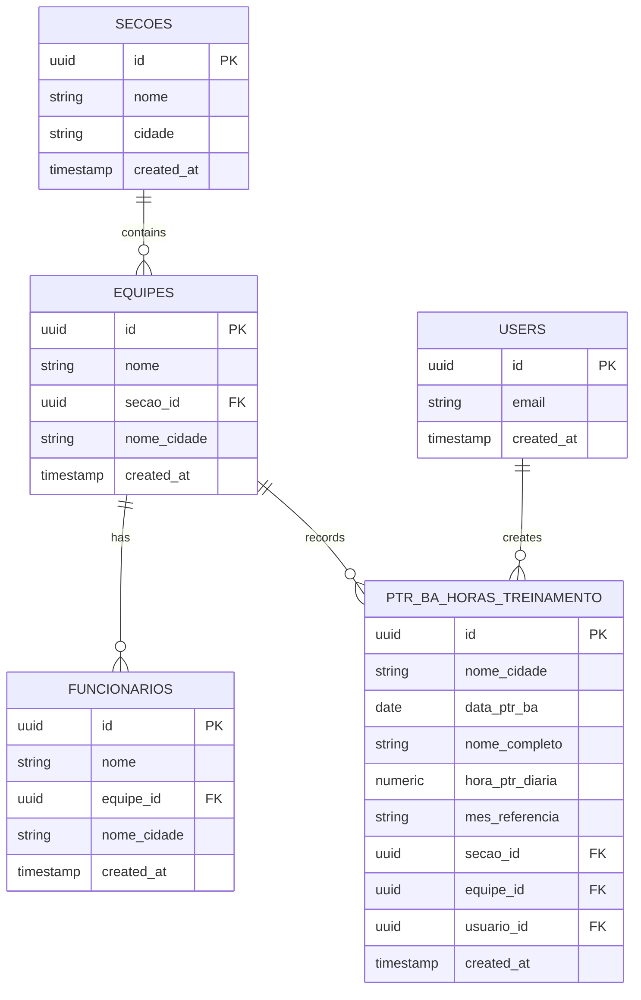

# Arquitetura Técnica - Modal PTR-BA Horas de Treinamento

## 1. Architecture design



## 2. Technology Description

- Frontend: React@18 + TypeScript + tailwindcss@3 + vite
- Backend: Supabase (PostgreSQL + Auth + RLS)
- UI Components: Lucide React + Custom Components
- State Management: React Hooks + Context API

## 3. Route definitions

| Route | Purpose |
|-------|---------|
| /dashboard | Dashboard principal com cards de indicadores |
| /indicadores | Página "Preencher indicadores" onde o modal é acionado |

## 4. API definitions

### 4.1 Core API

**Buscar Seções**
```
GET /rest/v1/secoes
```

Response:
| Param Name | Param Type | Description |
|------------|------------|-------------|
| id | uuid | ID único da seção |
| nome | string | Nome da seção (ex: "SBGO") |
| cidade | string | Nome da cidade |

**Buscar Equipes por Seção**
```
GET /rest/v1/equipes?secao_id=eq.{secao_id}
```

Response:
| Param Name | Param Type | Description |
|------------|------------|-------------|
| id | uuid | ID único da equipe |
| nome | string | Nome da equipe |
| secao_id | uuid | ID da seção |
| nome_cidade | string | Nome da cidade |

**Buscar Funcionários por Equipe**
```
GET /rest/v1/funcionarios?equipe_id=eq.{equipe_id}
```

Response:
| Param Name | Param Type | Description |
|------------|------------|-------------|
| id | uuid | ID único do funcionário |
| nome | string | Nome completo |
| equipe_id | uuid | ID da equipe |

**Inserir Horas de Treinamento**
```
POST /rest/v1/ptr_ba_horas_treinamento
```

Request:
| Param Name | Param Type | isRequired | Description |
|------------|------------|------------|-------------|
| nome_cidade | string | true | Nome da cidade/base |
| data_ptr_ba | date | true | Data do treinamento |
| nome_completo | string | true | Nome do funcionário |
| hora_ptr_diaria | numeric | true | Horas de treinamento (máx 2 decimais) |
| mes_referencia | string | true | Mês de referência (ex: "Janeiro") |
| secao_id | uuid | true | ID da seção |
| equipe_id | uuid | true | ID da equipe |
| usuario_id | uuid | true | ID do usuário logado |

**Verificar Registros Existentes**
```
GET /rest/v1/ptr_ba_horas_treinamento?data_ptr_ba=eq.{data}&equipe_id=eq.{equipe_id}
```

## 5. Server architecture diagram



## 6. Data model

### 6.1 Data model definition



### 6.2 Data Definition Language

**Tabela PTR-BA Horas de Treinamento**
```sql
-- create table
CREATE TABLE ptr_ba_horas_treinamento (
    id UUID PRIMARY KEY DEFAULT gen_random_uuid(),
    nome_cidade VARCHAR(100) NOT NULL,
    data_ptr_ba DATE NOT NULL,
    nome_completo VARCHAR(255) NOT NULL,
    hora_ptr_diaria NUMERIC(5,2) NOT NULL CHECK (hora_ptr_diaria > 0),
    mes_referencia VARCHAR(20) NOT NULL,
    secao_id UUID NOT NULL REFERENCES secoes(id),
    equipe_id UUID NOT NULL REFERENCES equipes(id),
    usuario_id UUID NOT NULL REFERENCES auth.users(id),
    created_at TIMESTAMP WITH TIME ZONE DEFAULT NOW(),
    updated_at TIMESTAMP WITH TIME ZONE DEFAULT NOW()
);

-- create indexes
CREATE INDEX idx_ptr_ba_horas_data ON ptr_ba_horas_treinamento(data_ptr_ba);
CREATE INDEX idx_ptr_ba_horas_equipe ON ptr_ba_horas_treinamento(equipe_id);
CREATE INDEX idx_ptr_ba_horas_usuario ON ptr_ba_horas_treinamento(usuario_id);
CREATE INDEX idx_ptr_ba_horas_mes ON ptr_ba_horas_treinamento(mes_referencia);

-- unique constraint para evitar duplicatas
CREATE UNIQUE INDEX idx_ptr_ba_horas_unique ON ptr_ba_horas_treinamento(data_ptr_ba, equipe_id, nome_completo);

-- RLS policies
ALTER TABLE ptr_ba_horas_treinamento ENABLE ROW LEVEL SECURITY;

CREATE POLICY "ptr_ba_horas_select_policy" ON ptr_ba_horas_treinamento
    FOR SELECT USING (auth.uid() IS NOT NULL);

CREATE POLICY "ptr_ba_horas_insert_policy" ON ptr_ba_horas_treinamento
    FOR INSERT WITH CHECK (auth.uid() IS NOT NULL);

CREATE POLICY "ptr_ba_horas_update_policy" ON ptr_ba_horas_treinamento
    FOR UPDATE USING (usuario_id = auth.uid());

CREATE POLICY "ptr_ba_horas_delete_policy" ON ptr_ba_horas_treinamento
    FOR DELETE USING (usuario_id = auth.uid());

-- grant permissions
GRANT ALL ON ptr_ba_horas_treinamento TO authenticated;

-- trigger para updated_at
CREATE OR REPLACE FUNCTION update_updated_at_column()
RETURNS TRIGGER AS $$
BEGIN
    NEW.updated_at = NOW();
    RETURN NEW;
END;
$$ language 'plpgsql';

CREATE TRIGGER update_ptr_ba_horas_updated_at 
    BEFORE UPDATE ON ptr_ba_horas_treinamento 
    FOR EACH ROW EXECUTE FUNCTION update_updated_at_column();
```

**Função para gerar mês de referência**
```sql
CREATE OR REPLACE FUNCTION get_mes_referencia(data_input DATE)
RETURNS TEXT AS $$
BEGIN
    RETURN CASE EXTRACT(MONTH FROM data_input)
        WHEN 1 THEN 'Janeiro'
        WHEN 2 THEN 'Fevereiro'
        WHEN 3 THEN 'Março'
        WHEN 4 THEN 'Abril'
        WHEN 5 THEN 'Maio'
        WHEN 6 THEN 'Junho'
        WHEN 7 THEN 'Julho'
        WHEN 8 THEN 'Agosto'
        WHEN 9 THEN 'Setembro'
        WHEN 10 THEN 'Outubro'
        WHEN 11 THEN 'Novembro'
        WHEN 12 THEN 'Dezembro'
    END;
END;
$$ LANGUAGE plpgsql;