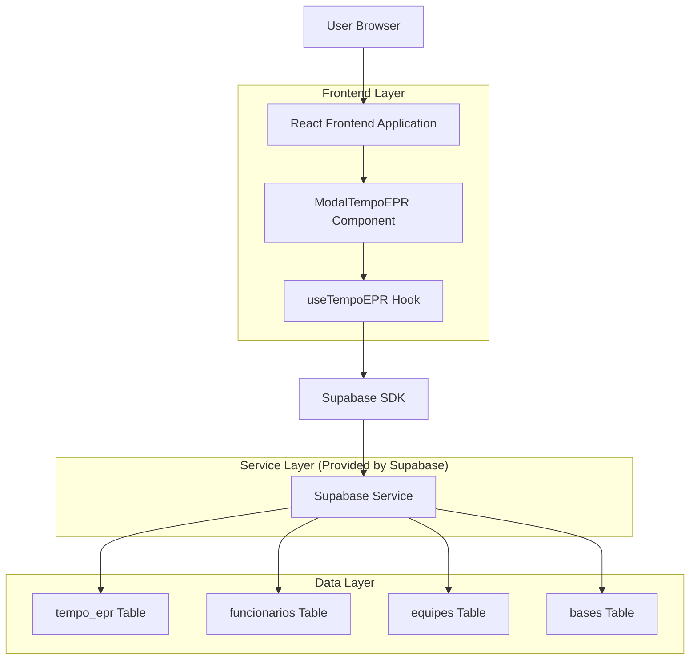
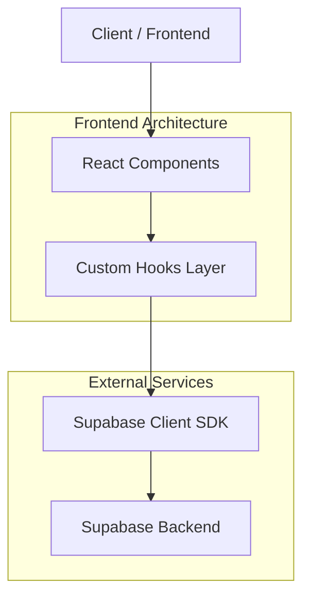
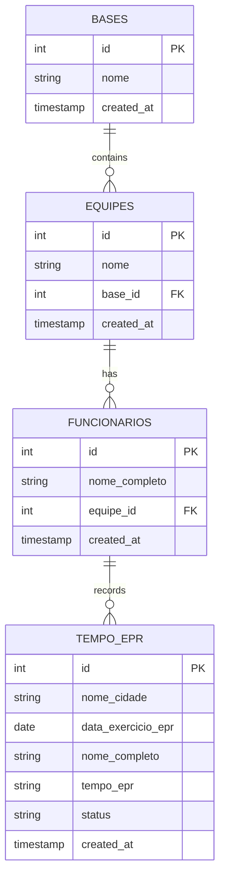

# Arquitetura Técnica - Modal Tempo EPR

## 1. Architecture design



## 2. Technology Description

- Frontend: React@18 + TypeScript + TailwindCSS@3 + Vite
- Backend: Supabase (PostgreSQL + Auth + RLS)
- Icons: Lucide React
- Date Handling: Native HTML5 date input
- State Management: React Hooks (useState, useEffect)

## 3. Route definitions

| Route | Purpose |
|-------|---------|
| /preencher-indicadores | Página principal com cards de indicadores, incluindo card "Tempo EPR" |

## 4. API definitions

### 4.1 Core API

**Buscar Bases Disponíveis**
```
GET /api/bases (via Supabase)
```

Response:
| Param Name | Param Type | Description |
|------------|------------|-------------|
| id | number | ID único da base |
| nome | string | Nome da base/cidade |

**Buscar Equipes por Base**
```
GET /api/equipes (via Supabase)
```

Request:
| Param Name | Param Type | isRequired | Description |
|------------|------------|------------|-------------|
| base_id | number | true | ID da base selecionada |

Response:
| Param Name | Param Type | Description |
|------------|------------|-------------|
| id | number | ID único da equipe |
| nome | string | Nome da equipe |
| base_id | number | ID da base associada |

**Buscar Funcionários por Equipe**
```
GET /api/funcionarios (via Supabase)
```

Request:
| Param Name | Param Type | isRequired | Description |
|------------|------------|------------|-------------|
| equipe_id | number | true | ID da equipe selecionada |

Response:
| Param Name | Param Type | Description |
|------------|------------|-------------|
| id | number | ID único do funcionário |
| nome_completo | string | Nome completo do funcionário |
| equipe_id | number | ID da equipe |

**Salvar Tempos EPR**
```
POST /api/tempo_epr (via Supabase)
```

Request:
| Param Name | Param Type | isRequired | Description |
|------------|------------|------------|-------------|
| nome_cidade | string | true | Nome da base/cidade |
| data_exercicio_epr | string | true | Data no formato YYYY-MM-DD |
| nome_completo | string | true | Nome do funcionário |
| tempo_epr | string | true | Tempo no formato MM:SS |
| status | string | true | Status calculado (Ideal/Tolerável/Reprovado) |

Response:
| Param Name | Param Type | Description |
|------------|------------|-------------|
| success | boolean | Status da operação |
| data | object | Dados salvos |

## 5. Server architecture diagram



## 6. Data model

### 6.1 Data model definition



### 6.2 Data Definition Language

**Tabela Tempo EPR (tempo_epr)**
```sql
-- Criar tabela
CREATE TABLE tempo_epr (
    id UUID PRIMARY KEY DEFAULT gen_random_uuid(),
    nome_cidade VARCHAR(255) NOT NULL,
    data_exercicio_epr DATE NOT NULL,
    nome_completo VARCHAR(255) NOT NULL,
    tempo_epr VARCHAR(10) NOT NULL CHECK (tempo_epr ~ '^[0-5][0-9]:[0-5][0-9]$'),
    status VARCHAR(20) NOT NULL CHECK (status IN ('Ideal', 'Tolerável', 'Reprovado')),
    created_at TIMESTAMP WITH TIME ZONE DEFAULT NOW(),
    updated_at TIMESTAMP WITH TIME ZONE DEFAULT NOW()
);

-- Criar índices
CREATE INDEX idx_tempo_epr_data ON tempo_epr(data_exercicio_epr DESC);
CREATE INDEX idx_tempo_epr_cidade ON tempo_epr(nome_cidade);
CREATE INDEX idx_tempo_epr_status ON tempo_epr(status);

-- Políticas RLS (Row Level Security)
ALTER TABLE tempo_epr ENABLE ROW LEVEL SECURITY;

-- Permitir leitura para usuários anônimos
CREATE POLICY "Allow read access for anon users" ON tempo_epr
    FOR SELECT USING (true);

-- Permitir todas as operações para usuários autenticados
CREATE POLICY "Allow all operations for authenticated users" ON tempo_epr
    FOR ALL USING (auth.role() = 'authenticated');

-- Grants de permissão
GRANT SELECT ON tempo_epr TO anon;
GRANT ALL PRIVILEGES ON tempo_epr TO authenticated;
```

**Função para Calcular Status Automático**
```sql
-- Função para calcular status baseado no tempo
CREATE OR REPLACE FUNCTION calcular_status_epr(tempo_input TEXT)
RETURNS TEXT AS $$
DECLARE
    minutos INTEGER;
    segundos INTEGER;
    total_segundos INTEGER;
BEGIN
    -- Extrair minutos e segundos do formato MM:SS
    minutos := CAST(SPLIT_PART(tempo_input, ':', 1) AS INTEGER);
    segundos := CAST(SPLIT_PART(tempo_input, ':', 2) AS INTEGER);
    
    -- Converter para total de segundos
    total_segundos := (minutos * 60) + segundos;
    
    -- Aplicar regras de status
    IF total_segundos <= 50 THEN
        RETURN 'Ideal';
    ELSIF total_segundos <= 60 THEN
        RETURN 'Tolerável';
    ELSE
        RETURN 'Reprovado';
    END IF;
END;
$$ LANGUAGE plpgsql;
```

## 7. Component Structure

### 7.1 Componentes Principais

**ModalTempoEPR.tsx**
- Componente principal do modal
- Gerencia estado de etapas (seleção vs tabela)
- Controla abertura/fechamento do modal
- Integra validações e salvamento

**useTempoEPR.ts**
- Hook customizado para lógica de negócio
- Gerencia estado dos formulários
- Implementa validações
- Controla integração com Supabase
- Calcula status automaticamente

### 7.2 Estrutura de Estados

```typescript
interface TempoEPRState {
  // Dados do formulário
  baseSelecionada: string;
  dataSelecionada: string;
  equipeSelecionada: string;
  
  // Dados da tabela
  funcionarios: Funcionario[];
  temposEPR: Record<string, string>;
  
  // Estados de controle
  etapaAtual: 'selecao' | 'tabela';
  isLoading: boolean;
  errors: Record<string, string>;
}

interface Funcionario {
  id: string;
  nome_completo: string;
  equipe_id: string;
}
```

### 7.3 Validações Implementadas

- **Validação de Formato**: Tempo EPR deve seguir padrão MM:SS
- **Validação de Data**: Data não pode ser futura
- **Validação de Duplicatas**: Verificar registros existentes para mesma data/equipe
- **Validação de Campos Obrigatórios**: Base, Data e Equipe são obrigatórios
- **Cálculo Automático de Status**: Baseado nas regras de tempo estabelecidas