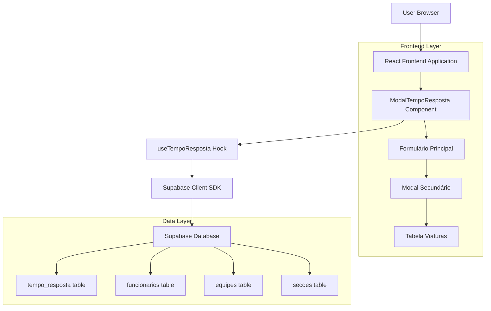
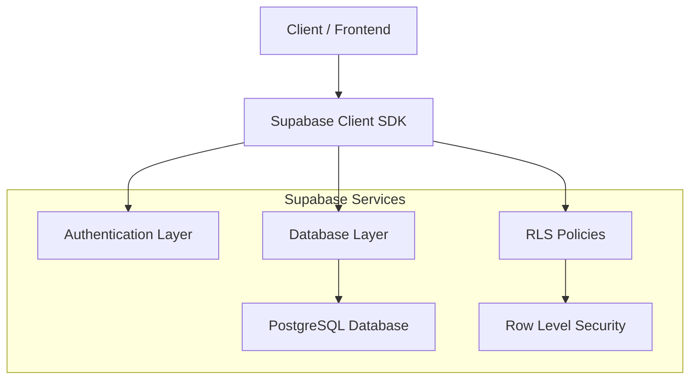
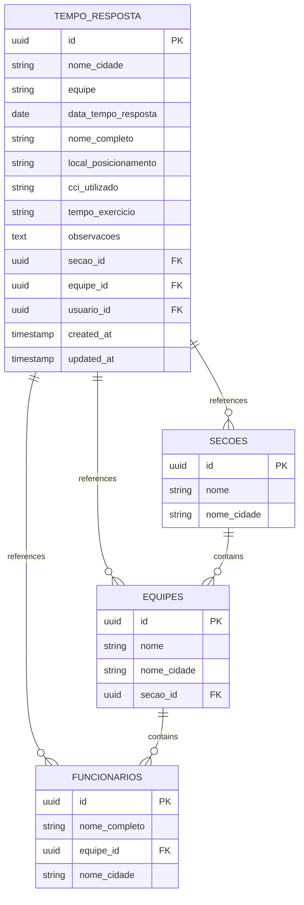

# Arquitetura Técnica - Modal de Tempo Resposta

## 1. Architecture design



## 2. Technology Description
- Frontend: React@18 + TypeScript + TailwindCSS@3 + Vite
- Backend: Supabase (PostgreSQL + Auth + RLS)
- State Management: React Hooks (useState, useEffect)
- Form Handling: Controlled components com validação customizada
- UI Components: Lucide React para ícones

## 3. Route definitions
| Route | Purpose |
|-------|---------|
| /indicadores | Página principal com cards de indicadores, incluindo "Tempo Resposta" |
| Modal Component | ModalTempoResposta renderizado condicionalmente sobre a página atual |

## 4. API definitions

### 4.1 Core API

**Buscar equipes por seção**
```typescript
// Função: getEquipesBySecao
// Retorna: Array<{id: string, nome: string, nome_cidade: string}>
```

**Buscar funcionários por equipe**
```typescript
// Função: getFuncionariosByEquipe
// Retorna: Array<{id: string, nome_completo: string, equipe_id: string}>
```

**Salvar tempo resposta**
```typescript
// Função: saveTempoResposta
// Parâmetros: TempoRespostaData[]
interface TempoRespostaData {
  nome_cidade: string;
  equipe: string;
  data_tempo_resposta: string;
  nome_completo: string;
  local_posicionamento: string;
  cci_utilizado: string;
  tempo_exercicio: string;
  observacoes?: string;
  secao_id: string;
  equipe_id: string;
  usuario_id: string;
}
```

## 5. Server architecture diagram



## 6. Data model

### 6.1 Data model definition



### 6.2 Data Definition Language

**Tabela tempo_resposta**
```sql
-- Criar tabela tempo_resposta
CREATE TABLE tempo_resposta (
    id UUID PRIMARY KEY DEFAULT gen_random_uuid(),
    nome_cidade VARCHAR(100) NOT NULL,
    equipe VARCHAR(100) NOT NULL,
    data_tempo_resposta DATE NOT NULL,
    nome_completo VARCHAR(255) NOT NULL,
    local_posicionamento VARCHAR(255) NOT NULL,
    cci_utilizado VARCHAR(100) NOT NULL,
    tempo_exercicio VARCHAR(10) NOT NULL, -- Formato HH:MM:SS
    observacoes TEXT,
    secao_id UUID NOT NULL REFERENCES secoes(id) ON DELETE CASCADE,
    equipe_id UUID NOT NULL REFERENCES equipes(id) ON DELETE CASCADE,
    usuario_id UUID NOT NULL REFERENCES auth.users(id) ON DELETE CASCADE,
    created_at TIMESTAMP WITH TIME ZONE DEFAULT NOW(),
    updated_at TIMESTAMP WITH TIME ZONE DEFAULT NOW()
);

-- Criar índices para performance
CREATE INDEX idx_tempo_resposta_secao_id ON tempo_resposta(secao_id);
CREATE INDEX idx_tempo_resposta_equipe_id ON tempo_resposta(equipe_id);
CREATE INDEX idx_tempo_resposta_usuario_id ON tempo_resposta(usuario_id);
CREATE INDEX idx_tempo_resposta_data ON tempo_resposta(data_tempo_resposta DESC);

-- Políticas RLS
ALTER TABLE tempo_resposta ENABLE ROW LEVEL SECURITY;

-- Política para SELECT
CREATE POLICY "Users can view tempo_resposta from their section" ON tempo_resposta
    FOR SELECT USING (
        secao_id IN (
            SELECT p.secao_id FROM profiles p WHERE p.id = auth.uid()
        )
    );

-- Política para INSERT
CREATE POLICY "Users can insert tempo_resposta for their section" ON tempo_resposta
    FOR INSERT WITH CHECK (
        secao_id IN (
            SELECT p.secao_id FROM profiles p WHERE p.id = auth.uid()
        )
        AND usuario_id = auth.uid()
    );

-- Política para UPDATE
CREATE POLICY "Users can update their own tempo_resposta" ON tempo_resposta
    FOR UPDATE USING (usuario_id = auth.uid());

-- Política para DELETE
CREATE POLICY "Users can delete their own tempo_resposta" ON tempo_resposta
    FOR DELETE USING (usuario_id = auth.uid());

-- Trigger para updated_at
CREATE OR REPLACE FUNCTION update_updated_at_column()
RETURNS TRIGGER AS $$
BEGIN
    NEW.updated_at = NOW();
    RETURN NEW;
END;
$$ language 'plpgsql';

CREATE TRIGGER update_tempo_resposta_updated_at 
    BEFORE UPDATE ON tempo_resposta 
    FOR EACH ROW EXECUTE FUNCTION update_updated_at_column();

-- Permissões básicas
GRANT SELECT ON tempo_resposta TO anon;
GRANT ALL PRIVILEGES ON tempo_resposta TO authenticated;
```