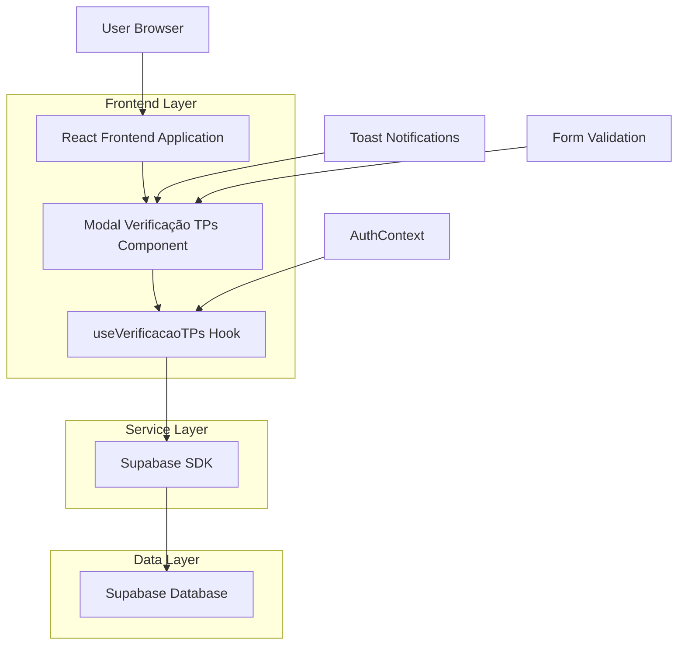
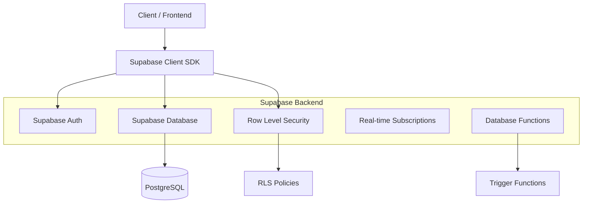
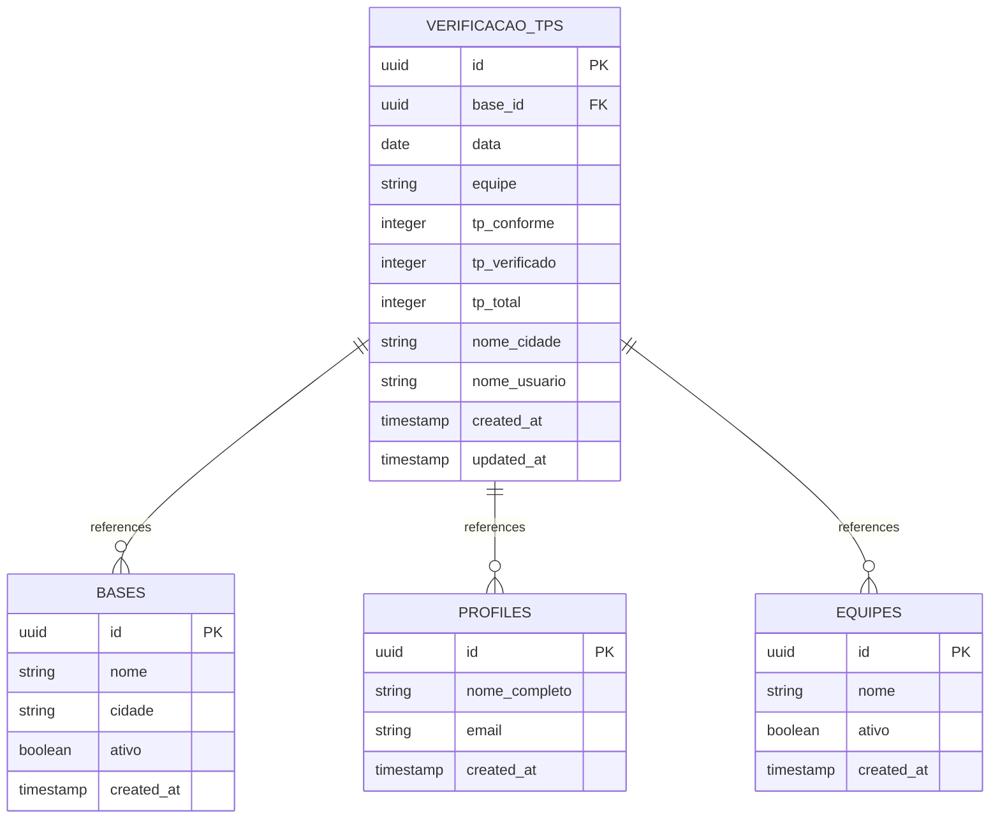

# Arquitetura Técnica - Modal de Verificação de TPs

## 1. Architecture Design



## 2. Technology Description

- **Frontend**: React@18 + TypeScript + Tailwind CSS + React Hook Form + Zod
- **Backend**: Supabase (PostgreSQL + Row Level Security)
- **State Management**: React Context (Auth) + Custom Hooks
- **Validation**: Zod schemas + React Hook Form
- **UI Components**: Headless UI + Lucide React Icons
- **Notifications**: React Hot Toast

## 3. Route Definitions

| Route | Purpose |
|-------|---------|
| /preencher-indicadores | Página principal com cards de indicadores, incluindo "Verificação de TPs" |
| Modal Component | Componente modal sobreposto, não possui rota própria |

## 4. API Definitions

### 4.1 Core API

**Verificação de TPs - Criar Registro**
```typescript
// Supabase Insert Operation
const { data, error } = await supabase
  .from('verificacao_tps')
  .insert(verificacaoData)
  .select()
```

**Request Data Structure:**
| Param Name | Param Type | isRequired | Description |
|------------|------------|------------|-------------|
| base_id | string | true | ID da base selecionada |
| data | string | true | Data no formato ISO (YYYY-MM-DD) |
| equipe | string | true | Nome da equipe selecionada |
| tp_conforme | number | true | Quantidade de TPs conformes |
| tp_verificado | number | true | Quantidade de TPs verificados |
| tp_total | number | true | Quantidade total de TPs |

**Response Structure:**
| Param Name | Param Type | Description |
|------------|------------|-------------|
| id | string | UUID do registro criado |
| created_at | string | Timestamp de criação |
| nome_cidade | string | Nome da cidade (preenchido automaticamente) |
| nome_usuario | string | Nome do usuário (preenchido automaticamente) |

**Buscar Bases Disponíveis**
```typescript
const { data: bases } = await supabase
  .from('bases')
  .select('id, nome, cidade')
  .eq('ativo', true)
```

**Buscar Equipes**
```typescript
const { data: equipes } = await supabase
  .from('equipes')
  .select('id, nome')
  .eq('ativo', true)
```

### 4.2 TypeScript Interfaces

```typescript
interface VerificacaoTPsFormData {
  base_id: string;
  data: string;
  equipe: string;
  tp_conforme: number;
  tp_verificado: number;
  tp_total: number;
}

interface VerificacaoTPsRecord {
  id: string;
  base_id: string;
  data: string;
  equipe: string;
  tp_conforme: number;
  tp_verificado: number;
  tp_total: number;
  nome_cidade: string;
  nome_usuario: string;
  created_at: string;
  updated_at: string;
}

interface Base {
  id: string;
  nome: string;
  cidade: string;
  ativo: boolean;
}

interface Equipe {
  id: string;
  nome: string;
  ativo: boolean;
}

interface UseVerificacaoTPsReturn {
  isLoading: boolean;
  error: string | null;
  salvarVerificacao: (data: VerificacaoTPsFormData) => Promise<void>;
  bases: Base[];
  equipes: Equipe[];
  loadingBases: boolean;
  loadingEquipes: boolean;
}
```

## 5. Server Architecture Diagram



## 6. Data Model

### 6.1 Data Model Definition



### 6.2 Data Definition Language

**Tabela verificacao_tps**
```sql
-- Criar tabela verificacao_tps
CREATE TABLE verificacao_tps (
    id UUID PRIMARY KEY DEFAULT gen_random_uuid(),
    base_id UUID REFERENCES bases(id) ON DELETE CASCADE,
    data DATE NOT NULL,
    equipe VARCHAR(100) NOT NULL,
    tp_conforme INTEGER NOT NULL CHECK (tp_conforme >= 0),
    tp_verificado INTEGER NOT NULL CHECK (tp_verificado >= 0),
    tp_total INTEGER NOT NULL CHECK (tp_total > 0),
    nome_cidade VARCHAR(100) NOT NULL,
    nome_usuario VARCHAR(100) NOT NULL,
    created_at TIMESTAMP WITH TIME ZONE DEFAULT NOW(),
    updated_at TIMESTAMP WITH TIME ZONE DEFAULT NOW(),
    
    -- Constraints de consistência
    CONSTRAINT check_tp_consistency CHECK (
        tp_conforme <= tp_verificado AND 
        tp_verificado <= tp_total
    ),
    
    -- Constraint de unicidade (evitar duplicatas)
    UNIQUE(base_id, data, equipe)
);

-- Índices para performance
CREATE INDEX idx_verificacao_tps_base_id ON verificacao_tps(base_id);
CREATE INDEX idx_verificacao_tps_data ON verificacao_tps(data DESC);
CREATE INDEX idx_verificacao_tps_equipe ON verificacao_tps(equipe);
CREATE INDEX idx_verificacao_tps_created_at ON verificacao_tps(created_at DESC);

-- Trigger para atualizar updated_at
CREATE OR REPLACE FUNCTION update_verificacao_tps_updated_at()
RETURNS TRIGGER AS $$
BEGIN
    NEW.updated_at = NOW();
    RETURN NEW;
END;
$$ LANGUAGE plpgsql;

CREATE TRIGGER trigger_update_verificacao_tps_updated_at
    BEFORE UPDATE ON verificacao_tps
    FOR EACH ROW
    EXECUTE FUNCTION update_verificacao_tps_updated_at();

-- Função para preencher automaticamente nome_cidade e nome_usuario
CREATE OR REPLACE FUNCTION fill_verificacao_tps_auto_fields()
RETURNS TRIGGER AS $$
BEGIN
    -- Preencher nome_cidade baseado na base selecionada
    SELECT cidade INTO NEW.nome_cidade
    FROM bases
    WHERE id = NEW.base_id;
    
    -- Preencher nome_usuario baseado no usuário autenticado
    SELECT nome_completo INTO NEW.nome_usuario
    FROM profiles
    WHERE id = auth.uid();
    
    RETURN NEW;
END;
$$ LANGUAGE plpgsql SECURITY DEFINER;

CREATE TRIGGER trigger_fill_verificacao_tps_auto_fields
    BEFORE INSERT ON verificacao_tps
    FOR EACH ROW
    EXECUTE FUNCTION fill_verificacao_tps_auto_fields();

-- Habilitar Row Level Security
ALTER TABLE verificacao_tps ENABLE ROW LEVEL SECURITY;

-- Política RLS: Usuários podem ver apenas registros de suas bases
CREATE POLICY "Users can view verificacao_tps from their bases" ON verificacao_tps
    FOR SELECT USING (
        base_id IN (
            SELECT ub.base_id 
            FROM user_bases ub 
            WHERE ub.user_id = auth.uid()
        )
    );

-- Política RLS: Usuários podem inserir registros apenas em suas bases
CREATE POLICY "Users can insert verificacao_tps in their bases" ON verificacao_tps
    FOR INSERT WITH CHECK (
        base_id IN (
            SELECT ub.base_id 
            FROM user_bases ub 
            WHERE ub.user_id = auth.uid()
        )
    );

-- Política RLS: Usuários podem atualizar apenas seus próprios registros
CREATE POLICY "Users can update their own verificacao_tps" ON verificacao_tps
    FOR UPDATE USING (
        base_id IN (
            SELECT ub.base_id 
            FROM user_bases ub 
            WHERE ub.user_id = auth.uid()
        )
    );

-- Grants de permissão
GRANT SELECT, INSERT, UPDATE ON verificacao_tps TO authenticated;
GRANT USAGE ON SEQUENCE verificacao_tps_id_seq TO authenticated;
```

**Tabela equipes (se não existir)**
```sql
-- Criar tabela equipes
CREATE TABLE IF NOT EXISTS equipes (
    id UUID PRIMARY KEY DEFAULT gen_random_uuid(),
    nome VARCHAR(100) NOT NULL UNIQUE,
    ativo BOOLEAN DEFAULT true,
    created_at TIMESTAMP WITH TIME ZONE DEFAULT NOW()
);

-- Inserir as 5 equipes padrão
INSERT INTO equipes (nome) VALUES 
    ('Equipe Alpha'),
    ('Equipe Beta'),
    ('Equipe Gamma'),
    ('Equipe Delta'),
    ('Equipe Epsilon')
ON CONFLICT (nome) DO NOTHING;

-- RLS para equipes
ALTER TABLE equipes ENABLE ROW LEVEL SECURITY;

CREATE POLICY "All authenticated users can view equipes" ON equipes
    FOR SELECT USING (auth.role() = 'authenticated');

GRANT SELECT ON equipes TO authenticated;
```

**Função de auditoria**
```sql
-- Tabela de auditoria para verificacao_tps
CREATE TABLE verificacao_tps_audit (
    id UUID PRIMARY KEY DEFAULT gen_random_uuid(),
    table_name VARCHAR(50) NOT NULL,
    record_id UUID NOT NULL,
    operation VARCHAR(10) NOT NULL,
    old_values JSONB,
    new_values JSONB,
    user_id UUID REFERENCES auth.users(id),
    created_at TIMESTAMP WITH TIME ZONE DEFAULT NOW()
);

-- Função de auditoria
CREATE OR REPLACE FUNCTION audit_verificacao_tps()
RETURNS TRIGGER AS $$
BEGIN
    INSERT INTO verificacao_tps_audit (
        table_name,
        record_id,
        operation,
        old_values,
        new_values,
        user_id
    ) VALUES (
        TG_TABLE_NAME,
        COALESCE(NEW.id, OLD.id),
        TG_OP,
        CASE WHEN TG_OP = 'DELETE' THEN row_to_json(OLD) ELSE NULL END,
        CASE WHEN TG_OP IN ('INSERT', 'UPDATE') THEN row_to_json(NEW) ELSE NULL END,
        auth.uid()
    );
    
    RETURN COALESCE(NEW, OLD);
END;
$$ LANGUAGE plpgsql SECURITY DEFINER;

-- Trigger de auditoria
CREATE TRIGGER trigger_audit_verificacao_tps
    AFTER INSERT OR UPDATE OR DELETE ON verificacao_tps
    FOR EACH ROW
    EXECUTE FUNCTION audit_verificacao_tps();

-- RLS para auditoria
ALTER TABLE verificacao_tps_audit ENABLE ROW LEVEL SECURITY;

CREATE POLICY "Users can view their own audit logs" ON verificacao_tps_audit
    FOR SELECT USING (user_id = auth.uid());

GRANT SELECT ON verificacao_tps_audit TO authenticated;
```