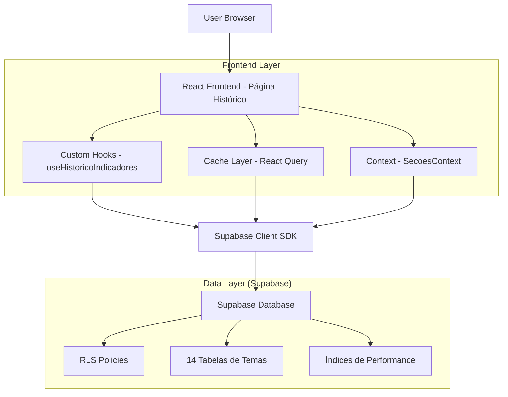
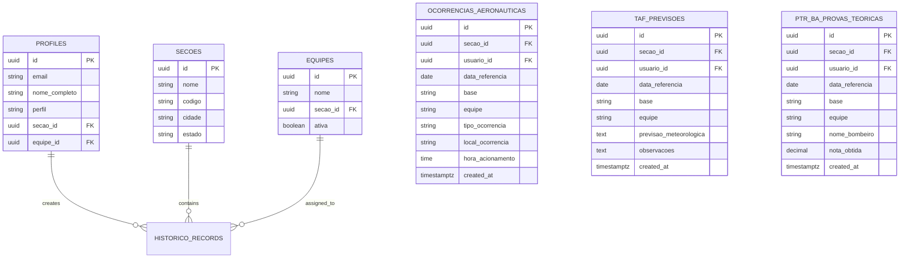

# Arquitetura Técnica - Página de Histórico de Indicadores

## 1. Architecture design



## 2. Technology Description

- Frontend: React@18 + Next.js@14 + TypeScript + Tailwind CSS@3
- State Management: React Query@4 (cache e sincronização)
- Backend: Supabase (PostgreSQL + RLS + Real-time)
- Authentication: Supabase Auth (já implementado)
- Icons: Lucide React
- Date Handling: date-fns

## 3. Route definitions

| Route | Purpose |
|-------|---------|
| /historico | Página principal de histórico de indicadores, acessível apenas para usuários BA-CE autenticados |

## 4. API definitions

### 4.1 Core API

**Consulta de Histórico por Tema**
```
GET /rest/v1/{tema_table}
```

Request Headers:
| Header Name | Header Type | isRequired | Description |
|-------------|-------------|------------|-------------|
| Authorization | Bearer token | true | Token JWT do Supabase Auth |
| apikey | string | true | Chave pública do Supabase |

Query Parameters:
| Param Name | Param Type | isRequired | Description |
|------------|------------|------------|-------------|
| select | string | true | Colunas a serem retornadas |
| order | string | false | Ordenação (padrão: data_referencia.desc) |
| limit | number | false | Limite de registros (padrão: 50) |
| offset | number | false | Offset para paginação |
| data_referencia | string | false | Filtro por período (gte.2024-01-01) |
| equipe_id | uuid | false | Filtro por equipe específica |

Response:
| Param Name | Param Type | Description |
|------------|------------|-------------|
| data | array | Array de registros do tema |
| count | number | Total de registros (com header Prefer: count=exact) |

**Exemplo de Consulta TAF:**
```typescript
const { data, error } = await supabase
  .from('taf_previsoes')
  .select(`
    id,
    data_referencia,
    base,
    equipe,
    previsao_meteorologica,
    observacoes,
    created_at,
    profiles!usuario_id(nome_completo)
  `)
  .gte('data_referencia', startDate)
  .lte('data_referencia', endDate)
  .order('data_referencia', { ascending: false })
  .range(offset, offset + limit - 1)
```

### 4.2 Tipos TypeScript

```typescript
// Tipo base para todos os registros de histórico
interface BaseHistoricoRecord {
  id: string
  secao_id: string
  usuario_id: string
  data_referencia: string
  base: string
  equipe?: string
  created_at: string
  updated_at: string
  profiles?: {
    nome_completo: string
  }
}

// Configuração de tema para organização
interface TemaConfig {
  id: string
  nome: string
  descricao: string
  table_name: string
  icon: LucideIcon
  color: string
}

// Filtros da página
interface HistoricoFilters {
  dataInicio?: string
  dataFim?: string
  equipeId?: string
  mes?: number
  ano?: number
  tema?: string
}

// Resposta paginada
interface HistoricoPaginatedResponse<T> {
  data: T[]
  count: number
  hasMore: boolean
  nextOffset: number
}
```

## 5. Data model

### 5.1 Data model definition



### 5.2 Data Definition Language

**Estrutura Base das Tabelas de Temas (já existente):**

```sql
-- Exemplo: Tabela TAF Previsões
CREATE TABLE taf_previsoes (
    id UUID PRIMARY KEY DEFAULT uuid_generate_v4(),
    secao_id UUID NOT NULL REFERENCES secoes(id),
    usuario_id UUID NOT NULL REFERENCES profiles(id),
    data_referencia DATE NOT NULL,
    base VARCHAR(100) NOT NULL,
    equipe VARCHAR(100),
    previsao_meteorologica TEXT,
    observacoes TEXT,
    created_at TIMESTAMPTZ DEFAULT NOW(),
    updated_at TIMESTAMPTZ DEFAULT NOW()
);

-- Índices para performance (já existentes)
CREATE INDEX idx_taf_previsoes_secao_id ON taf_previsoes(secao_id);
CREATE INDEX idx_taf_previsoes_data_referencia ON taf_previsoes(data_referencia);
CREATE INDEX idx_taf_previsoes_usuario_id ON taf_previsoes(usuario_id);
CREATE INDEX idx_taf_previsoes_secao_data ON taf_previsoes(secao_id, data_referencia);

-- Políticas RLS (já implementadas)
CREATE POLICY "taf_previsoes_select_policy" ON taf_previsoes
    FOR SELECT USING (
        is_gestor_pop() OR secao_id = get_user_secao_id()
    );

-- Metadados dos temas (já existente)
CREATE TABLE tema_tables_metadata (
    id UUID PRIMARY KEY DEFAULT uuid_generate_v4(),
    table_name VARCHAR(100) NOT NULL UNIQUE,
    tema_id VARCHAR(100) NOT NULL,
    tema_nome VARCHAR(200) NOT NULL,
    tema_descricao TEXT,
    created_at TIMESTAMPTZ DEFAULT NOW(),
    updated_at TIMESTAMPTZ DEFAULT NOW()
);

-- Configuração dos 14 temas
INSERT INTO tema_tables_metadata (table_name, tema_id, tema_nome, tema_descricao) VALUES
('ocorrencias_aeronauticas', 'ocorrencias-aeronauticas', 'Ocorrências Aeronáuticas', 'Registro de eventos relacionados a aeronaves e operações aéreas'),
('ocorrencias_nao_aeronauticas', 'ocorrencia-nao-aeronautica', 'Ocorrência Não Aeronáutica', 'Eventos e emergências não relacionados a aeronaves'),
('taf_previsoes', 'taf', 'TAF', 'Terminal Aerodrome Forecast - Previsão meteorológica'),
('ptr_ba_provas_teoricas', 'ptr-ba-prova-teorica', 'PTR-BA - Prova Teórica', 'Registro de provas teóricas do programa de treinamento'),
('ptr_ba_horas_treinamento', 'ptr-ba-horas-treinamento', 'PTR-BA - Horas de Treinamento', 'Controle de horas práticas de treinamento'),
('inspecoes_viaturas', 'inspecoes-viaturas', 'Inspeções de Viaturas', 'Verificações e manutenção preventiva de veículos'),
('tempo_epr', 'tempo-epr', 'Tempo EPR', 'Controle de tempo de Equipamento de Proteção Respiratória'),
('tempo_resposta', 'tempo-resposta', 'Tempo Resposta', 'Medição de tempos de resposta a emergências'),
('controle_agentes_extintores', 'controle-agentes-extintores', 'Controle de Agentes Extintores', 'Gestão e controle de agentes químicos extintores'),
('controle_trocas', 'controle-trocas', 'Controle de Trocas', 'Gerenciamento de trocas de plantão e escalas'),
('verificacao_tps', 'verificacao-tps', 'Verificação de TPS', 'Verificação de Equipamentos de Proteção Individual'),
('higienizacao_tps', 'higienizacao-tps', 'Higienização de TPS', 'Limpeza e desinfecção de equipamentos de proteção'),
('controle_uniformes_recebidos', 'controle-uniformes-recebidos', 'Controle de Uniformes Recebidos', 'Gestão de recebimento e distribuição de uniformes');
```

## 6. Implementação de Performance

### 6.1 Estratégia de Cache

```typescript
// React Query configuration para cache otimizado
const queryClient = new QueryClient({
  defaultOptions: {
    queries: {
      staleTime: 5 * 60 * 1000, // 5 minutos
      cacheTime: 10 * 60 * 1000, // 10 minutos
      refetchOnWindowFocus: false,
      retry: 2
    }
  }
})

// Hook personalizado para histórico
const useHistoricoIndicadores = (filters: HistoricoFilters) => {
  return useQuery({
    queryKey: ['historico', filters],
    queryFn: () => fetchHistoricoData(filters),
    enabled: !!filters,
    keepPreviousData: true
  })
}
```

### 6.2 Otimizações de Consulta

- **Paginação**: Limit de 50 registros por página com offset
- **Índices Compostos**: Consultas otimizadas por (secao_id, data_referencia)
- **Select Específico**: Apenas colunas necessárias para reduzir payload
- **Filtros no Servidor**: Aplicação de filtros via query parameters
- **Cache Inteligente**: Invalidação automática quando novos dados são inseridos

### 6.3 Real-time Updates

```typescript
// Subscription para atualizações em tempo real
useEffect(() => {
  const subscription = supabase
    .channel('historico_updates')
    .on('postgres_changes', 
      { event: 'INSERT', schema: 'public', table: 'taf_previsoes' },
      (payload) => {
        queryClient.invalidateQueries(['historico'])
      }
    )
    .subscribe()

  return () => subscription.unsubscribe()
}, [])
```