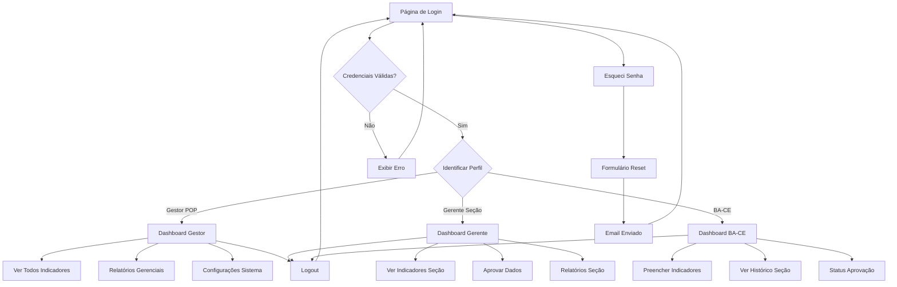

# Documento de Requisitos do Produto - Sistema de Indicadores Bombeiro MedMais

## 1. Visão Geral do Produto

Sistema de gestão de indicadores desenvolvido para auxiliar no preenchimento e monitoramento de métricas de seções de Bombeiro administradas pelo Grupo MedMais. A aplicação Next.js oferece uma plataforma moderna e segura para coleta, visualização e análise de dados operacionais, com diferentes níveis de acesso baseados no perfil do usuário.

O sistema visa otimizar o processo de coleta de dados operacionais, proporcionando visibilidade adequada para cada nível hierárquico e facilitando a tomada de decisões baseada em métricas precisas e atualizadas das operações de bombeiro em aeródromos.

## 2. Funcionalidades Principais

### 2.1 Papéis de Usuário

| Papel | Método de Registro | Permissões Principais |
|-------|-------------------|----------------------|
| Gestor POP | Email e senha via Supabase Auth | Visualização de todos os indicadores de todas as seções, relatórios gerenciais, configurações do sistema |
| Gerente de Seção | Email e senha via Supabase Auth | Visualização de indicadores apenas da sua seção/base, aprovação de dados, relatórios da seção |
| Bombeiro de Aeródromo Chefe de Equipe (BA-CE) | Email e senha via Supabase Auth | Preenchimento de indicadores da sua equipe, visualização de indicadores da seção completa |
| Visitante | N/A | Acesso apenas à tela de login e recuperação de senha |

### 2.2 Módulo de Funcionalidades

Nossos requisitos consistem nas seguintes páginas principais:

1. **Página de Login**: formulário de autenticação, opção "lembrar-me", link "esqueci senha", identificação do perfil do usuário
2. **Dashboard Principal**: visão geral personalizada por perfil, navegação para módulos específicos, indicadores de status
3. **Módulo de Indicadores**: listagem, preenchimento e visualização de indicadores baseado no perfil do usuário
4. **Módulo de Seções**: gerenciamento e visualização de seções/bases (para Gestores e Gerentes)
5. **Módulo de Relatórios**: dashboards e relatórios baseados nos dados coletados
6. **Página de Recuperação de Senha**: formulário para reset de senha, validações, feedback visual
7. **Configurações de Usuário**: perfil, preferências e configurações específicas do papel

### 2.3 Detalhes das Páginas

| Nome da Página | Nome do Módulo | Descrição da Funcionalidade |
|----------------|----------------|----------------------------|
| Página de Login | Formulário de Autenticação | Validar credenciais, autenticar via Supabase, identificar perfil do usuário, gerenciar estado de "lembrar-me" |
| Dashboard Principal | Visão Geral Personalizada | Exibir widgets específicos por perfil, estatísticas relevantes, navegação rápida para módulos |
| Dashboard Principal | Identificação de Usuário | Mostrar nome, perfil e seção do usuário logado, opções de logout e configurações |
| Módulo de Indicadores | Lista de Indicadores | Exibir indicadores disponíveis baseado no perfil e permissões do usuário |
| Módulo de Indicadores | Formulário de Preenchimento | Permitir inserção de dados nos indicadores (apenas BA-CE), validação de campos obrigatórios |
| Módulo de Indicadores | Visualização de Dados | Mostrar dados inseridos, histórico de preenchimentos, status de aprovação |
| Módulo de Seções | Gerenciamento de Seções | Listar seções disponíveis, detalhes de cada base, estatísticas por seção |
| Módulo de Relatórios | Dashboards Analíticos | Gráficos e métricas baseados nos indicadores coletados, filtros por período e seção |
| Recuperação de Senha | Formulário de Reset | Enviar email de recuperação via Supabase, validar formato de email, feedback de sucesso/erro |
| Configurações | Perfil do Usuário | Editar dados pessoais, alterar senha, configurações de notificação |

## 3. Processo Principal

**Fluxo do Gestor POP:**
O Gestor POP acessa o sistema, visualiza todos os indicadores de todas as seções, pode gerar relatórios gerenciais consolidados e configurar parâmetros do sistema. Tem visibilidade completa de todas as operações.

**Fluxo do Gerente de Seção:**
O Gerente de Seção acessa o sistema, visualiza apenas os indicadores da sua seção específica, pode aprovar dados inseridos pelos BA-CE da sua seção e gerar relatórios locais.

**Fluxo do BA-CE:**
O BA-CE acessa o sistema, preenche os indicadores da sua equipe com dados operacionais, pode visualizar o histórico de preenchimentos da seção completa e acompanhar o status de aprovação dos seus lançamentos.

**Fluxo de Navegação Geral:**

## 4. Design da Interface do Usuário

### 4.1 Estilo de Design

**Elementos principais do design:**
- **Cores Primárias**: #7a5b3e (marrom terroso) para elementos principais, #fa4b00 (laranja vibrante) para CTAs
- **Cores Secundárias**: #fafafa (branco suave) para backgrounds, #cdbdae (bege neutro) para elementos secundários, #1f1f1f (preto suave) para textos
- **Estilo de Botões**: Gradiente moderno com bordas arredondadas, efeitos hover suaves
- **Tipografia**: Fontes sans-serif modernas, tamanhos hierárquicos (32px títulos, 16px corpo, 14px labels)
- **Layout**: Divisão lateral 60/40, elementos geométricos abstratos no background, glassmorphism sutil
- **Ícones**: Estilo minimalista, outline style, cores consistentes com a paleta

### 4.2 Visão Geral do Design das Páginas

| Nome da Página | Nome do Módulo | Elementos da UI |
|----------------|----------------|-----------------|
| Página de Login | Seção de Boas-vindas | Background gradiente roxo (#7a5b3e adaptado), título "Welcome!" em branco, subtexto descritivo, botão "Learn More" com cor #fa4b00, elementos geométricos abstratos |
| Página de Login | Formulário de Login | Card translúcido centralizado, campos de input estilizados com placeholders, checkbox "Lembrar-me", botão submit com gradiente #fa4b00, ícones sociais minimalistas |
| Recuperação de Senha | Formulário de Reset | Layout similar ao login, campo único para email, botão de envio, link de retorno ao login |
| Dashboard | Header | Logo/marca, nome do usuário, botão de logout, navegação básica |

### 4.3 Responsividade

**Otimização para Desktop:**
- Layout principal otimizado para resoluções 1920x1080 e superiores
- Breakpoints adaptativos para telas menores (1366x768 mínimo)
- Elementos mantêm proporções e legibilidade em diferentes tamanhos
- Formulários centralizados com largura máxima responsiva
- Imagens e elementos gráficos com dimensionamento fluido