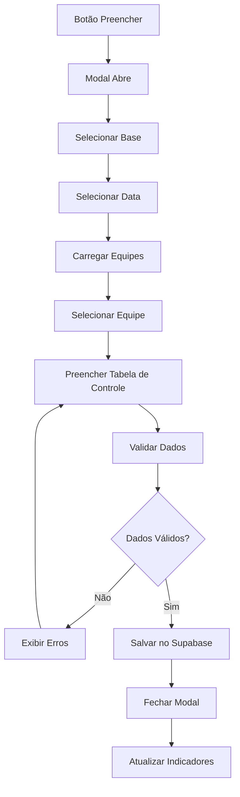

# PRD - Modal Controle de Agentes Extintores

## 1. Product Overview

Modal completo para registro e controle de agentes extintores, permitindo o gerenciamento de estoque atual e exigido de materiais de combate a incêndio (pó químico, LGE e nitrogênio) por equipe e base.

O sistema visa facilitar o controle de inventário de agentes extintores, garantindo que as equipes mantenham os níveis adequados de materiais de segurança conforme as exigências operacionais.

## 2. Core Features

### 2.1 User Roles

| Role | Registration Method | Core Permissions |
|------|---------------------|------------------|
| Usuário Autenticado | Login no sistema | Pode registrar dados de controle de agentes extintores para sua base/equipe |

### 2.2 Feature Module

O modal de Controle de Agentes Extintores consiste nas seguintes funcionalidades principais:

1. **Formulário Principal**: seleção de base, data e equipe para registro
2. **Tabela de Controle**: campos para estoque atual e exigido de materiais
3. **Sistema de Validação**: verificação de dados antes do salvamento
4. **Integração Supabase**: persistência dos dados na base de dados

### 2.3 Page Details

| Page Name | Module Name | Feature description |
|-----------|-------------|---------------------|
| Modal Principal | Formulário de Seleção | Dropdown para Base (carrega todas as bases disponíveis), campo Data (date picker DD/MM/AAAA com validação de data não futura), dropdown Equipe (carrega dinamicamente conforme base selecionada) |
| Modal Principal | Tabela de Controle | Campos numéricos para Quantidade de estoque atual pó químico (Kg), Quantidade de estoque atual LGE (Lts), Quantidade de estoque atual Nitrogênio (und), Quantidade exigida pó químico (Kg), Quantidade exigida LGE (Lts), Quantidade exigida Nitrogênio (und), campo texto para Observações |
| Modal Principal | Sistema de Ações | Botão Salvar (persiste dados no Supabase e fecha modal), Botão Cancelar (fecha modal sem salvar), Botão Fechar (X no cabeçalho) |
| Modal Principal | Validação de Dados | Validação de campos obrigatórios, validação de data não futura, validação de valores numéricos, feedback visual de erros |

## 3. Core Process

**Fluxo Principal do Usuário:**

1. Usuário clica no botão "Preencher" no card "Controle de Agentes Extintores"
2. Modal abre com fundo escurecido sobre o conteúdo existente
3. Usuário seleciona a Base no dropdown (carrega todas as bases disponíveis)
4. Usuário seleciona a Data usando o date picker (formato DD/MM/AAAA)
5. Sistema carrega dinamicamente as equipes disponíveis para a base selecionada
6. Usuário seleciona a Equipe no dropdown
7. Usuário preenche os campos da tabela de controle:
   - Estoque atual: pó químico (Kg), LGE (Lts), nitrogênio (und)
   - Quantidade exigida: pó químico (Kg), LGE (Lts), nitrogênio (und)
   - Observações (campo texto livre)
8. Sistema valida todos os campos obrigatórios e regras de negócio
9. Usuário clica em "Salvar" para persistir os dados ou "Cancelar" para descartar
10. Modal fecha e indicadores da página principal são atualizados

## 4. User Interface Design

### 4.1 Design Style

- **Cores Primárias**: #fa4b00 (laranja principal), #7a5b3e (marrom escuro)
- **Cores Secundárias**: #cdbdae (bege claro), branco (#ffffff)
- **Estilo de Botões**: Arredondados com hover effects e transições suaves
- **Fonte**: Sistema padrão com tamanhos variados (text-sm, text-lg, text-2xl)
- **Layout**: Modal centralizado com fundo escurecido, design responsivo
- **Ícones**: Lucide React icons para elementos visuais

### 4.2 Page Design Overview

| Page Name | Module Name | UI Elements |
|-----------|-------------|-------------|
| Modal Principal | Cabeçalho | Título "Controle de Agentes Extintores" em text-2xl font-semibold text-[#7a5b3e], botão fechar (X) com hover effects |
| Modal Principal | Formulário de Seleção | Grid responsivo com dropdowns estilizados, date picker com formato DD/MM/AAAA, labels com ícones Lucide |
| Modal Principal | Tabela de Controle | Tabela responsiva com bordas suaves, campos numéricos com validação, alternância de cores nas linhas, hover effects |
| Modal Principal | Botões de Ação | Botão Salvar em bg-[#fa4b00] com hover:bg-[#e63e00], Botão Cancelar em border-gray-300 com hover effects |
| Modal Principal | Sistema de Validação | Mensagens de erro em text-red-600, bordas vermelhas em campos inválidos, feedback visual imediato |

### 4.3 Responsiveness

O modal é projetado com abordagem mobile-first, adaptando-se automaticamente a diferentes tamanhos de tela. A tabela de controle utiliza overflow-x-auto para dispositivos menores, mantendo a usabilidade em tablets e smartphones. Todos os elementos possuem touch-friendly sizing para interação táctil otimizada.