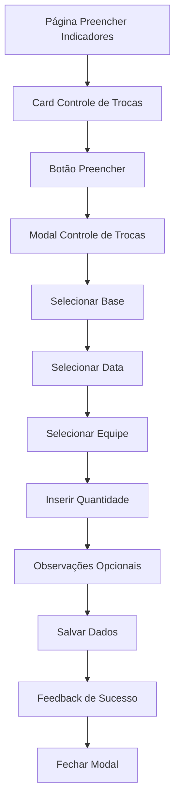

# PRD - Modal Controle de Trocas

## 1. Product Overview
Modal para registro e controle de trocas mensais por equipe, integrado à página "Preencher Indicadores" do sistema de gestão de indicadores.
- Permite o registro eficiente da quantidade de trocas realizadas por equipe em uma base específica, facilitando o controle e acompanhamento mensal.
- Destinado a gestores e operadores que precisam registrar dados de trocas para análise de performance e relatórios gerenciais.

## 2. Core Features

### 2.1 User Roles
| Role | Registration Method | Core Permissions |
|------|---------------------|------------------|
| Usuário Autenticado | Login no sistema | Pode registrar dados de controle de trocas para sua base/equipe |

### 2.2 Feature Module
Nosso modal de Controle de Trocas consiste das seguintes funcionalidades principais:
1. **Formulário de Registro**: seleção de base, data, equipe e quantidade de trocas.
2. **Validação de Dados**: verificação de campos obrigatórios e formato de dados.
3. **Persistência**: salvamento dos dados no Supabase com feedback visual.

### 2.3 Page Details
| Page Name | Module Name | Feature description |
|-----------|-------------|---------------------|
| Modal Controle de Trocas | Seleção de Base | Dropdown com todas as bases disponíveis no sistema |
| Modal Controle de Trocas | Campo de Data | Date picker formatado DD/MM/AAAA para seleção da data de referência |
| Modal Controle de Trocas | Seleção de Equipe | Dropdown dinâmico que carrega equipes baseado na base selecionada |
| Modal Controle de Trocas | Quantidade de Trocas | Campo numérico para inserir quantidade mensal de trocas da equipe |
| Modal Controle de Trocas | Observações | Campo de texto opcional para comentários adicionais |
| Modal Controle de Trocas | Botões de Ação | Salvar dados com validação e Cancelar para fechar modal |

## 3. Core Process
O usuário acessa a página "Preencher Indicadores", localiza o card "Controle de Trocas" e clica no botão "Preencher". O modal é aberto permitindo:
1. Seleção da base (obrigatório)
2. Seleção da data de referência (obrigatório)
3. Seleção da equipe baseada na base escolhida (obrigatório)
4. Preenchimento da quantidade de trocas mensais (obrigatório)
5. Preenchimento opcional de observações
6. Salvamento dos dados com validação e feedback visual

## 4. User Interface Design
### 4.1 Design Style
- **Cores primárias**: #7a5b3e (marrom principal), #fa4b00 (laranja de destaque)
- **Cores secundárias**: #cdbdae (bege claro), branco para fundos
- **Estilo de botões**: Arredondados com hover effects e transições suaves
- **Fonte**: Sistema padrão com tamanhos 14px (corpo), 16px (labels), 24px (título)
- **Layout**: Modal centralizado com formulário em coluna única, campos bem espaçados
- **Ícones**: Lucide React com estilo minimalista, ícone de troca/exchange para o título

### 4.2 Page Design Overview
| Page Name | Module Name | UI Elements |
|-----------|-------------|-------------|
| Modal Controle de Trocas | Cabeçalho | Título "Controle de Trocas" com ícone, botão X para fechar, fundo branco com borda inferior |
| Modal Controle de Trocas | Formulário Principal | Campos organizados verticalmente com labels em cinza escuro, inputs com borda cinza clara e focus laranja |
| Modal Controle de Trocas | Dropdown Base | Select estilizado com ícone de seta, opções com hover em cinza claro |
| Modal Controle de Trocas | Campo Data | Input tipo date com formatação DD/MM/AAAA, ícone de calendário |
| Modal Controle de Trocas | Dropdown Equipe | Select dinâmico habilitado após seleção de base, loading state quando carregando |
| Modal Controle de Trocas | Campo Quantidade | Input numérico com validação, placeholder indicativo |
| Modal Controle de Trocas | Campo Observações | Textarea redimensionável com placeholder, altura mínima 80px |
| Modal Controle de Trocas | Botões de Ação | Botão Salvar (laranja) e Cancelar (cinza), alinhados à direita, com estados de loading |

### 4.3 Responsiveness
Modal responsivo desktop-first com adaptação para mobile. Em telas menores, o modal ocupa 95% da largura com padding reduzido. Campos mantêm largura total em todas as resoluções. Touch-friendly com botões de tamanho adequado para interação móvel.