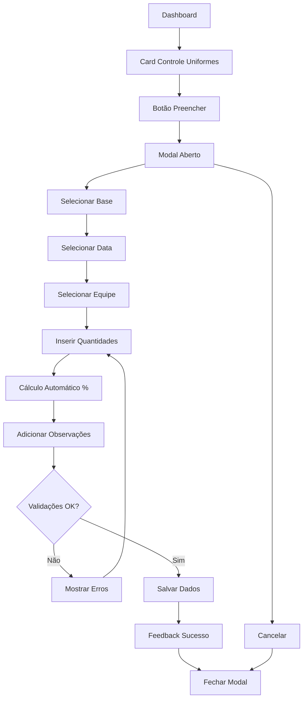

# PRD - Modal Controle de Uniformes Recebidos

## 1. Product Overview

Sistema de controle e registro de uniformes e EPIs recebidos pelas equipes operacionais, permitindo o acompanhamento da distribuição de equipamentos e cálculo automático de percentuais de entrega.

O modal facilita o registro padronizado das entregas de uniformes e EPIs, oferecendo visibilidade sobre o cumprimento das metas de distribuição por equipe e base operacional.

## 2. Core Features

### 2.1 User Roles

| Role | Registration Method | Core Permissions |
|------|---------------------|------------------|
| Usuário Operacional | Login com credenciais do sistema | Pode registrar entregas de uniformes e EPIs para sua base |
| Supervisor | Login com credenciais elevadas | Pode visualizar e registrar entregas para todas as bases |

### 2.2 Feature Module

O modal de Controle de Uniformes Recebidos consiste das seguintes funcionalidades principais:

1. **Formulário de Registro**: campos para entrada de dados de entrega de uniformes e EPIs
2. **Cálculos Automáticos**: porcentagens de entrega baseadas nos valores previstos vs entregues
3. **Validações**: verificação de consistência e formato dos dados inseridos
4. **Integração com Banco**: salvamento e recuperação de dados da tabela controle_uniformes_recebidos

### 2.3 Page Details

| Page Name | Module Name | Feature description |
|-----------|-------------|---------------------|
| Modal Principal | Formulário de Entrada | Campos para Base (dropdown), Data (calendário), Equipe (dropdown), quantidades de EPIs e uniformes entregues/previstos, observações |
| Modal Principal | Cálculos Automáticos | Calcula automaticamente porcentagem de EPIs entregues (epi_entregue/epi_previsto * 100) e porcentagem de uniformes entregues (uniforme_entregue/uniforme_previsto * 100) |
| Modal Principal | Validações em Tempo Real | Valida campos obrigatórios, formato de data, valores numéricos não negativos, consistência entre valores entregues ≤ previstos |
| Modal Principal | Controles de Ação | Botões "Salvar" para confirmar registro e "Cancelar" para fechar sem salvar |
| Modal Principal | Feedback Visual | Mensagens de sucesso após salvamento, indicadores de erro para campos inválidos, loading states durante operações |

## 3. Core Process

**Fluxo Principal do Usuário:**

1. Usuário acessa o dashboard e localiza o card "Controle de Uniformes Recebidos" na seção "Preencher Indicadores"
2. Clica no botão "Preencher" para abrir o modal
3. Seleciona a Base no dropdown (nome_cidade preenchido automaticamente)
4. Seleciona a Data usando o calendário (formato dd/mm/aaaa)
5. Escolhe a Equipe no dropdown (5 equipes pré-definidas)
6. Insere as quantidades numéricas: EPIs Entregues, EPIs Previstos, Uniformes Entregues, Uniformes Previstos
7. Sistema calcula automaticamente as porcentagens de entrega
8. Adiciona observações se necessário
9. Clica em "Salvar" para registrar os dados ou "Cancelar" para fechar
10. Recebe feedback visual de confirmação ou erro

## 4. User Interface Design

### 4.1 Design Style

- **Cores Primárias**: #7a5b3e (marrom principal), #fa4b00 (laranja de destaque)
- **Cores Secundárias**: #cdbdae (bege claro), tons de cinza para textos
- **Estilo de Botões**: Arredondados com gradientes sutis, efeitos hover e focus
- **Fontes**: Sistema padrão com tamanhos 14px (corpo), 16px (labels), 20px (título)
- **Layout**: Card-based com espaçamento generoso, grid responsivo 2 colunas
- **Ícones**: Lucide React com estilo minimalista, cores consistentes com o tema

### 4.2 Page Design Overview

| Page Name | Module Name | UI Elements |
|-----------|-------------|-------------|
| Modal Principal | Header | Título "Controle de Uniformes Recebidos" em #7a5b3e, botão X para fechar com hover em #fa4b00 |
| Modal Principal | Formulário Base | Dropdown estilizado com ícone de seta, placeholder "Selecione a base", validação visual |
| Modal Principal | Seletor Data | Input com ícone de calendário, máscara dd/mm/aaaa, datepicker integrado |
| Modal Principal | Dropdown Equipe | Lista das 5 equipes, estilo consistente com outros dropdowns |
| Modal Principal | Campos Numéricos | Inputs com validação visual, ícones de quantidade, formatação numérica |
| Modal Principal | Cálculos Automáticos | Badges com porcentagens em tempo real, cores baseadas no valor (verde >80%, amarelo 50-80%, vermelho <50%) |
| Modal Principal | Área Observações | Textarea expansível, contador de caracteres, placeholder informativo |
| Modal Principal | Botões Ação | "Salvar" em gradiente laranja-vermelho, "Cancelar" em cinza, estados loading e disabled |

### 4.3 Responsiveness

Modal desktop-first com adaptação mobile completa. Em telas menores, layout muda para coluna única, campos mantêm altura adequada para touch, botões ficam full-width. Otimização para navegação por teclado e leitores de tela com ARIA labels completos.