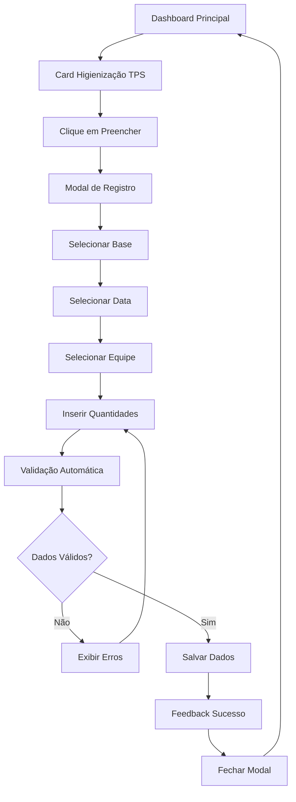

# PRD - Modal de Higienização de TPS

## 1. Product Overview

Sistema de registro e controle de higienização de Equipamentos de Proteção Individual (TPS) para bombeiros, permitindo o acompanhamento mensal da quantidade de equipamentos higienizados por equipe e base operacional.

O produto visa facilitar o controle de qualidade e manutenção dos equipamentos de segurança, garantindo que os bombeiros tenham acesso a equipamentos limpos e em condições adequadas de uso, contribuindo para a segurança operacional das equipes.

## 2. Core Features

### 2.1 User Roles

| Role | Registration Method | Core Permissions |
|------|---------------------|------------------|
| Bombeiro Operacional | Login com credenciais do sistema | Pode registrar higienização de TPS de sua base |
| Chefe de Equipe | Login com credenciais do sistema | Pode registrar e visualizar dados de sua equipe |
| Administrador | Login com credenciais administrativas | Acesso completo a todos os registros e relatórios |

### 2.2 Feature Module

Nosso sistema de higienização de TPS consiste das seguintes páginas principais:

1. **Dashboard Principal**: seção "Preencher Indicadores", card "Higienização de TPS"
2. **Modal de Registro**: formulário completo para registro de higienização
3. **Visualização de Dados**: histórico e relatórios de higienização

### 2.3 Page Details

| Page Name | Module Name | Feature description |
|-----------|-------------|---------------------|
| Dashboard Principal | Card Higienização TPS | Exibir card com título, descrição e botão "Preencher" para acesso ao modal |
| Modal de Registro | Formulário Base | Dropdown para seleção da base operacional com carregamento dinâmico |
| Modal de Registro | Formulário Data | Campo de data com seletor de calendário, formato dd/mm/aaaa, validação de data não futura |
| Modal de Registro | Formulário Equipe | Dropdown com 5 equipes pré-cadastradas filtradas por base selecionada |
| Modal de Registro | Campos Numéricos | Campos para quantidade de TPs higienizados e total com validação numérica |
| Modal de Registro | Validação | Validar campos obrigatórios, consistência (higienizados ≤ total), valores não negativos |
| Modal de Registro | Ações | Botões "Salvar" e "Cancelar" com feedback visual e tratamento de erros |
| Modal de Registro | Auditoria | Logs automáticos de todas as operações com timestamp e usuário |

## 3. Core Process

**Fluxo Principal do Usuário:**

1. Usuário acessa o dashboard e visualiza o card "Higienização de TPS"
2. Clica no botão "Preencher" para abrir o modal
3. Seleciona a base operacional no dropdown
4. Escolhe a data da higienização usando o seletor de calendário
5. Seleciona a equipe responsável no dropdown
6. Insere a quantidade de TPs higienizados no mês
7. Insere a quantidade total de TPs disponíveis
8. Sistema valida os dados em tempo real
9. Usuário clica em "Salvar" para confirmar o registro
10. Sistema exibe feedback de sucesso e fecha o modal
11. Dados são salvos na base de dados com informações de auditoria

## 4. User Interface Design

### 4.1 Design Style

- **Cores Primárias**: #7a5b3e (marrom principal), #fa4b00 (laranja de destaque)
- **Cores Secundárias**: #cdbdae (bege claro), branco para fundos
- **Estilo de Botões**: Arredondados com gradientes sutis, efeitos hover e focus
- **Fonte**: Sistema padrão com tamanhos 14px (corpo), 16px (labels), 24px (títulos)
- **Layout**: Card-based com modal centralizado, design responsivo
- **Ícones**: Lucide React com estilo minimalista, cores consistentes com o tema

### 4.2 Page Design Overview

| Page Name | Module Name | UI Elements |
|-----------|-------------|-------------|
| Dashboard Principal | Card Higienização TPS | Card com fundo branco, borda sutil #cdbdae/20, título em #7a5b3e, botão laranja #fa4b00 |
| Modal de Registro | Header Modal | Fundo gradiente #cdbdae/10, título #7a5b3e, botão fechar com hover #fa4b00 |
| Modal de Registro | Formulário Base | Dropdown estilizado com borda #cdbdae, focus ring #fa4b00, ícone de seta |
| Modal de Registro | Formulário Data | Input com ícone de calendário, seletor popup, validação visual em tempo real |
| Modal de Registro | Formulário Equipe | Dropdown similar à base, carregamento dinâmico com spinner |
| Modal de Registro | Campos Numéricos | Inputs numéricos com validação visual, bordas vermelhas para erros |
| Modal de Registro | Botões Ação | "Cancelar" em cinza, "Salvar" em #fa4b00 com loading spinner |
| Modal de Registro | Mensagens | Toast notifications para sucesso (verde) e erro (vermelho) |

### 4.3 Responsiveness

O modal é projetado com abordagem mobile-first, adaptando-se automaticamente a diferentes tamanhos de tela:
- Desktop: Modal centralizado com largura máxima de 600px
- Tablet: Modal ocupa 90% da largura com padding reduzido
- Mobile: Modal em tela cheia com navegação otimizada para touch
- Acessibilidade completa com navegação por teclado e leitores de tela