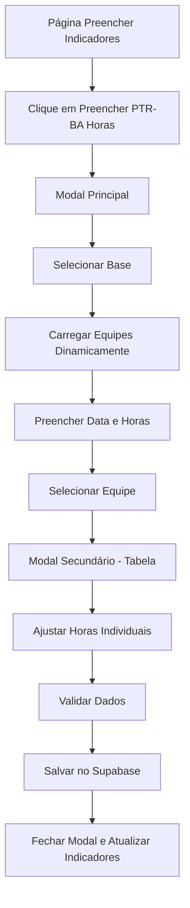

# PRD - Modal PTR-BA Horas de Treinamento

## 1. Product Overview

Sistema de registro de horas de treinamento PTR-BA que permite aos usuários registrar e gerenciar as horas de treinamento diário dos membros das equipes de diferentes bases aeroportuárias.

O produto resolve a necessidade de controle e documentação das horas de treinamento obrigatórias para certificação PTR-BA, oferecendo uma interface intuitiva para preenchimento em lote e histórico de registros por equipe e período.

## 2. Core Features

### 2.1 User Roles

| Role | Registration Method | Core Permissions |
|------|---------------------|------------------|
| Chefe de Equipe | Login com credenciais existentes | Pode registrar horas para sua equipe e visualizar histórico |
| Administrador BA-CE | Login com credenciais existentes | Pode registrar horas para qualquer equipe e gerenciar todos os registros |

### 2.2 Feature Module

Nosso sistema de horas de treinamento PTR-BA consiste nas seguintes páginas principais:

1. **Modal Principal**: seleção de base, data, equipe e horas de treinamento diário.
2. **Modal Secundário**: tabela de membros da equipe com horas pré-preenchidas para confirmação e ajustes.
3. **Histórico de Registros**: visualização dos registros anteriores por equipe e período.

### 2.3 Page Details

| Page Name | Module Name | Feature description |
|-----------|-------------|---------------------|
| Modal Principal | Formulário de Seleção | Selecionar base (dropdown), data (date picker DD/MM/AAAA), equipe (dropdown dinâmico baseado na base), hora de treinamento diário (campo numérico com step 0.5) |
| Modal Principal | Validação de Campos | Validar campos obrigatórios, horas positivas com máximo 2 casas decimais, data não futura |
| Modal Secundário | Tabela de Membros | Exibir tabela com nomes dos membros da equipe (auto-preenchido) e horas de treinamento (valor do campo principal) |
| Modal Secundário | Edição Individual | Permitir ajuste individual das horas por membro da equipe |
| Modal Secundário | Ações de Salvamento | Botões Salvar (persistir no Supabase) e Cancelar (fechar sem salvar) |
| Histórico | Visualização de Registros | Mostrar registros anteriores filtrados por equipe, data e mês de referência |
| Histórico | Prevenção de Duplicatas | Verificar e alertar sobre registros duplicados na mesma data/equipe |

## 3. Core Process

**Fluxo Principal do Usuário:**

1. Usuário acessa a página "Preencher indicadores"
2. Clica no botão "Preencher" do card "PTR-BA Horas de treinamento"
3. Modal principal abre com campos: Base, Data, Equipe, Hora de treinamento diário
4. Usuário seleciona a base → dropdown de equipes carrega dinamicamente
5. Usuário preenche data e hora de treinamento diário
6. Ao selecionar equipe → modal secundário abre com tabela de membros
7. Tabela mostra nomes dos membros com horas pré-preenchidas
8. Usuário pode ajustar horas individuais se necessário
9. Clica em "Salvar" → dados são persistidos no Supabase
10. Modal fecha e indicadores da página principal são atualizados

**Fluxo de Validação:**
- Sistema verifica se todos os campos obrigatórios estão preenchidos
- Valida se horas são positivas e têm máximo 2 casas decimais
- Confirma que data não é futura
- Verifica duplicatas na mesma data/equipe antes de salvar

## 4. User Interface Design

### 4.1 Design Style

- **Cores primárias**: #7a5b3e (marrom principal), #fa4b00 (laranja de destaque)
- **Cores secundárias**: #cdbdae (bege claro para bordas e fundos)
- **Estilo de botões**: Arredondados com gradientes sutis e efeitos hover
- **Fonte**: Sistema padrão com tamanhos 14px (corpo), 16px (labels), 20px (títulos)
- **Layout**: Modal centralizado com fundo escurecido, cards com sombras suaves
- **Ícones**: Lucide React com estilo minimalista e cores consistentes

### 4.2 Page Design Overview

| Page Name | Module Name | UI Elements |
|-----------|-------------|-------------|
| Modal Principal | Container Principal | Modal centralizado 600px largura, fundo branco, sombra suave, bordas arredondadas 12px |
| Modal Principal | Campos de Formulário | Dropdowns com estilo consistente, date picker formatado DD/MM/AAAA, campo numérico com step 0.5 |
| Modal Principal | Header | Título "PTR-BA - Horas de Treinamento", botão fechar (X) no canto superior direito |
| Modal Secundário | Tabela de Membros | Tabela responsiva com header fixo, linhas alternadas, colunas Nome e Horas de Treinamento |
| Modal Secundário | Campos Editáveis | Inputs numéricos inline para ajuste individual das horas |
| Modal Secundário | Botões de Ação | Botão "Salvar" (cor primária #fa4b00), botão "Cancelar" (cor secundária), alinhados à direita |
| Overlay | Fundo Escurecido | Background rgba(0,0,0,0.5) cobrindo toda a tela durante exibição dos modais |

### 4.3 Responsiveness

O produto é desktop-first com adaptação para tablets. Os modais se ajustam automaticamente para telas menores, mantendo usabilidade em dispositivos touch com botões e campos de tamanho adequado para interação por toque.