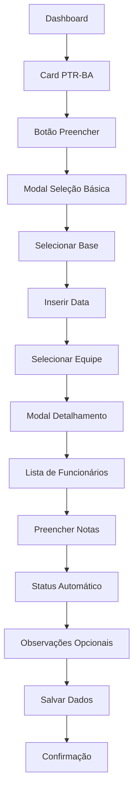

# PRD - Modal PTR-BA (Prova Teórica)

## 1. Product Overview
Sistema de modal para registro e gerenciamento de notas das provas teóricas PTR-BA, permitindo o preenchimento estruturado de dados de avaliação dos funcionários por equipe e base.

O produto visa digitalizar e padronizar o processo de registro de provas teóricas, facilitando o controle de aprovações/reprovações e justificativas de ausências, integrando-se ao sistema existente de indicadores.

## 2. Core Features

### 2.1 User Roles
Não há distinção de papéis específicos para este modal - todos os usuários autenticados com permissões adequadas podem utilizá-lo.

### 2.2 Feature Module
O modal PTR-BA consiste em duas etapas principais:
1. **Modal de Seleção Básica**: campos de configuração inicial (base, data, equipe)
2. **Modal de Detalhamento**: tabela de preenchimento de notas e observações por funcionário

### 2.3 Page Details

| Page Name | Module Name | Feature description |
|-----------|-------------|---------------------|
| Modal Seleção Básica | Campos de Configuração | Selecionar base através de dropdown, inserir data da prova no formato dd/mm/aaaa, escolher equipe através de dropdown com 5 opções cadastradas |
| Modal Detalhamento | Tabela de Funcionários | Exibir automaticamente lista de funcionários da equipe selecionada com campos para nota (0,0-10,0), status automático (Aprovado ≥8,0 / Reprovado ≤7,9), observações de texto livre |
| Modal Detalhamento | Sistema de Validação | Validar entrada numérica de notas no range 0,0-10,0, calcular automaticamente status baseado na nota, permitir observações para justificar ausências |
| Modal Detalhamento | Persistência de Dados | Salvar automaticamente dados na tabela ptr_ba_provas_teoricas incluindo nome_cidade, data_prova, nome_completo, nota_prova, status, observacoes |

## 3. Core Process

**Fluxo Principal do Usuário:**
1. Usuário acessa o card "PTR-BA - Prova Teórica" no dashboard
2. Clica no botão "Preencher" para abrir o primeiro modal
3. Seleciona a base correspondente (dropdown automático baseado na base do usuário)
4. Insere a data da prova no formato dd/mm/aaaa
5. Seleciona uma das 5 equipes cadastradas
6. Sistema abre automaticamente o segundo modal com a lista de funcionários
7. Para cada funcionário, usuário preenche a nota (0,0-10,0)
8. Sistema calcula automaticamente o status (Aprovado/Reprovado)
9. Usuário adiciona observações quando necessário (férias, atestado, recusa)
10. Confirma e salva os dados no sistema

## 4. User Interface Design

### 4.1 Design Style
- **Cores primárias**: #fa4b00 (laranja principal), #7a5b3e (marrom secundário)
- **Cores secundárias**: #cdbdae (bege claro), tons de cinza para backgrounds
- **Estilo de botões**: Arredondados com hover effects e transições suaves
- **Fonte**: Sistema padrão com tamanhos 12px-24px, peso medium/semibold para títulos
- **Layout**: Card-based com modais sobrepostos, navegação por etapas
- **Ícones**: Lucide React com estilo outline, cores consistentes com a paleta

### 4.2 Page Design Overview

| Page Name | Module Name | UI Elements |
|-----------|-------------|-------------|
| Modal Seleção Básica | Header | Título "PTR-BA - Prova Teórica" com ícone, botão X para fechar, fundo branco com sombra |
| Modal Seleção Básica | Campos de Entrada | Dropdown Base com ícone Building2, campo Data com ícone Calendar, dropdown Equipe com ícone Users, validação visual com bordas vermelhas |
| Modal Seleção Básica | Botões de Ação | Botão "Cancelar" cinza, botão "Continuar" laranja #fa4b00, estados disabled durante loading |
| Modal Detalhamento | Tabela de Funcionários | Header com fundo cinza claro, linhas alternadas branco/cinza, campos de nota com validação numérica, status com cores semafóricas |
| Modal Detalhamento | Campos de Status | Verde para Aprovado (≥8,0), vermelho para Reprovado (≤7,9), badges arredondados com bordas |
| Modal Detalhamento | Observações | Textarea expansível, placeholder explicativo, foco com borda laranja, resize vertical |

### 4.3 Responsividade
Desktop-first com adaptação mobile, otimização para touch em tablets, tabela com scroll horizontal em telas pequenas, campos empilhados verticalmente em mobile.