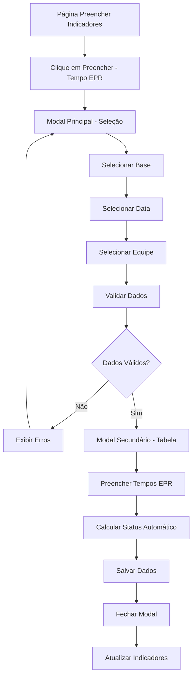

# PRD - Modal Tempo EPR

## 1. Product Overview

Sistema de registro e controle de tempos de EPR (Equipamento de Proteção Respiratória) para funcionários organizados por equipes e bases operacionais.

- O produto permite o registro eficiente dos tempos de colocação de EPR por equipe, com cálculo automático de status de desempenho baseado em critérios técnicos estabelecidos.
- Destinado a supervisores e chefes de equipe que precisam monitorar e registrar o desempenho da equipe em exercícios de EPR.
- O sistema contribui para o controle de qualidade e segurança operacional através do acompanhamento sistemático dos tempos de resposta.

## 2. Core Features

### 2.1 User Roles

| Role | Registration Method | Core Permissions |
|------|---------------------|------------------|
| Usuário Autenticado | Login no sistema | Pode registrar tempos de EPR para equipes sob sua responsabilidade |
| Supervisor | Acesso via perfil | Pode visualizar e registrar dados de múltiplas equipes |

### 2.2 Feature Module

Nossos requisitos do modal Tempo EPR consistem nas seguintes páginas principais:

1. **Modal Principal**: Seleção de base, data e equipe para registro de tempos de EPR.
2. **Modal Secundário**: Tabela de funcionários com campos para tempo de EPR e status automático.

### 2.3 Page Details

| Page Name | Module Name | Feature description |
|-----------|-------------|---------------------|
| Modal Principal | Seleção de Parâmetros | Selecionar base (dropdown), data (date picker DD/MM/AAAA), equipe (dropdown dinâmico baseado na base) |
| Modal Principal | Validação de Dados | Validar campos obrigatórios, data não futura, verificar duplicatas |
| Modal Secundário | Tabela de Funcionários | Exibir lista de membros da equipe com campos editáveis para tempo EPR |
| Modal Secundário | Cálculo de Status | Calcular automaticamente status (Ideal/Tolerável/Reprovado) baseado no tempo inserido |
| Modal Secundário | Ações de Salvamento | Salvar dados no Supabase, fechar modal, atualizar indicadores |

## 3. Core Process

### Fluxo Principal do Usuário

1. **Acesso ao Modal**: Usuário clica no botão "Preencher" no card "Tempo EPR" na página "Preencher indicadores"
2. **Seleção de Parâmetros**: Usuário seleciona Base, Data e Equipe no modal principal
3. **Validação Inicial**: Sistema valida campos obrigatórios e verifica duplicatas
4. **Exibição da Tabela**: Sistema carrega funcionários da equipe e exibe tabela para preenchimento
5. **Preenchimento de Tempos**: Usuário insere tempos de EPR no formato MM:SS para cada funcionário
6. **Cálculo Automático**: Sistema calcula status automaticamente baseado nas regras estabelecidas
7. **Salvamento**: Usuário salva dados, sistema persiste no Supabase e atualiza indicadores

## 4. User Interface Design

### 4.1 Design Style

- **Cores primárias**: #7a5b3e (marrom principal), #fa4b00 (laranja destaque)
- **Cores secundárias**: #cdbdae (bege claro), #f8f9fa (cinza claro)
- **Estilo de botões**: Rounded corners (rounded-lg), efeitos hover suaves
- **Fontes**: Sistema padrão com font-medium para títulos, text-sm para conteúdo
- **Layout**: Card-based com modal overlay, navegação em duas etapas
- **Ícones**: Lucide React icons (Clock, Building2, Calendar, Users, Timer)

### 4.2 Page Design Overview

| Page Name | Module Name | UI Elements |
|-----------|-------------|-------------|
| Modal Principal | Container | Fundo escurecido (bg-black/50), modal centralizado com rounded-2xl, shadow-2xl |
| Modal Principal | Cabeçalho | Ícone Clock, título "Tempo EPR", alerta com ícone AlertTriangle |
| Modal Principal | Formulário | Grid responsivo com dropdowns estilizados, date picker, validação visual |
| Modal Secundário | Tabela | Estrutura idêntica ao modal TAF: bg-white, border-gray-200, hover effects |
| Modal Secundário | Campos de Tempo | Input MM:SS com validação, cálculo automático de status |
| Modal Secundário | Status Visual | Badges coloridos: verde (Ideal), amarelo (Tolerável), vermelho (Reprovado) |

### 4.3 Responsiveness

O produto é desktop-first com adaptação mobile completa. Inclui otimização para touch interaction em dispositivos móveis, com tabelas responsivas usando overflow-x-auto e breakpoints adequados para diferentes resoluções de tela.

## 5. Validações e Regras de Negócio

### 5.1 Validações de Entrada

- **Base**: Campo obrigatório, deve ser selecionada uma base válida
- **Data**: Campo obrigatório, não pode ser futura, formato DD/MM/AAAA
- **Equipe**: Campo obrigatório, deve pertencer à base selecionada
- **Tempo EPR**: Formato MM:SS obrigatório, valores válidos de 00:00 a 59:59

### 5.2 Regras de Status Automático

- **Status "Ideal"**: Tempo até 00:00:50
- **Status "Tolerável"**: Tempo de 00:00:51 até 00:01:00  
- **Status "Reprovado"**: Tempo acima de 00:01:01

### 5.3 Prevenção de Duplicatas

- Verificar se já existem registros para a mesma data e equipe
- Exibir mensagem de erro caso encontre duplicatas
- Permitir sobrescrita apenas com confirmação explícita

## 6. Integração e Persistência

### 6.1 Estrutura de Dados

**Tabela**: `tempo_epr`

| Coluna | Tipo | Descrição |
|--------|------|-----------|
| nome_cidade | TEXT | Nome da base/cidade selecionada |
| data_exercicio_epr | DATE | Data do exercício de EPR |
| nome_completo | TEXT | Nome completo do funcionário |
| tempo_epr | TEXT | Tempo no formato MM:SS |
| status | TEXT | Status calculado (Ideal/Tolerável/Reprovado) |

### 6.2 Comportamento Pós-Salvamento

- Fechar modal automaticamente após salvamento bem-sucedido
- Atualizar indicadores na página principal
- Exibir toast de confirmação
- Limpar formulário para próximo uso