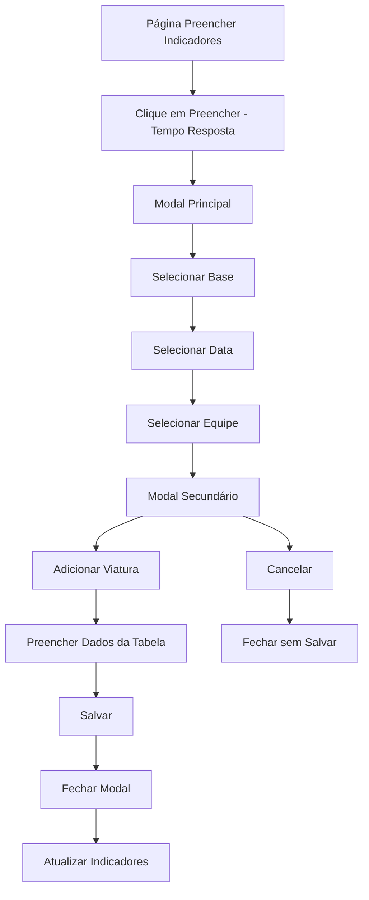

# PRD - Modal de Registro de Tempo Resposta

## 1. Product Overview
Sistema de registro e controle de tempos de resposta para equipes de bombeiros aeroportuários, permitindo o cadastro detalhado de exercícios de tempo resposta com múltiplas viaturas e integrantes por equipe.

O produto visa facilitar o controle e monitoramento dos tempos de resposta das equipes, fornecendo dados precisos para análise de performance e cumprimento de normas operacionais.

## 2. Core Features

### 2.1 User Roles
| Role | Registration Method | Core Permissions |
|------|---------------------|------------------|
| Usuário Autenticado | Login no sistema | Pode registrar tempos de resposta para sua base/equipe |
| Administrador | Acesso administrativo | Pode visualizar e gerenciar todos os registros |

### 2.2 Feature Module
Nossos requisitos do modal de Tempo Resposta consistem nas seguintes páginas principais:

1. **Modal Principal**: Seleção de base, data e equipe para o exercício
2. **Modal Secundário**: Tabela de registro detalhado com múltiplas viaturas e integrantes

### 2.3 Page Details
| Page Name | Module Name | Feature description |
|-----------|-------------|---------------------|
| Modal Principal | Formulário Base | Selecionar base (dropdown), data do exercício (date picker DD/MM/AAAA), equipe (dropdown dinâmico baseado na base selecionada) |
| Modal Principal | Validação | Validar campos obrigatórios, impedir datas futuras, carregar equipes dinamicamente |
| Modal Secundário | Gerenciamento Viaturas | Botão "Adicionar Viatura" para incluir múltiplas entradas na tabela |
| Modal Secundário | Tabela Registro | Colunas: Nome do BA-MC (dropdown com integrantes), Local posicionamento (texto), CCI utilizado (texto), Tempo aferido (HH:MM:SS), Observações (texto) |
| Modal Secundário | Ações | Botões "Salvar" (persistir no Supabase) e "Cancelar" (fechar sem salvar) |

## 3. Core Process
**Fluxo Principal do Usuário:**
1. Usuário clica no botão "Preencher" no card "Tempo Resposta" na página "Preencher indicadores"
2. Modal principal abre com campos Base, Data e Equipe
3. Usuário seleciona base (carrega equipes automaticamente)
4. Usuário seleciona data (validação de data não futura)
5. Usuário seleciona equipe (abre modal secundário)
6. Modal secundário exibe tabela para registro detalhado
7. Usuário clica "Adicionar Viatura" para incluir novas linhas
8. Usuário preenche dados: BA-MC, Local, CCI, Tempo, Observações
9. Usuário clica "Salvar" (dados persistidos no Supabase)
10. Modal fecha e indicadores são atualizados

## 4. User Interface Design

### 4.1 Design Style
- **Cores primárias**: #7a5b3e (marrom principal), #fa4b00 (laranja de destaque)
- **Cores secundárias**: #cdbdae (bege claro), tons de cinza para texto
- **Estilo de botões**: Arredondados com gradientes sutis e efeitos hover
- **Fonte**: Sistema padrão com tamanhos hierárquicos (2xl para títulos, base para texto)
- **Layout**: Modal centralizado com fundo escurecido, design de cards
- **Ícones**: Lucide React com estilo minimalista

### 4.2 Page Design Overview
| Page Name | Module Name | UI Elements |
|-----------|-------------|-------------|
| Modal Principal | Container | Fundo escurecido, modal centralizado max-w-6xl, sombras suaves, bordas arredondadas |
| Modal Principal | Cabeçalho | Título "Tempo Resposta", botão fechar com ícone X, gradiente sutil |
| Modal Principal | Formulário | Dropdowns estilizados, date picker formatado, labels claras, validação visual |
| Modal Secundário | Tabela | Estrutura idêntica ao PTR-BA, cabeçalho fixo, linhas alternadas, inputs integrados |
| Modal Secundário | Ações | Botão "Adicionar Viatura" destacado, "Salvar" e "Cancelar" com cores diferenciadas |

### 4.3 Responsiveness
Desktop-first com adaptação para tablets e mobile. Tabela com scroll horizontal em telas menores. Modal ajusta altura automaticamente mantendo usabilidade em dispositivos touch.