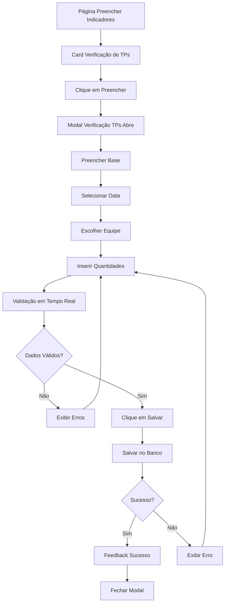

# PRD - Modal de Verificação de TPs

## 1. Product Overview

O Modal de Verificação de TPs é um componente essencial do sistema de gestão de indicadores que permite aos usuários registrar e acompanhar dados de verificação de Termos de Posse (TPs) de forma estruturada e eficiente.

- Facilita o registro padronizado de dados de verificação de TPs por equipe e base operacional
- Integra-se ao fluxo de trabalho existente na seção "Preencher Indicadores" para coleta sistemática de dados

## 2. Core Features

### 2.1 User Roles

| Role | Registration Method | Core Permissions |
|------|---------------------|------------------|
| Usuário Autenticado | Login via sistema existente | Pode preencher e visualizar dados de verificação de TPs da sua base |
| Gestor | Acesso via perfil administrativo | Pode visualizar dados de todas as bases e gerar relatórios |

### 2.2 Feature Module

O modal de Verificação de TPs consiste nos seguintes módulos principais:

1. **Interface do Modal**: formulário de entrada de dados, validações em tempo real, feedback visual
2. **Integração de Dados**: conexão com tabela verificacao_tps, preenchimento automático de campos
3. **Sistema de Validação**: validação de campos obrigatórios, consistência de dados, formato de entrada

### 2.3 Page Details

| Page Name | Module Name | Feature description |
|-----------|-------------|---------------------|
| Preencher Indicadores | Card Verificação de TPs | Exibe botão "Preencher" que aciona o modal de entrada de dados |
| Modal Verificação TPs | Formulário Principal | Coleta dados: Base, Data, Equipe, TPs conformes, verificados e total |
| Modal Verificação TPs | Sistema de Validação | Valida campos obrigatórios, formato de data, valores numéricos e consistência |
| Modal Verificação TPs | Controles de Ação | Botões "Salvar" e "Cancelar" com feedback visual e tratamento de erros |

## 3. Core Process

### Fluxo Principal do Usuário

1. **Acesso ao Modal**: Usuário navega para "Preencher Indicadores" → Localiza card "Verificação de TPs" → Clica em "Preencher"
2. **Preenchimento de Dados**: Seleciona Base (dropdown) → Escolhe Data (calendário) → Seleciona Equipe → Insere quantidades numéricas
3. **Validação e Submissão**: Sistema valida dados em tempo real → Usuário clica "Salvar" → Confirmação de sucesso ou exibição de erros
4. **Finalização**: Modal fecha automaticamente após sucesso ou permanece aberto para correções

## 4. User Interface Design

### 4.1 Design Style

- **Cores Primárias**: Azul (#3B82F6) para botões principais, Verde (#10B981) para sucesso
- **Cores Secundárias**: Cinza (#6B7280) para textos secundários, Vermelho (#EF4444) para erros
- **Estilo de Botões**: Arredondados (border-radius: 8px) com efeitos hover e focus
- **Tipografia**: Inter ou system fonts, tamanhos 14px (corpo), 16px (labels), 18px (título)
- **Layout**: Modal centralizado com overlay, design card-based com espaçamento consistente
- **Ícones**: Lucide React para calendário, dropdown arrows e estados de validação

### 4.2 Page Design Overview

| Page Name | Module Name | UI Elements |
|-----------|-------------|-------------|
| Modal Verificação TPs | Header | Título "Verificação de TPs", botão X para fechar, ícone representativo |
| Modal Verificação TPs | Formulário Base | Dropdown com ícone de localização, label "Base", validação visual |
| Modal Verificação TPs | Seletor Data | Input com ícone de calendário, formato dd/mm/aaaa, datepicker integrado |
| Modal Verificação TPs | Dropdown Equipe | Lista das 5 equipes, ícone de grupo, seleção única obrigatória |
| Modal Verificação TPs | Campos Numéricos | 3 inputs para TPs (conformes, verificados, total), validação em tempo real |
| Modal Verificação TPs | Controles Ação | Botão "Cancelar" (secundário), "Salvar" (primário), loading states |
| Modal Verificação TPs | Feedback | Toast notifications, indicadores de erro inline, mensagens de sucesso |

### 4.3 Responsiveness

- **Desktop-first** com adaptação para tablets (768px+) e mobile (320px+)
- **Touch-friendly**: Botões com área mínima de 44px, dropdowns otimizados para toque
- **Navegação por teclado**: Tab order lógico, Enter para submissão, Escape para cancelar
- **Acessibilidade**: ARIA labels, roles adequados, contraste WCAG AA, screen reader support

## 5. Validações e Regras de Negócio

### 5.1 Validações de Campo

- **Base**: Seleção obrigatória de uma base válida do sistema
- **Data**: Formato dd/mm/aaaa, data não futura, não anterior a 1 ano
- **Equipe**: Seleção obrigatória de uma das 5 equipes cadastradas
- **TPs Conformes**: Número inteiro ≥ 0, ≤ TPs Verificados
- **TPs Verificados**: Número inteiro ≥ 0, ≤ TPs Total
- **TPs Total**: Número inteiro > 0, valor máximo configurável

### 5.2 Validações de Consistência

- TPs Conformes ≤ TPs Verificados ≤ TPs Total
- Não permitir duplicação de registros (mesma base, data e equipe)
- Validação de permissões por base do usuário logado

### 5.3 Tratamento de Erros

- Mensagens de erro contextuais e específicas por campo
- Highlight visual de campos com erro (borda vermelha)
- Prevenção de submissão com dados inválidos
- Retry automático para falhas de conectividade
- Log de auditoria para todas as tentativas de submissão