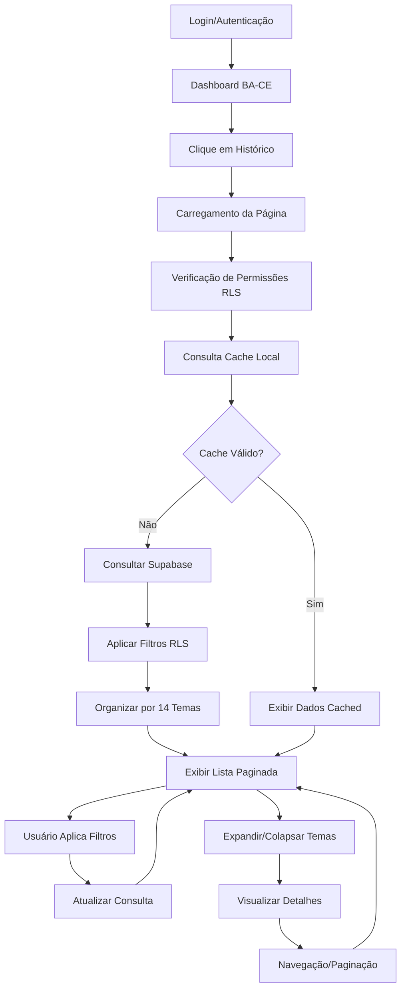
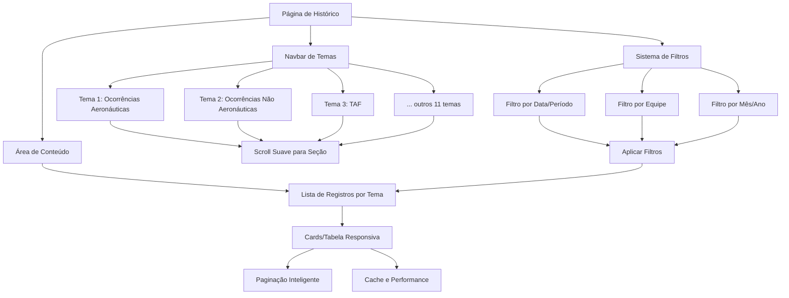

# PRD - Página de Histórico de Indicadores

## 1. Product Overview

A Página de Histórico de Indicadores é uma funcionalidade essencial que permite aos usuários BA-CE visualizar, filtrar e analisar todos os indicadores preenchidos organizados pelos 14 temas existentes no sistema. Esta página oferece uma visão consolidada e histórica de todos os dados inseridos, mantendo as regras de segurança e isolamento por seção implementadas no sistema.

A página resolve o problema de consulta e análise histórica de dados, permitindo que os usuários acompanhem tendências, verifiquem preenchimentos anteriores e tenham uma visão completa de suas atividades operacionais ao longo do tempo.

O objetivo é proporcionar uma experiência de consulta eficiente e organizada, com performance otimizada e interface intuitiva que mantenha a consistência visual do sistema existente.

## 2. Core Features

### 2.1 User Roles

| Role | Registration Method | Core Permissions |
|------|---------------------|------------------|
| BA-CE (Bombeiro Aeródromo - Chefe de Equipe) | Cadastro via sistema existente | Pode visualizar histórico completo da sua seção, aplicar filtros e exportar dados |

### 2.2 Feature Module

Nossa página de histórico de indicadores consiste das seguintes funcionalidades principais:

1. **Página Principal de Histórico**: navbar de temas, filtros de busca, lista de indicadores organizados por tema, paginação.
2. **Navbar de Navegação por Temas**: navegação horizontal com os 14 temas, indicador visual do tema ativo, contadores de registros.
3. **Visualização por Tema**: agrupamento dos 14 temas, exibição de dados específicos com scroll suave.
4. **Sistema de Filtros**: filtros por data, equipe, mês/ano com interface intuitiva, mantidos ao trocar de tema.
5. **Cache e Performance**: sistema de cache inteligente, carregamento otimizado, atualizações em tempo real.

### 2.3 Page Details

| Page Name | Module Name | Feature description |
|-----------|-------------|---------------------|
| Página de Histórico | Navbar de Temas | Navegação horizontal com 14 temas, indicador visual do tema ativo, contadores de registros, ícones representativos |
| Página de Histórico | Sistema de Filtros | Implementar filtros por data/período, equipe, mês/ano com interface intuitiva, mantidos ao trocar de tema |
| Página de Histórico | Lista de Indicadores | Exibir todos os indicadores preenchidos organizados pelos 14 temas com paginação e scroll suave |
| Página de Histórico | Visualização por Tema | Agrupar indicadores por tema com navegação rápida, expansão/colapso, contadores de registros |
| Página de Histórico | Cache e Performance | Sistema de cache inteligente, consultas otimizadas, atualizações em tempo real |
| Página de Histórico | Controle de Acesso | Verificação de permissões RLS, isolamento por seção do usuário |

## 3. Core Process

### Fluxo Principal do Usuário BA-CE:

O usuário BA-CE acessa o sistema através da autenticação existente, navega até a seção "Histórico" através do menu lateral, e visualiza automaticamente todos os indicadores preenchidos da sua seção organizados pelos 14 temas. O usuário pode aplicar filtros específicos (data, equipe, mês/ano) para refinar a busca, expandir/colapsar seções de temas para visualizar detalhes, e navegar através da paginação para acessar registros históricos. O sistema mantém o cache dos dados consultados e atualiza automaticamente quando novos indicadores são preenchidos.

## 4. Navbar de Navegação por Temas

### 4.1 Estrutura da Navbar
A navbar será o elemento central de navegação da página de histórico, permitindo acesso rápido aos 14 temas de indicadores:

**Layout e Posicionamento:**
- Navbar horizontal fixa no topo da área de conteúdo
- Scroll horizontal suave quando necessário em telas menores
- Altura de 60px com design clean e moderno
- Sombra sutil para destacar do conteúdo principal

### 4.2 Os 14 Temas da Navbar
Cada tema terá seu próprio botão na navbar com as seguintes características:

| # | Tema | Ícone Sugerido | Estado Inativo | Estado Ativo | Badge Contador |
|---|------|----------------|----------------|--------------|----------------|
| 1 | Ocorrências Aeronáuticas | ✈️ Plane | Texto cinza (#1f1f1f/80) | Fundo laranja (#ff6600), texto branco | Fundo cinza (#f3f4f6), texto escuro |
| 2 | Ocorrências Não Aeronáuticas | 🚨 AlertTriangle | Texto cinza (#1f1f1f/80) | Fundo laranja (#ff6600), texto branco | Fundo cinza (#f3f4f6), texto escuro |
| 3 | TAF (Previsões Meteorológicas) | 🌤️ Cloud | Texto cinza (#1f1f1f/80) | Fundo laranja (#ff6600), texto branco | Fundo cinza (#f3f4f6), texto escuro |
| 4 | PTR-BA - Prova Teórica | 📝 FileText | Texto cinza (#1f1f1f/80) | Fundo laranja (#ff6600), texto branco | Fundo cinza (#f3f4f6), texto escuro |
| 5 | PTR-BA - Horas de Treinamento | ⏱️ Clock | Texto cinza (#1f1f1f/80) | Fundo laranja (#ff6600), texto branco | Fundo cinza (#f3f4f6), texto escuro |
| 6 | Inspeções de Viaturas | 🚗 Truck | Texto cinza (#1f1f1f/80) | Fundo laranja (#ff6600), texto branco | Fundo cinza (#f3f4f6), texto escuro |
| 7 | Tempo EPR | ⏰ Timer | Texto cinza (#1f1f1f/80) | Fundo laranja (#ff6600), texto branco | Fundo cinza (#f3f4f6), texto escuro |
| 8 | Tempo Resposta | ⚡ Zap | Texto cinza (#1f1f1f/80) | Fundo laranja (#ff6600), texto branco | Fundo cinza (#f3f4f6), texto escuro |
| 9 | Controle de Agentes Extintores | 🧯 Shield | Texto cinza (#1f1f1f/80) | Fundo laranja (#ff6600), texto branco | Fundo cinza (#f3f4f6), texto escuro |
| 10 | Controle de Trocas | 🔄 RefreshCw | Texto cinza (#1f1f1f/80) | Fundo laranja (#ff6600), texto branco | Fundo cinza (#f3f4f6), texto escuro |
| 11 | Verificação de TPS | ✅ CheckCircle | Texto cinza (#1f1f1f/80) | Fundo laranja (#ff6600), texto branco | Fundo cinza (#f3f4f6), texto escuro |
| 12 | Higienização de TPS | 🧼 Droplets | Texto cinza (#1f1f1f/80) | Fundo laranja (#ff6600), texto branco | Fundo cinza (#f3f4f6), texto escuro |
| 13 | Controle de Uniformes Recebidos | 👕 Package | Texto cinza (#1f1f1f/80) | Fundo laranja (#ff6600), texto branco | Fundo cinza (#f3f4f6), texto escuro |
| 14 | Atividades Acessórias | 📋 Clipboard | Texto cinza (#1f1f1f/80) | Fundo laranja (#ff6600), texto branco | Fundo cinza (#f3f4f6), texto escuro |

### 4.3 Funcionalidades da Navbar

**Navegação e Interação:**
- Clique em um tema rola suavemente até a seção correspondente
- Tema ativo destacado com cor de fundo e borda
- Hover effects com transições suaves (300ms)
- Contador de registros exibido em badge no canto superior direito de cada botão

**Estados Visuais:**
- **Ativo**: Fundo laranja (#ff6600), texto branco, ícone destacado
- **Hover**: Fundo laranja claro (orange-50/50), elevação sutil
- **Inativo**: Fundo branco, texto cinza (#1f1f1f/80), ícone em tom cinza
- **Loading**: Skeleton loading cinza ou spinner discreto

**Responsividade:**
- Desktop: Todos os 14 temas visíveis horizontalmente
- Tablet: Scroll horizontal com indicadores de mais conteúdo
- Mobile: Dropdown compacto ou scroll horizontal otimizado

### 4.4 Comportamentos Especiais

**Persistência de Estado:**
- Filtros aplicados mantidos ao trocar de tema
- Posição de scroll preservada ao retornar a um tema
- Tema ativo salvo no localStorage para sessões futuras

**Indicadores Visuais:**
- Badge com número de registros por tema
- Indicador de "novo conteúdo" quando há registros recentes
- Loading state durante carregamento de dados
- Estado vazio quando não há registros para o tema

**Agrupamento Lógico:**
- Temas relacionados podem ter cores similares
- Separadores visuais entre grupos de temas
- Tooltips explicativos para cada tema

## 5. User Interface Design
### 5.1 Design Style

- **Cores Primárias**: 
  - Laranja principal: #ff6600 (elementos ativos, botões primários)
  - Branco: #ffffff (backgrounds principais)
  - Cinza claro: #f3f4f6 (backgrounds secundários)
  - Cinza médio: #e5e7eb (borders e divisores)
  - Cinza escuro: #1f1f1f (textos principais)
  - Cinza texto: #1f1f1f/80 (textos secundários)
- **Estilo de Botões**: Rounded corners (8px), hover states suaves, ícones Lucide React
- **Fonte**: Sistema padrão (Inter/system fonts), tamanhos 12px-24px conforme hierarquia
- **Layout**: Card-based design, sidebar fixa 64px, header laranja, espaçamento consistente 16px/24px
- **Ícones**: Lucide React icons, FileText para histórico, Filter para filtros, Calendar para datas

### 5.2 Page Design Overview

| Page Name | Module Name | UI Elements |
|-----------|-------------|-------------|
| Página de Histórico | Navbar de Temas | Barra horizontal fixa (60px altura), fundo branco (#ffffff), 14 botões com ícones cinza/laranja, badges cinza (#f3f4f6), scroll horizontal suave, sombra sutil cinza |
| Página de Histórico | Sistema de Filtros | Barra horizontal com seletores dropdown estilizados, botões laranja (#ff6600) com texto branco, borders cinza (#e5e7eb), layout responsivo, mantidos ao trocar tema |
| Página de Histórico | Visualização por Tema | Cards expansíveis com headers brancos, borders cinza (#e5e7eb), ícones cinza/laranja, contadores em badges cinza (#f3f4f6), animações suaves, scroll suave entre seções |
| Página de Histórico | Lista de Registros | Cards com fundo branco, sombra sutil cinza, tipografia cinza escuro (#1f1f1f), hover effects laranja suave, paginação com botões laranja |
| Página de Histórico | Estados Especiais | Loading skeletons cinza (#f3f4f6), estados vazios com ilustrações cinza, indicadores laranja para "novo conteúdo", tooltips com fundo cinza escuro |

### 5.3 Responsiveness
A página de histórico será totalmente responsiva com design mobile-first:

**Navbar de Temas:**
- **Desktop (1200px+)**: Todos os 14 temas visíveis horizontalmente, hover effects completos
- **Tablet (768px-1199px)**: Scroll horizontal suave com indicadores de mais conteúdo
- **Mobile (320px-767px)**: Dropdown compacto ou scroll horizontal otimizado com swipe

**Layout Geral:**
- **Desktop**: Layout completo com sidebar, navbar fixa, filtros horizontais, grid de 3 colunas para registros
- **Tablet**: Sidebar colapsável, navbar responsiva, filtros empilhados, grid de 2 colunas
- **Mobile**: Menu hambúrguer, navbar compacta, filtros em modal, lista vertical de registros