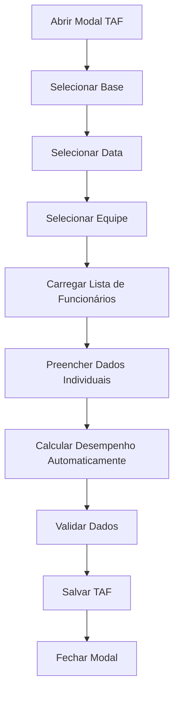

# Documento de Requisitos de Produto - Modal TAF

## 1. Visão Geral do Produto
Modal para registro e avaliação do TAF (Teste de Aptidão Física) dos bombeiros aeronáuticos, seguindo o padrão visual e funcional dos modais existentes no sistema. O modal permite o cadastro de resultados de testes físicos com cálculo automático de desempenho baseado em critérios de idade e tempo.

## 2. Funcionalidades Principais

### 2.1 Papéis de Usuário
| Papel | Método de Acesso | Permissões Principais |
|-------|------------------|----------------------|
| Gestor/Supervisor | Acesso através do dashboard | Pode registrar e visualizar resultados de TAF de todas as equipes |

### 2.2 Módulo de Funcionalidades
O modal TAF consiste das seguintes seções principais:
1. **Cabeçalho**: Título "TAF" com alerta informativo
2. **Formulário de Dados Básicos**: Seleção de base, data e equipe
3. **Lista de Funcionários**: Avaliação individual de cada membro da equipe selecionada

### 2.3 Detalhes das Páginas

| Nome da Página | Nome do Módulo | Descrição da Funcionalidade |
|----------------|----------------|----------------------------|
| Modal TAF | Cabeçalho | Exibir título "TAF" e alerta "Deve ser preenchido sempre que realizado." |
| Modal TAF | Seleção de Base | Dropdown para seleção da base correspondente pelo BA-ce |
| Modal TAF | Seleção de Data | Campo de data no formato dd/mm/aaaa para registro da ocorrência |
| Modal TAF | Seleção de Equipe | Dropdown com as equipes cadastradas para a base selecionada |
| Modal TAF | Lista de Funcionários | Exibir funcionários da equipe com campos para avaliação individual |
| Modal TAF | Avaliação Individual | Campos para idade, tempo total, desempenho calculado e observações |
| Modal TAF | Cálculo de Desempenho | Calcular automaticamente nota baseada na idade e tempo registrado |
| Modal TAF | Validação de Dados | Validar campos obrigatórios e regras de negócio |
| Modal TAF | Salvamento | Persistir dados do TAF no banco de dados |

## 3. Processo Principal

### Fluxo de Uso do Modal TAF:
1. Usuário acessa o modal TAF através do dashboard
2. Sistema exibe cabeçalho com título e alerta informativo
3. Usuário seleciona a base desejada no dropdown
4. Usuário seleciona a data do teste no formato dd/mm/aaaa
5. Usuário seleciona a equipe no dropdown (carregado baseado na base)
6. Sistema exibe lista de funcionários da equipe selecionada
7. Para cada funcionário, usuário preenche:
   - Idade (campo numérico obrigatório)
   - Tempo total no formato HH:MM:SS
   - Observações (opcional, obrigatório quando não realizado)
8. Sistema calcula automaticamente o desempenho baseado na idade e tempo
9. Usuário salva os dados
10. Sistema valida e persiste as informações

## 4. Design da Interface do Usuário

### 4.1 Estilo de Design
- **Cores primárias**: #fa4b00 (laranja principal), cores secundárias seguindo o padrão do sistema
- **Estilo de botões**: Arredondados com foco ring laranja, estados de loading com spinner
- **Fonte**: Fonte padrão do sistema com tamanhos variados (text-sm, text-base)
- **Estilo de layout**: Modal centralizado com backdrop blur, cards para seções, campos com bordas arredondadas
- **Ícones**: Lucide React icons para consistência visual

### 4.2 Visão Geral do Design das Páginas

| Nome da Página | Nome do Módulo | Elementos da UI |
|----------------|----------------|-----------------|
| Modal TAF | Cabeçalho | Título "TAF" em destaque, alerta informativo em cor de destaque, botão X para fechar |
| Modal TAF | Campos Básicos | Dropdowns estilizados para Base e Equipe, campo de data com validação, labels com ícones |
| Modal TAF | Lista de Funcionários | Cards individuais para cada funcionário, campos organizados em grid, separação visual clara |
| Modal TAF | Campos de Avaliação | Input numérico para idade, input de tempo com máscara HH:MM:SS, campo de desempenho readonly calculado |
| Modal TAF | Observações | Textarea opcional com placeholder explicativo, validação condicional |
| Modal TAF | Botões de Ação | Botão Salvar com ícone e loading state, botão Cancelar, posicionamento no rodapé |

### 4.3 Responsividade
Modal responsivo com adaptação para desktop e mobile, otimizado para touch interaction em dispositivos móveis, scroll interno quando necessário para listas longas de funcionários.

## 5. Regras de Negócio Específicas

### 5.1 Cálculo de Desempenho por Idade

**Para funcionários com idade ≤ 39 anos:**
- 00:00:00 - 00:02:00 → Nota 10
- 00:02:01 - 00:02:20 → Nota 9
- 00:02:21 - 00:02:40 → Nota 8
- 00:02:41 - 00:03:00 → Nota 7
- Acima de 00:03:01 → Reprovado

**Para funcionários com idade ≥ 40 anos:**
- 00:00:00 - 00:03:00 → Nota 10
- 00:03:01 - 00:03:20 → Nota 9
- 00:03:21 - 00:03:40 → Nota 8
- 00:03:41 - 00:04:00 → Nota 7
- Acima de 00:04:01 → Reprovado

### 5.2 Validações Obrigatórias
- Base: Obrigatória
- Data: Obrigatória, não pode ser futura
- Equipe: Obrigatória
- Idade: Obrigatória para cada funcionário
- Tempo total: Obrigatório quando TAF foi realizado
- Observações: Obrigatórias quando:
  - Funcionário não realizou o TAF (férias, atestado médico, recusa)
  - Desempenho = "Reprovado" ou situação especial

### 5.3 Comportamentos Especiais
- Lista de funcionários só aparece após seleção da equipe
- Desempenho é calculado automaticamente após preenchimento de idade e tempo
- Campos ficam desabilitados durante loading
- Mensagens de erro específicas para cada tipo de validação
- Toast de sucesso após salvamento bem-sucedido