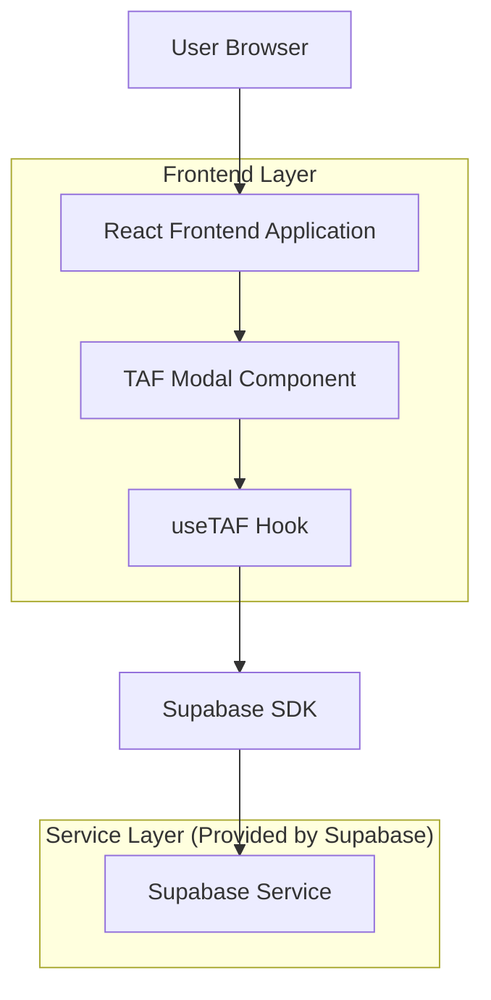
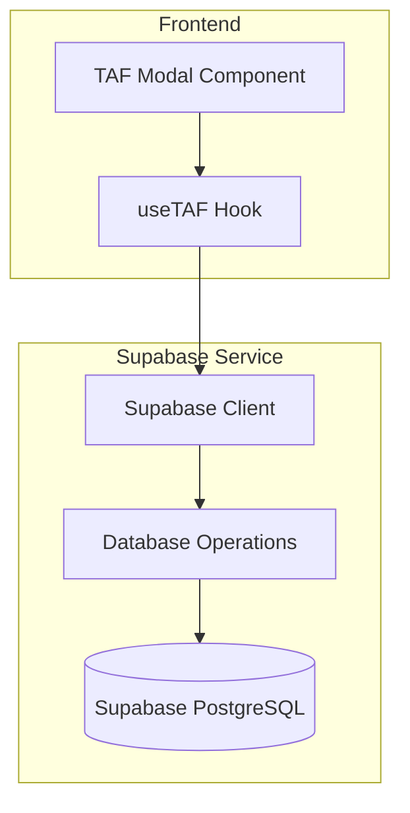
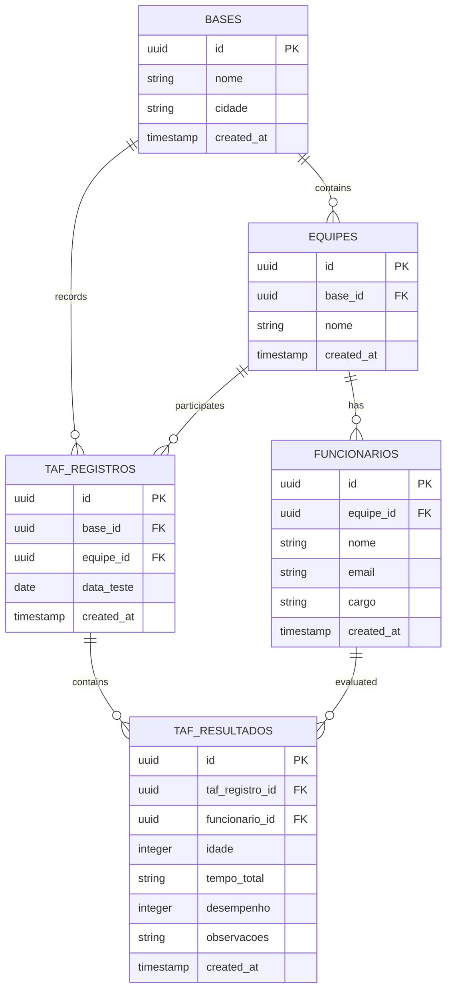

# Documento de Arquitetura Técnica - Modal TAF

## 1. Design da Arquitetura



## 2. Descrição da Tecnologia
- Frontend: React@18 + TypeScript + tailwindcss@3 + vite
- Backend: Supabase (PostgreSQL + Auth + Real-time)
- Ícones: lucide-react
- Notificações: sonner (toast)
- Validação: Validação customizada no frontend

## 3. Definições de Rotas
| Rota | Propósito |
|------|-----------|
| /dashboard | Dashboard principal onde o modal TAF será acessado |
| Modal TAF | Componente modal sobreposto, não possui rota própria |

## 4. Definições de API

### 4.1 API Principal

**Buscar bases disponíveis**
```
GET /api/bases (via Supabase)
```

Response:
| Nome do Parâmetro | Tipo do Parâmetro | Descrição |
|-------------------|-------------------|-----------|
| id | string (UUID) | ID único da base |
| nome | string | Nome da base |
| cidade | string | Cidade da base |

**Buscar equipes por base**
```
GET /api/equipes (via Supabase)
```

Request:
| Nome do Parâmetro | Tipo do Parâmetro | Obrigatório | Descrição |
|-------------------|-------------------|-------------|-----------|
| base_id | string (UUID) | true | ID da base selecionada |

Response:
| Nome do Parâmetro | Tipo do Parâmetro | Descrição |
|-------------------|-------------------|-----------|
| id | string (UUID) | ID único da equipe |
| nome | string | Nome da equipe |

**Buscar funcionários por equipe**
```
GET /api/funcionarios (via Supabase)
```

Request:
| Nome do Parâmetro | Tipo do Parâmetro | Obrigatório | Descrição |
|-------------------|-------------------|-------------|-----------|
| equipe_id | string (UUID) | true | ID da equipe selecionada |

Response:
| Nome do Parâmetro | Tipo do Parâmetro | Descrição |
|-------------------|-------------------|-----------|
| id | string (UUID) | ID único do funcionário |
| nome | string | Nome completo do funcionário |

**Salvar dados do TAF**
```
POST /api/taf (via Supabase)
```

Request:
| Nome do Parâmetro | Tipo do Parâmetro | Obrigatório | Descrição |
|-------------------|-------------------|-------------|-----------|
| base_id | string (UUID) | true | ID da base |
| data_teste | string (date) | true | Data do teste no formato YYYY-MM-DD |
| equipe_id | string (UUID) | true | ID da equipe |
| resultados | array | true | Array com resultados individuais |

Exemplo de Request:
```json
{
  "base_id": "uuid-base",
  "data_teste": "2024-01-15",
  "equipe_id": "uuid-equipe",
  "resultados": [
    {
      "funcionario_id": "uuid-funcionario",
      "idade": 35,
      "tempo_total": "00:02:15",
      "desempenho": 8,
      "observacoes": ""
    }
  ]
}
```

## 5. Arquitetura do Servidor



## 6. Modelo de Dados

### 6.1 Definição do Modelo de Dados



### 6.2 Linguagem de Definição de Dados

**Tabela TAF_REGISTROS**
```sql
-- Criar tabela de registros de TAF
CREATE TABLE taf_registros (
    id UUID PRIMARY KEY DEFAULT gen_random_uuid(),
    base_id UUID NOT NULL REFERENCES bases(id),
    equipe_id UUID NOT NULL REFERENCES equipes(id),
    data_teste DATE NOT NULL,
    created_at TIMESTAMP WITH TIME ZONE DEFAULT NOW(),
    updated_at TIMESTAMP WITH TIME ZONE DEFAULT NOW()
);

-- Criar índices
CREATE INDEX idx_taf_registros_base_id ON taf_registros(base_id);
CREATE INDEX idx_taf_registros_equipe_id ON taf_registros(equipe_id);
CREATE INDEX idx_taf_registros_data_teste ON taf_registros(data_teste DESC);

-- Políticas de segurança RLS
ALTER TABLE taf_registros ENABLE ROW LEVEL SECURITY;

-- Permitir leitura para usuários anônimos
GRANT SELECT ON taf_registros TO anon;

-- Permitir todas as operações para usuários autenticados
GRANT ALL PRIVILEGES ON taf_registros TO authenticated;
```

**Tabela TAF_RESULTADOS**
```sql
-- Criar tabela de resultados individuais do TAF
CREATE TABLE taf_resultados (
    id UUID PRIMARY KEY DEFAULT gen_random_uuid(),
    taf_registro_id UUID NOT NULL REFERENCES taf_registros(id) ON DELETE CASCADE,
    funcionario_id UUID NOT NULL REFERENCES funcionarios(id),
    idade INTEGER NOT NULL CHECK (idade > 0 AND idade < 100),
    tempo_total VARCHAR(8), -- Formato HH:MM:SS
    desempenho INTEGER CHECK (desempenho >= 0 AND desempenho <= 10),
    observacoes TEXT,
    created_at TIMESTAMP WITH TIME ZONE DEFAULT NOW(),
    updated_at TIMESTAMP WITH TIME ZONE DEFAULT NOW()
);

-- Criar índices
CREATE INDEX idx_taf_resultados_registro_id ON taf_resultados(taf_registro_id);
CREATE INDEX idx_taf_resultados_funcionario_id ON taf_resultados(funcionario_id);
CREATE INDEX idx_taf_resultados_desempenho ON taf_resultados(desempenho DESC);

-- Políticas de segurança RLS
ALTER TABLE taf_resultados ENABLE ROW LEVEL SECURITY;

-- Permitir leitura para usuários anônimos
GRANT SELECT ON taf_resultados TO anon;

-- Permitir todas as operações para usuários autenticados
GRANT ALL PRIVILEGES ON taf_resultados TO authenticated;

-- Dados iniciais (exemplo)
-- Os dados serão inseridos através do modal conforme os testes forem realizados
```

**Função para calcular desempenho automaticamente**
```sql
-- Função para calcular desempenho baseado na idade e tempo
CREATE OR REPLACE FUNCTION calcular_desempenho_taf(idade_param INTEGER, tempo_param VARCHAR)
RETURNS INTEGER AS $$
DECLARE
    tempo_segundos INTEGER;
    desempenho INTEGER;
BEGIN
    -- Converter tempo HH:MM:SS para segundos
    tempo_segundos := EXTRACT(EPOCH FROM tempo_param::TIME);
    
    -- Calcular desempenho baseado na idade
    IF idade_param <= 39 THEN
        -- Critérios para idade <= 39 anos
        IF tempo_segundos <= 120 THEN -- 00:02:00
            desempenho := 10;
        ELSIF tempo_segundos <= 140 THEN -- 00:02:20
            desempenho := 9;
        ELSIF tempo_segundos <= 160 THEN -- 00:02:40
            desempenho := 8;
        ELSIF tempo_segundos <= 180 THEN -- 00:03:00
            desempenho := 7;
        ELSE
            desempenho := 0; -- Reprovado
        END IF;
    ELSE
        -- Critérios para idade >= 40 anos
        IF tempo_segundos <= 180 THEN -- 00:03:00
            desempenho := 10;
        ELSIF tempo_segundos <= 200 THEN -- 00:03:20
            desempenho := 9;
        ELSIF tempo_segundos <= 220 THEN -- 00:03:40
            desempenho := 8;
        ELSIF tempo_segundos <= 240 THEN -- 00:04:00
            desempenho := 7;
        ELSE
            desempenho := 0; -- Reprovado
        END IF;
    END IF;
    
    RETURN desempenho;
END;
$$ LANGUAGE plpgsql;
```