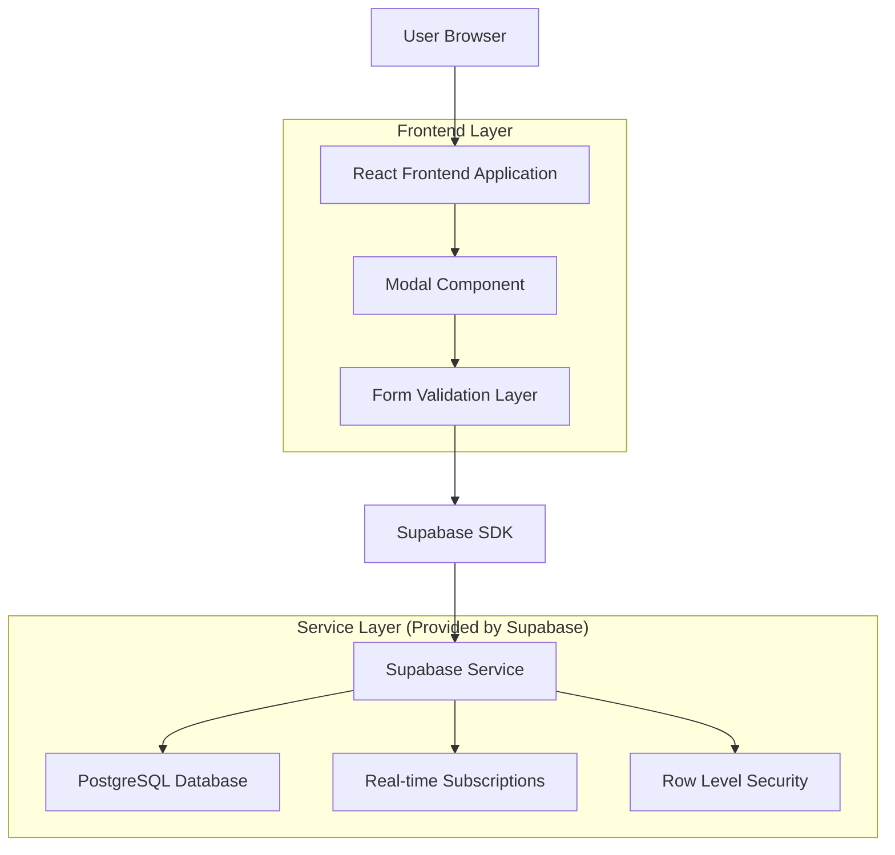
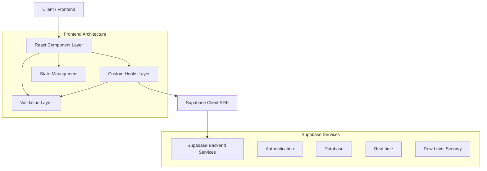
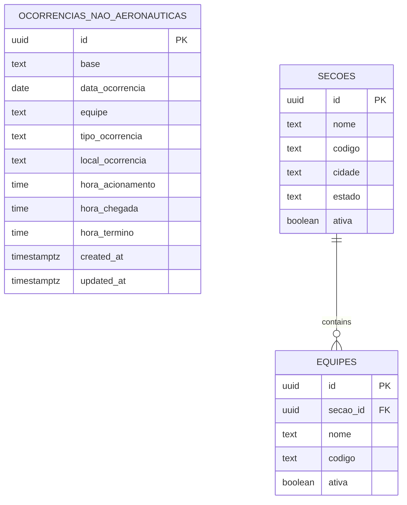

# Documento de Arquitetura Técnica - Modal de Ocorrências Não Aeronáuticas

## 1. Architecture design



## 2. Technology Description

- Frontend: React@19 + TypeScript + Tailwind CSS@3 + Next.js@15
- Backend: Supabase (PostgreSQL + Auth + Real-time)
- Validation: React Hook Form + Custom validators
- UI Components: Lucide React icons + Custom components

## 3. Route definitions

| Route | Purpose |
|-------|---------|
| /indicadores/evento | Página principal onde o modal será integrado |
| Modal Component | Componente modal sobreposto, não possui rota própria |

## 4. API definitions

### 4.1 Core API

**Supabase Table Operations**

Inserção de ocorrência não aeronáutica:
```typescript
// Tipo de dados da ocorrência
interface OcorrenciaNaoAeronautica {
  id?: string
  base: string
  data_ocorrencia: string
  equipe: string
  tipo_ocorrencia: string
  local_ocorrencia: string
  hora_acionamento: string
  hora_chegada: string
  hora_termino: string
  created_at?: string
  updated_at?: string
}

// Operação de inserção
const { data, error } = await supabase
  .from('ocorrencias_nao_aeronauticas')
  .insert([ocorrenciaData])
```

**Validação de Dados**

Validação de horários:
```typescript
interface TimeValidation {
  isValid: boolean
  message?: string
}

// Função de validação de formato HH:MM:SS
const validateTimeFormat = (time: string): TimeValidation
const validateTimeSequence = (start: string, end: string): TimeValidation
```

**Busca de Dados de Referência**

Busca de equipes por seção:
```typescript
const { data: equipes } = await supabase
  .from('equipes')
  .select('id, nome, codigo')
  .eq('secao_id', secaoId)
  .eq('ativa', true)
```

## 5. Server architecture diagram



## 6. Data model

### 6.1 Data model definition



### 6.2 Data Definition Language

**Tabela de Ocorrências Não Aeronáuticas**
```sql
-- Criar tabela principal
CREATE TABLE ocorrencias_nao_aeronauticas (
    id UUID PRIMARY KEY DEFAULT gen_random_uuid(),
    base TEXT NOT NULL,
    data_ocorrencia DATE NOT NULL,
    equipe TEXT NOT NULL,
    tipo_ocorrencia TEXT NOT NULL CHECK (
        tipo_ocorrencia IN (
            'Incêndios ou Vazamentos de Combustíveis no PAA',
            'Condições de Baixa Visibilidade',
            'Atendimento a Aeronave Presidencial',
            'Incêndio em Instalações Aeroportuárias',
            'Ocorrências com Artigos Perigosos',
            'Remoção de Animais e Dispersão de Avifauna',
            'Incêndios Florestais ou em Áreas de Cobertura Vegetal Próximas ao Aeródromo',
            'Emergências Médicas em Geral',
            'Iluminação de Emergência em Pista de Pouso e Decolagem'
        )
    ),
    local_ocorrencia TEXT NOT NULL,
    hora_acionamento TIME NOT NULL,
    hora_chegada TIME NOT NULL,
    hora_termino TIME NOT NULL,
    created_at TIMESTAMP WITH TIME ZONE DEFAULT NOW(),
    updated_at TIMESTAMP WITH TIME ZONE DEFAULT NOW(),
    
    -- Constraint para validar sequência de horários
    CONSTRAINT valid_time_sequence CHECK (
        hora_acionamento <= hora_chegada AND 
        hora_chegada <= hora_termino
    ),
    
    -- Constraint para validar data não futura
    CONSTRAINT valid_date CHECK (data_ocorrencia <= CURRENT_DATE)
);

-- Criar índices para performance
CREATE INDEX idx_ocorrencias_nao_aeronauticas_data ON ocorrencias_nao_aeronauticas(data_ocorrencia DESC);
CREATE INDEX idx_ocorrencias_nao_aeronauticas_base ON ocorrencias_nao_aeronauticas(base);
CREATE INDEX idx_ocorrencias_nao_aeronauticas_tipo ON ocorrencias_nao_aeronauticas(tipo_ocorrencia);
CREATE INDEX idx_ocorrencias_nao_aeronauticas_created_at ON ocorrencias_nao_aeronauticas(created_at DESC);

-- Trigger para atualizar updated_at automaticamente
CREATE OR REPLACE FUNCTION update_updated_at_column()
RETURNS TRIGGER AS $$
BEGIN
    NEW.updated_at = NOW();
    RETURN NEW;
END;
$$ language 'plpgsql';

CREATE TRIGGER update_ocorrencias_nao_aeronauticas_updated_at
    BEFORE UPDATE ON ocorrencias_nao_aeronauticas
    FOR EACH ROW
    EXECUTE FUNCTION update_updated_at_column();

-- Políticas de segurança RLS (Row Level Security)
ALTER TABLE ocorrencias_nao_aeronauticas ENABLE ROW LEVEL SECURITY;

-- Política para usuários autenticados poderem inserir
CREATE POLICY "Usuários autenticados podem inserir ocorrências" ON ocorrencias_nao_aeronauticas
    FOR INSERT WITH CHECK (auth.role() = 'authenticated');

-- Política para usuários autenticados poderem visualizar
CREATE POLICY "Usuários autenticados podem visualizar ocorrências" ON ocorrencias_nao_aeronauticas
    FOR SELECT USING (auth.role() = 'authenticated');

-- Política para usuários autenticados poderem atualizar suas próprias ocorrências
CREATE POLICY "Usuários podem atualizar suas ocorrências" ON ocorrencias_nao_aeronauticas
    FOR UPDATE USING (auth.role() = 'authenticated');

-- Conceder permissões básicas
GRANT SELECT ON ocorrencias_nao_aeronauticas TO anon;
GRANT ALL PRIVILEGES ON ocorrencias_nao_aeronauticas TO authenticated;

-- Dados iniciais para teste (opcional)
INSERT INTO ocorrencias_nao_aeronauticas (
    base, data_ocorrencia, equipe, tipo_ocorrencia, 
    local_ocorrencia, hora_acionamento, hora_chegada, hora_termino
) VALUES 
(
    'BA-CE', 
    '2024-01-15', 
    'Equipe Alpha', 
    'Emergências Médicas em Geral',
    'Terminal de Passageiros - Portão 5',
    '14:30:00',
    '14:35:00', 
    '15:15:00'
);
```

**Estrutura de Componentes React**
```typescript
// Hook personalizado para gerenciar ocorrências não aeronáuticas
interface UseOcorrenciasNaoAeronauticas {
  // Estados
  loading: boolean
  error: string | null
  
  // Dados de referência
  equipes: Equipe[]
  tiposOcorrencia: string[]
  
  // Funções
  saveOcorrencia: (data: OcorrenciaNaoAeronautica) => Promise<boolean>
  validateForm: (data: OcorrenciaNaoAeronautica) => ValidationResult
  fetchEquipes: () => Promise<void>
}

// Componente principal do modal
interface OcorrenciaNaoAeronauticaModalProps {
  isOpen: boolean
  onClose: () => void
  onSuccess?: () => void
}
```