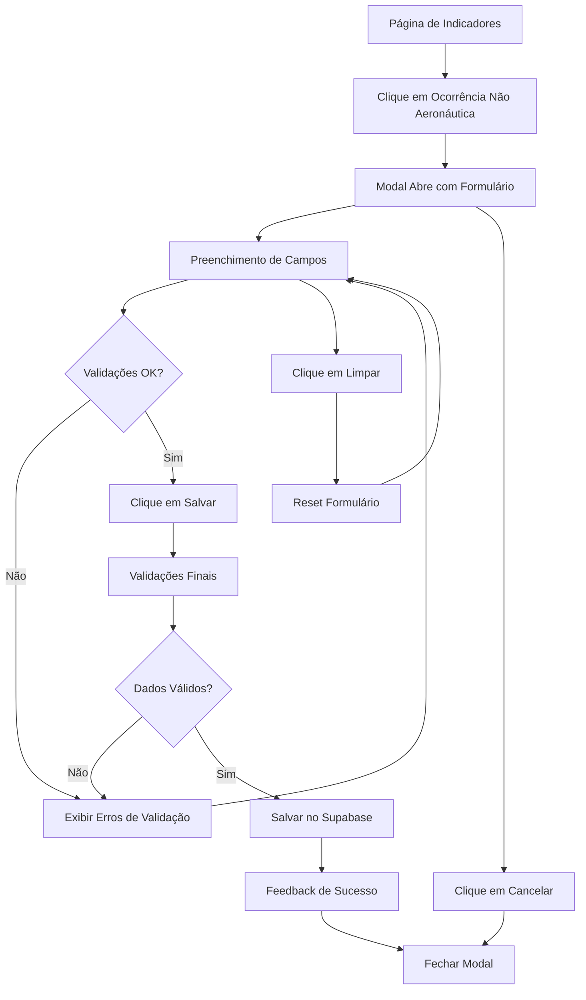

# Documento de Requisitos do Produto - Modal de Ocorrências Não Aeronáuticas

## 1. Product Overview

Sistema de registro de ocorrências não aeronáuticas integrado ao Sistema de Indicadores Bombeiro MedMais, permitindo o cadastro estruturado de emergências e eventos que não envolvem aeronaves, mas ocorrem no ambiente aeroportuário.

O modal complementa o sistema existente de ocorrências aeronáuticas, oferecendo uma interface dedicada para registrar incidentes como incêndios, emergências médicas, condições de baixa visibilidade e outras situações críticas que requerem resposta dos bombeiros aeroportuários.

## 2. Core Features

### 2.1 User Roles

| Role | Registration Method | Core Permissions |
|------|---------------------|------------------|
| BA-CE | Sistema existente | Pode registrar e visualizar ocorrências da sua base |
| Gerente de Seção | Sistema existente | Pode visualizar e gerenciar ocorrências da sua seção |
| Gestor POP | Sistema existente | Acesso completo a todas as ocorrências do sistema |

### 2.2 Feature Module

O modal de ocorrências não aeronáuticas consiste nos seguintes módulos principais:

1. **Modal de Registro**: interface principal, formulário estruturado, validações em tempo real
2. **Sistema de Validação**: validação de campos obrigatórios, formato de horários, sequência temporal
3. **Integração de Dados**: conexão com Supabase, persistência de dados, feedback de operações

### 2.3 Page Details

| Page Name | Module Name | Feature description |
|-----------|-------------|---------------------|
| Modal de Registro | Cabeçalho com Alerta | Exibe título "Ocorrência não aeronáutica" com alerta informativo sobre preenchimento obrigatório |
| Modal de Registro | Seção de Identificação | Campos para Base (dropdown pré-selecionado BA-CE), Data da ocorrência (datepicker dd/mm/aaaa), Equipe (dropdown com 5 equipes) |
| Modal de Registro | Seção de Classificação | Dropdown Tipo de ocorrência com 9 categorias pré-definidas, campo Local da Ocorrência com texto livre e sugestões |
| Modal de Registro | Seção de Horários | Campos Hora do acionamento, Hora de chegada ao local, Hora do término (todos com máscara HH:MM:SS e validações) |
| Modal de Registro | Controles de Ação | Botão Limpar formulário, Botão Salvar com validações, Botão Cancelar para fechar modal |
| Modal de Registro | Sistema de Feedback | Mensagens de sucesso/erro, indicadores visuais de validação, loading states durante operações |

## 3. Core Process

**Fluxo Principal do Usuário:**

1. Usuário acessa a página de indicadores/eventos
2. Clica no botão para abrir modal de ocorrências não aeronáuticas
3. Sistema abre modal com formulário estruturado
4. Usuário preenche campos obrigatórios com validações em tempo real
5. Sistema valida sequência temporal dos horários
6. Usuário clica em "Salvar" - sistema executa validações finais
7. Sistema persiste dados no Supabase e exibe feedback de sucesso
8. Modal fecha automaticamente após confirmação

**Fluxo Alternativo - Cancelamento:**
- Usuário pode clicar "Cancelar" a qualquer momento para fechar modal sem salvar
- Usuário pode usar "Limpar formulário" para resetar todos os campos

## 4. User Interface Design

### 4.1 Design Style

- **Cores Primárias**: #fa4b00 (laranja principal), #7a5b3e (marrom secundário)
- **Cores Secundárias**: #cdbdae (bege claro), tons de cinza para textos
- **Estilo de Botões**: Arredondados com hover effects, gradientes sutis
- **Tipografia**: Fonte system com tamanhos 14px-18px, peso semibold para labels
- **Layout**: Card-based com seções bem definidas, espaçamento generoso
- **Ícones**: Lucide React icons, estilo outline, cores harmoniosas

### 4.2 Page Design Overview

| Page Name | Module Name | UI Elements |
|-----------|-------------|-------------|
| Modal de Registro | Container Principal | Modal centralizado, max-width 6xl, fundo branco, sombra suave, border radius 16px |
| Modal de Registro | Cabeçalho | Título em #7a5b3e, ícone de alerta laranja, botão X com hover effect |
| Modal de Registro | Seção de Campos | Grid responsivo 1-2 colunas, labels em gray-900 semibold, inputs com border focus laranja |
| Modal de Registro | Dropdown Tipo | 9 opções categorizadas, texto completo visível, scroll interno se necessário |
| Modal de Registro | Campos de Horário | Máscara automática HH:MM:SS, fonte monospace, validação visual em tempo real |
| Modal de Registro | Botões de Ação | Limpar (cinza), Salvar (laranja), Cancelar (texto), alinhamento responsivo |

### 4.3 Responsiveness

- **Desktop-first** com adaptação mobile completa
- **Breakpoints**: md (768px) para layout de 2 colunas
- **Touch optimization**: botões com área mínima 44px, espaçamento adequado
- **Modal responsivo**: ajuste automático de largura e altura conforme viewport